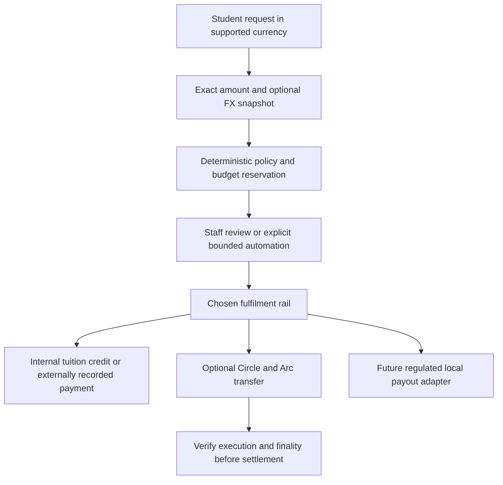
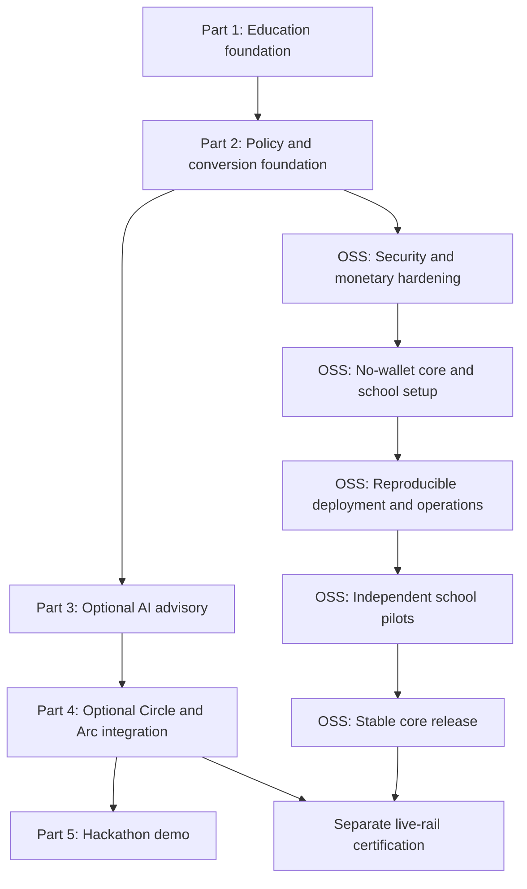
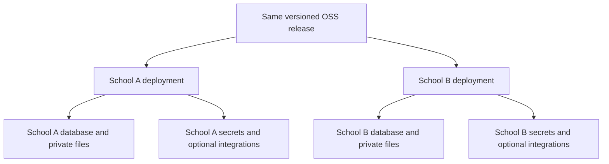

# EduFlow AI — Project Plan & Architecture Roadmap

**Tagline:** Open-source education finance and student assistance, with deterministic controls, optional AI, and optional USDC settlement.

**Document scope:** Parts 1–5 describe the existing implementation and hackathon track. Sections 5–11 define the proposed institution-ready OSS release track. A completed demo milestone is not a production-readiness claim.

**OSS launch recommendation:** Keep MIT; ship one institution per self-hosted instance; make AI and external payment rails opt-in; release a no-wallet school workflow before enabling live autonomous disbursements. These are planning recommendations, not implemented features.

---

## 1. Executive Summary & Core Concept

EduFlow AI is an education finance platform that transforms slow, manual student financial assistance into a bounded, intelligent, and auditable system. 

Institutions operate in domestic fiat currencies. Current `CurrencyCode` supports USDC, USD, PHP, EUR, GBP, CAD, SGD, and INR; AUD and NGN remain expansion targets. OSS adoption must not require a school or student to hold cryptocurrency. **Circle / Arc USDC settlement is an optional rail**, subject to provider availability, institutional approval, and local requirements. Smart-contract-enforced spending boundaries are not claimed as shipped.

Target architecture separates school workflows from optional conversion and settlement:
- **School core:** Request intake, versioned policies, staff review, tuition assistance records, and audit exports. Native-fiat accounting and a no-wallet fulfilment path are OSS roadmap work; current tuition accounts use USDC base units.
- **Currency conversion:** Existing integer converter and quote snapshots form the starting point. Verified live feeds, rate freshness enforcement, executable quotes, and complete end-to-end monetary precision remain release gates; static fallback rates are not executable FX quotes.
- **Optional settlement:** Circle / Arc integrates through Lepton gateways. Automated local-currency off-ramping is not wired. A tuition ledger offset is an internal accounting operation, not a bank payout or proof of an FX trade.

Traditional education assistance models operate sequentially:
> Student request $\rightarrow$ Manual review $\rightarrow$ Manual approval $\rightarrow$ Slow cross-border bank transfer.

EduFlow introduces a **bounded autonomous agent loop with multi-currency awareness**:
> Student request (in Local Currency or USDC) $\rightarrow$ Deterministic FX quotation & rate lock $\rightarrow$ Policy evaluation against canonical USDC limits $\rightarrow$ Autonomous approval within strict boundaries $\rightarrow$ Human escalation for exceptions $\rightarrow$ Programmable USDC disbursement & local settlement.

### Non-Negotiable Security Principles
1. **No Direct LLM Fund Control:** The Large Language Model (LLM) **never** has direct access to private keys or direct authorization to move funds. All decisions are evaluated against deterministic PHP rules and dual-ledger database state.
2. **Fixed-Point Base-Unit Math — Required Release Invariant:** Monetary calculations and persisted amounts must use exact minor units (6 decimals for the application's USDC amounts, 2 for currently supported fiat). This is not yet true across the legacy treasury/payment path; Section 5 identifies the float and two-decimal storage gaps.
3. **Locked Exchange Rate Snapshots:** Every decision, reservation, and transaction records an immutable snapshot of the exchange rate, rate provider, and timestamp.
4. **The LLM Is a Proposer, Not an Authoriser:** Model output is advisory only. It may tighten a decision but never loosen one. Every money-moving path is gated by a deterministic predicate evaluated in PHP — see Part 3 §3.1 and §3.2.
5. **A Stored Hash Is a Claim, Not Proof:** Settlement requires successful execution, matching chain/asset/sender/recipient/amount, and the rail's documented finality evidence. Transaction lookup alone is insufficient. Missing lookup results are pending or unknown until investigated, not automatically proof of fabrication. The database ledger is never presented as on-chain funds.

---

## 2. Multi-Currency Architecture



### Supported Currencies & Precision Matrix

| Currency | Code | Type | Minor Unit Decimals | Multiplier ($1.00$) |
|---|---|---|---|---|
| **USD Coin (Settlement)** | `USDC` | Stablecoin | 6 | `1,000,000` |
| **US Dollar** | `USD` | Fiat | 2 | `100` |
| **Philippine Peso** | `PHP` | Fiat | 2 | `100` |
| **Euro** | `EUR` | Fiat | 2 | `100` |
| **British Pound** | `GBP` | Fiat | 2 | `100` |
| **Canadian Dollar** | `CAD` | Fiat | 2 | `100` |
| **Singapore Dollar** | `SGD` | Fiat | 2 | `100` |
| **Indian Rupee** | `INR` | Fiat | 2 | `100` |

---

## 3. Multi-Part Implementation Roadmap



---

### Part 1: Education Data Foundation & Request Intake (COMPLETED)
- [x] **Data Foundation:**
  - `Student` model linked to `User` with student number, program, year level, academic status, and attendance rate.
  - `AcademicTerm` model with calendar boundaries and `isActive()` evaluation.
  - `TuitionAccount` model storing integer base-unit USDC amounts (6 decimal places) with computed remaining balance.
  - `AssistanceRequest` model with UUID `submission_key` idempotency constraints and non-negative database triggers.
  - Database migration `2026_09_27_090000_create_education_tables.php`.
- [x] **Access Control:**
  - Extended `RoleEnums` with `STUDENT` and `FINANCE_OFFICER`.
  - Restricted Filament panels: `/finance` for finance officers/admins, `/admin` for super admins only.
  - Allowlisted user activity logging to prevent credential/secret leakage.
- [x] **Student Interface (React / Inertia 3):**
  - Student dashboard at `/student/dashboard` displaying tuition balance and request history.
  - Assistance request form at `/assistance/create` with decimal USDC validation (up to 1,000,000 max).
  - Assistance detail page at `/assistance/{id}` with clear status tracking.
- [x] **Staff Review Panel (Filament 5):**
  - Dedicated `FinancePanelProvider` at `/finance` with `AssistanceRequestResource`.
  - Read-only table and infolist showing exact 6-decimal USDC values, student academic standing, and tuition accounts.
- [x] **Testing & Validation:**
  - Previously reported: 249 passing Pest tests (1,144 assertions) across unit, feature, authorization, and lifecycle suites.
  - Previously reported: clean TypeScript compilation (`npm run types:check`) and Vite asset bundling. Historical counts are not current OSS release evidence; each release needs fresh CI results.

---

### Part 2: Deterministic Policy Engine & Multi-Currency Conversion (COMPLETED)

#### Objectives
1. **Currency Conversion & Exchange Rate Layer:**
   - `CurrencyRate` model and repository storing live and fallback exchange rates against USDC.
   - `CurrencyConverter` service converting between USDC base units and any supported fiat/crypto currency using integer scaling.
   - Exchange rate quote expiration and locking (`quote_id`, `rate`, `quoted_at`, `expires_at`).
   - Multi-currency display formatting utility for frontend and Filament panel (e.g. `$100.00 USDC ≈ ₱5,750.00 PHP` or `€92.50 EUR`).
2. **Institutional Assistance Funds & Policies:**
   - `AssistanceFund` model with reserve threshold ($5,000 USDC$) and daily budget limits ($1,000 USDC$).
   - `AssistancePolicyVersion` model with versioned rules for enrollment, GPA, attendance, and semester caps.
3. **Deterministic `EvaluateAssistancePolicy` Action:**
   - Check enrollment status (`enrolled`).
   - Check academic status (`qualified` or threshold GPA).
   - Check attendance threshold (e.g. $\ge 85\%$).
   - Check outstanding tuition balance ($> 0$).
   - Check student semester assistance cap.
   - Check fund minimum reserves and daily budget.
4. **Autonomous Limit vs. Human Review Split:**
   - Single autonomous limit: **$100.000000 USDC** (or converted local currency equivalent at locked rate).
   - Example ($150 USDC requested / ~₱8,625 PHP):
     - Automatic approved portion: **$100.000000 USDC** (~₱5,750 PHP).
     - Escalated human-review portion: **$50.000000 USDC** (~₱2,875 PHP).
     - Status: `partially_approved` with pending escalation.
5. **Agent Decisions & Dual-Currency Audit Logs:**
   - `AgentDecision` capturing exact evaluation rules, pass/fail checks, locked exchange rates, and split amounts.
6. **Filament Staff Actions:**
   - Staff review and one-click approve/reject actions for the escalated human-review portion in the Finance Panel.

#### Planned Files
- `app/Enums/CurrencyCode.php`
- `app/Models/CurrencyRate.php`
- `app/Services/CurrencyConverter.php`
- `app/Models/AssistanceFund.php`
- `app/Models/AssistancePolicyVersion.php`
- `app/Models/AgentDecision.php`
- `app/Actions/EvaluateAssistancePolicy.php`
- `app/Actions/ApproveEscalatedRequest.php`
- `app/Filament/Resources/AssistanceRequests/Actions/ApproveEscalatedAction.php`
- `tests/Feature/CurrencyConverterTest.php`
- `tests/Feature/PolicyEvaluationTest.php`

---

### Part 3: AI Agent Layer (Laravel AI SDK)

**Status: SDK installed; advisory layer and approval seam shipped and tested.**

`laravel/ai` v1.0.1 is installed. The four agents, two tools, and advisory boundary exist;
the plan previously reported 27 adversarial tests. Advisory and conversational wiring
are described below. These implementation milestones do not certify production safety
or external-provider availability; fresh release CI remains required.

Shipped:
- `AssistanceAssessor`, `TreasuryAnalyst` — `HasStructuredOutput`, advisory only.
- `AskEduFlowAgent` — conversational, read-only, no tools.
- `SettlementOperator` — `Conversational` + `HasTools`, proposes via tool calls.
- `DisburseAssistance` — `Approvable`; `needsApproval()` **is** the policy engine, and
  `handle()` re-evaluates rather than trusting the earlier verdict.
- `RecordHardshipContext` — not approvable, writes advisory only.
- `AdvisoryEnvelope` / `AdvisorySanitizer` / `AdvisoryGate` — allowlist, fail-closed.

Two findings from reading the SDK rather than assuming it:
- An agent that pauses a tool must be `Conversational` (or be handed history via
  `withMessages`), or resuming throws `ApprovalNotResumableException`. `SettlementOperator`
  uses `RemembersConversations` for exactly this reason.
- `continue()` and `continueOrStart()` do **not** verify participant ownership. Any route
  resuming a conversation must call `ConversationStore::conversationBelongsTo()` first.

Also shipped: admin-configured providers. `ai_providers` holds endpoints with an
encrypted `api_key` cast, managed under `Settings -> AI Providers` (any SDK driver,
including `openai-compatible` for Ollama, LM Studio, vLLM, LiteLLM or a gateway).
`AiProviderResolver` resolves an admin provider ahead of `.env`, per request, and
`AiSettings` gates every call behind two separate switches plus an opt-in for settlement
proposals. Keys are never rendered back into the edit form.

The advisory gate is wired in. `EvaluateAssistancePolicy::recordDecision()` writes the
authoritative decision row first, then attaches commentary under a namespaced `advisory`
key. The existing implementation calls `AdvisoryGate::assessHardship()` synchronously;
that gate calls `prompt()`. Failure can leave the deterministic verdict intact, but a
slow provider can still delay the caller. Moving advisory work to a durable queue after
commit is an OSS release gate, not an already-satisfied invariant. Prior live gateway
checks are development observations, not reproducible release evidence.

Verified live against 9Router, which shaped two design decisions. It ignores
`response_format: json_schema`, so agents also request the JSON shape in their
instructions and the gate decodes a string response. And `AiProviderResolver` must return a
built `Provider` instance rather than the driver name, because a bare name resolves against
`config/ai.php` and fails with "requires a default text model".

`AskEduFlow` is now conversational. The deterministic answer is computed first and is always
the floor; `StudentBrief` hands the model the facts *and* that explanation, and `QnaGate`
replaces the text only when `BriefGuard` finds every figure in the response inside the brief.
Verified live against the configured gateway: it rephrases the split explanation correctly,
refuses to discuss moving funds, and a fabricated balance falls back to the computed figure.
`conversationBelongsTo()` is called inside the gate, not at the route, so no caller can skip it.

Replacing the matcher also surfaced a live routing bug. `str_contains($q, 'usd')` matched
"USDC", so any question quoting an amount was answered about exchange rates, and `'aid'`
matched inside "paid". `answer()` and `query()` also carried separate keyword chains that had
drifted apart, so a question could be answered from the policy and labelled `general`; there is
now one `classify()`.

The approval-resume endpoint is in place. `ApprovalResumeGate` is the only route from a human
decision to a paused tool call, and holds six checks: role through the Gate, conversation
ownership, pending-set subset, a tool allowlist that never constructs `Decision::edit()`, target
provenance read from the stored pause rather than the payload, and the settings gate. The request
body is only ever `id => bool`, so there is no field through which an amount or recipient could
arrive. A replay returns `nothing_pending` rather than paying again, and every settlement in the
response is flagged as requiring on-chain verification.

Verified by mutation: removing the ownership check turns 3 tests red, the tool allowlist 1, the
pending-set subset 1, and the replay short-circuit 1.

Building it surfaced a latent defect. `app(SettlementOperator::class)` returns an agent holding
*blank* Organization, AssistanceFund and AssistancePolicyVersion records, because Eloquent models
take no constructor arguments and the container instantiates them anyway. Its `primaryWallet()` is
null, so `DisburseAssistance::handle()` refuses with "The organization has no active wallet" — the
right outcome for the wrong reason, and it behaves differently once a wallet row exists.
`SettlementOperatorFactory` now refuses to build an operator from non-existent records. The SDK
also binds only `ConversationStore` while implementing `VerifiesConversationOwnership` and
`ResolvesPendingApprovals`; resolving those interfaces failed until they were aliased in
`AppServiceProvider`.

Remaining: decide whether to wire `TuitionSettlementService` into the settlement path or delete it.
It still has zero callers.

#### 3.1 Three-Tier Authority Model

The LLM is a *proposer*, never an authoriser. Authority is split into three tiers and the
boundary between them is enforced in PHP, not in a prompt.

| Tier | Owner | Examples | Can move funds? |
| --- | --- | --- | --- |
| **Deterministic** | PHP, non-negotiable | limits, reserve math, daily caps, FX rate locking, auto-vs-escalate, vendor allowlist, signing | Only after all checks pass |
| **Advisory** | LLM, clamped by PHP | hardship category, urgency, confidence, review priority, narrative, anomaly flags | Never |
| **Prohibited** | — | approved amount, policy verdict, key material, recipient selection | Never |

**One-way ratchet:** the LLM may only *tighten* a decision. If the deterministic engine
returns `ESCALATE`, no model response can downgrade it to `AUTO_APPROVE`. Any code path
where model output could loosen a decision is a defect.

#### 3.2 The Seam: `Approvable` Tools

The SDK's `Approvable` contract maps directly onto bounded autonomy. An `Approvable` tool
pauses the run before executing, and `needsApproval(Request): Approval|bool` is evaluated
**per tool call against its arguments**. This predicate *is* the policy engine:

```php
class DisburseAssistance implements Approvable, Tool
{
    use InteractsWithApprovals;

    /**
     * The deterministic policy engine, evaluated per call.
     * Within limits -> executes autonomously. Over limit -> pauses for a human.
     */
    protected function needsApproval(Request $request): Approval|bool
    {
        $result = $this->policy->evaluateStudentAssistance(
            requestedAmount: $request['amount'],
            org: $this->org,
            wallet: $this->wallet,
        );

        return $result->isAutoApproved()
            ? false
            : Approval::required($result->reasoning);
    }
}
```

The model decides *what to propose*; `needsApproval()` decides *whether a human must sign*.
This replaces the current arrangement where the agent writes directly to
`CircleWalletService` — the transfer becomes a tool call that cannot bypass approval.

#### 3.3 Structured Output as the Contract

`HasStructuredOutput` with `schema(JsonSchema $schema)` produces schema-validated output,
removing the hand-rolled `validateSchema()` in `DecisionExplainer`. The advisory schema is
an **allowlist** — advisory fields only, never `approved_amount` or `decision`:

```php
public function schema(JsonSchema $schema): array
{
    return [
        'hardship_category' => $schema->string()->enum([
            'medical', 'academic_materials', 'tuition_shortfall', 'living_costs', 'other',
        ])->required(),
        'urgency' => $schema->string()->enum(['standard', 'high'])->required(),
        'confidence' => $schema->number()->min(0)->max(1)->required(),
        'narrative' => $schema->string()->required(),
        'anomaly_flags' => $schema->array()->items($schema->string())->required(),
    ];
}
```

Unknown keys returned by the model are dropped before the payload reaches the policy
engine, so a prompt-injected `"approved_amount": 999999` is discarded.

#### 3.4 Agents to Build

| Agent | Type | Role | Authority |
| --- | --- | --- | --- |
| `AssistanceAssessor` | `HasStructuredOutput` | Classify hardship, score urgency, flag anomalies | Advisory only |
| `TreasuryAnalyst` | `HasStructuredOutput` | Forecast narrative, explain reserve risk | Advisory only |
| `AskEduFlow` | `Conversational` + `RemembersConversations` | Student Q&A over balance, rates, policy | Read-only |
| `SettlementOperator` | `HasTools` (Approvable) | Propose disbursements as tool calls | Gated by `needsApproval()` |

All four use `Promptable`. `AskEduFlow` uses `RemembersConversations` so chat history
persists to the SDK's `agent_conversations` tables, replacing the stateless `fetch()` POST
in `resources/js/components/ask-eduflow.tsx`.

#### 3.5 Non-Negotiable Invariants

1. **No tool reaches `CircleWalletService` without passing `needsApproval()`.** Every
   money-moving tool implements `Approvable`.
2. **No model output is trusted for arithmetic.** All amounts are integer base units
   computed in PHP. The model never sees or emits an approved figure.
3. **Rate locking stays in PHP.** The model may explain a locked quote; it cannot create one.
4. **The agent must not run in the synchronous settlement path.** Advisory calls use
   `->queue()->then()->catch()` so a provider timeout degrades to the deterministic path
   rather than blocking a payment.
5. **Fail closed.** A missing, malformed, or schema-violating response is treated as
   "no advisory available" and the deterministic engine proceeds alone.
6. **Conversations are not authorisation.** The SDK's `continue()` / `continueOrStart()`
   do not verify participant ownership; the app must call
   `ConversationStore::conversationBelongsTo()` before resuming.

#### 3.6 Provider Strategy

`config/ai.php` supports OpenAI, Anthropic, Gemini, Azure, Bedrock, Groq, xAI, DeepSeek,
Mistral, Ollama, OpenRouter, and `openai-compatible`.

- **Demo without a key:** the `openai-compatible` driver can target a local Ollama or
  LM Studio endpoint, so the AI layer runs in a hackathon demo with no paid API key.
- **Production:** `ANTHROPIC_API_KEY` or `OPENAI_API_KEY` via the SDK's **Failover**
  support, so a provider outage degrades instead of failing.
- Provider selected through the `Laravel\Ai\Enums\Lab` enum rather than raw strings.

#### 3.7 Testing Strategy

`Agent::fake()` removes the network from the test suite entirely — no API key, no cost,
no flakiness:

```php
AssistanceAssessor::fake([['hardship_category' => 'medical', 'urgency' => 'high', ...]]);

// Faking a paused tool call, to assert the human-in-the-loop path
SettlementOperator::fake([
    AgentResponse::fakeWithPendingApprovals([
        new PendingApproval(id: 'call_abc', tool: 'DisburseAssistance', arguments: [...], reason: '...'),
    ]),
]);
```

Faking a structured agent without explicit responses auto-generates schema-conforming
data. Required adversarial tests:

- Model returns `approved_amount` → assert it is discarded, not applied.
- Model returns a verdict of `auto_approve` for an over-limit request → assert the
  ratchet holds and the call still escalates.
- Model returns malformed JSON → assert fail-closed and deterministic fallback.
- Model times out → assert no payment is blocked and nothing is half-written.
- Prompt-injected student statement attempting to override policy → assert inert.

#### 3.8 Planned Files

All shipped. `tests/Feature/Ai/AdversarialAgentTest.php` covers the five scenarios in
3.7, `tests/Feature/Ai/ApprovalRatchetTest.php` the approval seam, and
`tests/Feature/Ai/AiProviderAdminTest.php` plus `tests/Feature/Filament/AiProviderAdminUiTest.php`
the admin provider configuration and key encryption.

Remaining release work:
- Move advisory calls out of synchronous evaluation and settlement paths.
- Approval-resume endpoint, verifying conversation ownership, staff authority, and fresh policy checks (3.5.6).
- Re-run advisory and conversational boundary tests with no provider configured.

---

### Part 4: Circle / Arc USDC Settlement Layer & FX Off-Ramp Rails (IN PROGRESS)

**Status: Circle / Arc transfer and hash-reconciliation integration exists; production settlement certification and local-currency off-ramping remain incomplete.**

Shipped:
- **Lepton Agent Wallet** via the published `yukazakiri/lepton-agent` package. No CLI
  strings in application code; gateways are injected via contracts.
- **Programmable Disbursements:** the autonomous $100 USDC portion dispatches through
  `CircleWalletService`; the $50 remainder dispatches only after a human authorises it in
  the `/finance` panel via `ApproveEscalatedAction`.
- **Settlement Provenance:** transactions record gateway, base units, explorer URL,
  and simulation metadata. `CircleWalletService::executePayment()` currently writes
  `CONFIRMED` immediately after the gateway returns; production must distinguish
  submission from verified settlement.
- **Reconciliation:** `php artisan lepton:reconcile` checks hashes via
  `eth_getTransactionByHash`, with a Circle history fallback. Existing verdicts are
  `verified` / `fabricated` / `unverifiable` / `ledger_only`; these legacy labels need
  stronger evidence and pending/unknown states before live use. See Sections 5 and 8.
- **Operations truth:** `php artisan lepton:doctor` reports CLIs, Circle auth, treasury
  identity, funding, chain reads, and ledger-versus-chain drift.

Outstanding:
- **Internal Tuition Credit:** `app/Services/TuitionSettlementService.php` exists but
  has no caller in `app/`. It updates an internal tuition ledger; it is not a fiat
  off-ramp. Rework it into the no-wallet core with atomic posting and idempotency,
  then wire it into fulfilment. External cash payouts remain separate adapters.
- Real Arc Testnet funding: the ledger balance is a demo figure, not on-chain funds.
  Reconciliation must stay honest about the difference rather than presenting the ledger
  as settled.

---

### Part 5: Hackathon Demo & End-to-End Verification

**Demo-only:** Amounts below are illustrative policy examples, not installation defaults.
Read the active policy and current fixtures for the actual split. Fake and testnet runs
must be labelled separately; neither proves mainnet or local-bank readiness.

- **Demo Walkthrough (3–5 Minutes):**
  1. **Student Login:** Juan logs in, seeing a tuition balance displayed in both local currency (e.g., `₱17,250 PHP`) and `300.00 USDC`.
  2. **Assistance Request:** Juan submits an emergency request for `150.00 USDC` (`₱8,625 PHP`).
  3. **Autonomous Evaluation:** Policy engine runs instantly:
     - Verifies enrollment (✓), attendance 95% (✓), academic standing (✓), outstanding balance (✓).
     - Checks autonomous limit ($100.00 USDC / ₱5,750 PHP).
  4. **The Split Decision:**
     - Deterministic policy approves `$100.00 USDC` immediately; the model has no approval authority.
     - Escalates `$50.00 USDC` to human review with exact policy reasons.
  5. **Disbursement & Conversion:**
     - Simulates or executes Circle/Arc testnet payment of $100 USDC to Juan's wallet.
     - Displays live conversion quote and transaction receipt.
  6. **Admin Review:**
     - Finance officer logs into `/finance` and views Juan's escalated request with complete AI reasoning and locked exchange rate.
     - Administrator approves the remaining $50 USDC.
  7. **Audit & Explanation:**
     - EduFlow answers: *"Why didn't you send the full $150 USDC initially?"*
     - Agent explains the institutional threshold and currency conversion breakdown.

---

## 4. Technology Stack

- **Backend:** Laravel 13, PHP 8.5, SQLite (dev/test) / PostgreSQL (production), Laravel Octane
- **Frontend:** React 19, Inertia.js v3, Tailwind CSS v4, Radix UI, shadcn/ui, Lucide Icons
- **Admin & Operations:** Filament v5, Spatie Permission & Shield, Spatie Activitylog
- **AI:** `laravel/ai` (official Laravel AI SDK) — agents, structured output, tools,
  human tool approval, conversation memory. See Part 3.
- **Agent Infrastructure:** `yukazakiri/lepton-agent` — Circle Agent Stack + Arc gateway.
  Contracts for wallets, Arc RPC, and x402; `circle` and `fake` drivers.
- **Testing:** Pest 5, Pest Agent Plugin, PHPUnit, `Agent::fake()` for AI
- **Routing & Types:** Laravel Wayfinder, TypeScript 5.9
- **Web3 & Currency:** USDC, Circle Agent Wallets, Arc Testnet, Multi-Currency Fixed-Point Math

---

## 5. OSS Readiness Review — Verified Gaps

**Review basis:** Repository source and configuration inspected on 2026-10-02. This is
not a full security audit, live settlement test, or PostgreSQL certification. `.env.example`
exists but editor privacy rules blocked reading it; its defaults are unverified. Existing
implementation work is preserved. Findings below describe the original review; implementation
progress is tracked immediately after the table. No item is closed solely by changing this document.

| ID | Observed gap and evidence | Required outcome | Gate |
| --- | --- | --- | --- |
| OSS-01 | `auto-release.yml` contains a literal Graphite credential. | Revoke/rotate with its owner, replace with Actions secrets or remove integration, scan working tree and history. Removing the string alone does not revoke it. | Before public release |
| OSS-02 | `DatabaseSeeder` always calls `RolesAndPermissionsSeeder`; that seeder creates `admin@admin.com` with password `password` and superadmin rights, outside a local/testing guard. | Production seeds create roles/settings only. First admin is explicitly bootstrapped with unique credentials or expiring invitation. Test production seeding creates no default users. | Before any school deployment |
| OSS-03 | `CircleWalletService::executePayment()` takes `float`; financial models cast money to floats; legacy financial tables store `decimal(15, 2)`. `EvaluateAssistancePolicy` converts base units to two-decimal floats and casts a daily sum before scaling. | Exact minor-unit money representation across decisions, caps, balances, postings, and gateways. Audit and migrate legacy precision; do not assume rounded historical values can be recovered. | Before production financial use |
| OSS-04 | Payment gateway call precedes wallet/transaction persistence; transfer options omit `idempotencyKey`. `ApproveEscalatedRequest` pays before its later state updates. | Durable payment intent, atomic reservation, unique fulfilment identity, stable provider idempotency, crash recovery and reconciliation before retry. | Before external payments |
| OSS-05 | `LeptonReconciliationService` marks any returned transaction array verified, without execution success or amount/recipient matching; null lookup becomes fabricated; Circle fallback searches only 200 records. | Successful receipt/finality plus expected payment matching; distinguish pending, unknown, reverted, and mismatched. Paginated provider evidence or unresolved status when evidence is incomplete. | Before live USDC |
| OSS-06 | Staff dashboards/widgets use `Organization::first()`; students and academic terms have no institution ownership column in the education migration. | Enforced one-institution installation for initial OSS release; explicit installation institution resolver. No shared-database multi-school claim. | Before school pilots |
| OSS-07 | `CurrencyConverter` uses static fallback rates, assumes USD parity, and creates a new 15-minute snapshot timestamp independently of the source rate expiry. | Separate indicative display rates from executable quotes; preserve source timestamps/expiry, rounding, fees and spread. Hold real FX when valid quote unavailable. | Before FX-sensitive payments |
| OSS-08 | `TuitionSettlementService` has no caller and writes a two-decimal transaction amount. | Tested internal tuition-credit fulfilment, no duplicate posting, native-currency records, no claim that a ledger offset is a bank transfer. | Before no-wallet core launch |
| OSS-09 | `EvaluateAssistancePolicy` invokes advisory synchronously through `prompt()`. AI switches default off in `AiSettings`. | Keep AI off by default; queue advisory after durable decision commit. Slow/unavailable AI must not delay approval or fulfilment. | Before enabling AI in pilots |
| OSS-10 | Dockerfile uses Bun without a frozen lock, frontend PHP from distro packages, `--ignore-platform-reqs`, starter-kit branding, and an amd64-only helper. Entrypoint checks `/var/www/html` while image root is `/app`. No Compose file found. | Clean, reproducible production image and deployment bundle; matching runtime paths, real platform checks, non-root operation, documented services and architecture support. | Before container release |
| OSS-11 | README is demo-focused; installation docs and `version.json` still identify KoamiStarterKit. Composer hooks enable Blog and run starter-kit setup. `.gitattributes` excludes README from archives. | Product identity and release metadata agree. School installation preserves application code, ships docs, and never invokes scaffold rewriting or demo provisioning. | Before OSS release |
| OSS-12 | CI tests SQLite through `phpunit.xml`; inspected CI has no PostgreSQL job. Auto-release runs independently of CI and tags prereleases as `latest`. Root PHP constraint/README say 8.3+, but locked Symfony 8.1 dependencies require PHP 8.4.1+. | Test actual production DB, concurrency and upgrades; publish only tested commits; isolate preview/stable channels; document a certified runtime baseline. | Before stable release |

### O0 Implementation Progress

- **OSS-01 source cleanup implemented:** Graphite integration and literal token removed.
  Workflow credential regression tests added. Owner revocation/rotation and historical
  exposure review are still required; this blocker is not fully closed.
- **OSS-02 seed safety implemented:** Default accounts are limited to local/testing,
  including direct role-seeder invocation. Production/staging seeding creates no users or
  demo records. `eduflow:bootstrap-admin` creates the first admin through hidden password
  prompts, refuses existing accounts/second superadmins, and records a secret-free audit.
  Existing default accounts are not deleted or reset; operators must remediate them.
- **OSS-12 release guards implemented in part:** CI no longer commits formatter/refactor
  changes. Preview publication requires successful same-repository push CI and checks out
  its exact commit. Manual publication requires exact-commit CI; preview/draft releases
  cannot update stable `latest`. Ad hoc Docker publication disabled. PostgreSQL coverage,
  runtime/image certification and supply-chain attestations remain open.
- Operator bootstrap/release notes added to README; source archives now retain README
  and changelog instead of excluding them. No schema migration, dependency
  change, live payment, full installer or shared-institution tenancy introduced.
- **OSS-06 selection guard implemented in part:** `InstallationInstitution` requires an
  explicit `EDUFLOW_INSTITUTION_ID` outside local/testing and exactly one organization;
  missing/invalid/ambiguous selection fails closed. Dashboard/widgets, wallet doctor and
  settlement operator factory no longer choose `Organization::first()`. Stateless scoped
  resolution and negative selection tests added. This is not full resource ownership,
  second-institution creation prevention, schema backfill or installation onboarding.
- Next: institution setup/ownership and exact money/reservation foundations.
  O0 still needs credential-owner confirmation, dependency/asset review and named owners.

**Strengths to preserve:** MIT already exists; deterministic policy actions, student
intake, role separation, AI opt-in settings, encrypted provider keys, Lepton contracts,
quote snapshots, and fake gateways offer a useful foundation. Do not rewrite working
modules just to introduce a new framework.

**Meaning of “any institution”:** Download, inspect, adapt, and self-host without project
permission or a central account. It does not mean every jurisdiction, currency, school
policy, bank, or payment provider is certified on day one. Publish a capability/support
matrix and grow it through pilots.

---

## 6. Product, License, and Institution Boundary

### 6.1 Initial Product Scope

**First supported workflow:** A school imports students and opening tuition balances,
publishes an aid policy, receives requests, approves or escalates deterministically,
records fulfilment, and exports audit evidence. No wallet or AI provider required.

The core supplements an existing SIS/accounting system. It is not yet a general school
ERP, payroll engine, complete general ledger, or replacement for statutory accounting.
Existing vendor/treasury features stay available for development; they are not certified
by the student-aid launch unless their full acceptance suite passes too.

| Capability | Initial OSS core | Optional / later |
| --- | --- | --- |
| Students, terms, tuition balances, aid intake, staff review | Supported release target | SIS adapters after CSV pilot |
| Versioned policies, exact budgets, decision explanations, exports | Supported release target | More country/policy templates |
| Internal tuition credit and manually recorded external fulfilment | Supported release target; not shipped yet | Bank/provider integration |
| AI explanations and hardship advisory | Disabled by default | Approved cloud endpoint or tested local provider |
| Circle / Arc transfers | Disabled by default | Separate certified rail and institution opt-in |
| Automated FX/off-ramp | Not promised | Provider/jurisdiction-specific adapters |
| Shared hosted multi-tenancy | Not initial scope | Separate architecture and isolation review |

Students need no blockchain address for the core. A manually recorded payment needs
staff evidence and reconciliation; staff marking “paid” is not independent proof of a
bank settlement. An internal credit must be labelled as an internal credit.

### 6.2 License and Sustainable OSS

- **Keep existing MIT license.** Schools may use, modify, redistribute, or sell their
  version while retaining required notices. Do not silently relicense contributors' work.
- Audit Composer/npm dependencies, bundled assets/fonts, model weights, generated UI,
  and container contents for redistribution terms. The root MIT license does not
  override third-party licenses or make Circle/AI services open-source.
- Publish third-party notices and a software bill of materials (SBOM) with release
  artifacts. Record provenance for imported starter-kit code.
- No license server, per-student unlock, mandatory telemetry, central login, or required
  paid service for the school core. Optional integrations may have their own costs.
- Revenue options: paid hosting, deployment help, training, migration, custom adapters,
  and support agreements. Hosted service is an operating model, not a separate mandatory
  code license. MIT permits competitors to host forks; accept that trade-off.
- MIT has no warranty or support SLA. Separate commercial agreements from community
  support. Maintainer bandwidth and financial/security expertise constrain release scope.

### 6.3 One Institution per Installation First

**Recommended v1 boundary:** One institution, one installation-owned database, storage,
queue/cache namespace, encryption key, mail configuration, and optional treasury context.
Two schools run two instances, even when an IT provider manages both. Never share their
provider credentials or wallet sessions. Campuses inside one legal institution may share
an instance only under the same access/data policy; separate campus wallets and scoped
campus permissions require additional design.



Reuse `Organization` as the institution identity; do not add a competing `School` model.
Persist an explicit installation institution selection. Replace `Organization::first()`
and hardcoded IDs with a fail-closed resolver; reject a missing/ambiguous institution.
Setup must prevent creation of a second active institution on the single-school profile.
Future ownership migrations must backfill and validate existing records, not assign
ambiguous records to whichever organization appears first.

**Future shared hosting:** Do not advertise multi-tenancy because an `organization_id`
exists. It needs memberships, authorization, tenant-bound queries/unique keys, private
file paths, queues/cache, AI conversations, exports, provider sessions, and background
jobs, with negative cross-institution tests. Choose database-per-institution or shared
schema only after an explicit threat model and operational review. No tenancy package
or microservice split is required to ship the self-hosted core.

### 6.4 School Configuration Without Forking

Build on existing settings, `Organization`, and `AssistancePolicyVersion`:
- Name/logo, country, locale, timezone, default/display currencies, contact/privacy owner.
- Academic calendar, student ID format, tuition categories, policy thresholds, attendance
  and academic eligibility, caps, reviewer routing, and reserve rules.
- Mail, storage, retention, staff invitation, enabled integrations, and automation mode.
- Policy versions are immutable after activation. Record effective dates and approver;
  preview changes against fixtures/history before activation. Policy updates never
  silently expand an already-approved payment.
- Defaults are conservative: manual release, zero autonomous payout allowance, no
  enabled live rail, AI off, public registration off. Schools must consciously activate
  any automation. Attendance/GPA eligibility is configurable, not a universal rule.

Use typed configuration and existing contracts. Avoid arbitrary executable policy code,
per-school source edits, and a generic plugin marketplace in the initial release.

---

## 7. Distribution, Setup, and Data Portability

### 7.1 Supported Distribution Contract

1. **Primary: versioned OCI container plus Docker Compose deployment bundle.** Same image
   for HTTP, worker, and scheduler roles. Bundle defines PostgreSQL, Redis, persistent
   private files, secret injection, health/readiness, and reverse-proxy/TLS instructions.
2. **Secondary: tagged source release for experienced Laravel operators.** Include lock
   files, migration/upgrade notes, production configuration template, and built frontend
   assets or an exact documented build. Use `composer install`, not `composer update`,
   for a tagged release. No scaffold wizard or repository creation/push in school setup.
3. **Demo profile:** Disposable local deployment with synthetic accounts/data and fake
   gateways. Explicit testnet profile requires operator consent. Demo and production
   data/services must never share an instance. Testnet is not the default school path.

**Initial certification target:** PHP 8.5, Laravel 13, Filament 5, PostgreSQL, Redis,
FrankenPHP/Octane for the packaged runtime. Pin actual image/DB versions and extensions
only after clean-build and migration tests pass. SQLite stays development/test/demo.
MySQL, shared hosting, alternate Octane drivers and ARM64 are not advertised as supported
until their matrix passes. Provide an amd64 image first; remove architecture assumptions
before adding ARM64. Node/npm is build-time only for non-SSR production; SSR, if offered,
needs a separately tested Node runtime. Align toolchain versions and choose one lock-file
workflow; current npm/Bun divergence is not a release contract.

No `--ignore-platform-reqs` in a certified build. Run real platform checks in the runtime
image. Secrets, databases, uploaded files, debug tools, and development artifacts must
not enter an image layer; use an explicit build-context exclusion policy. Public source
archives must retain README and installation/security documentation.

**Planning-only CLI names:** `eduflow:install` and `eduflow:health` are proposed, not
existing commands. Installation creates stable roles/settings and institution/admin
state; health reports dependency readiness without changing balances or broadcasting
payments. No installation command should call `eduflow:demo`.

### 7.2 School Onboarding Flow

1. An operator chooses a supported tagged release, deployment host, data location, and
   internal/external domain. Verify checksum/image digest and follow the production guide.
2. Provision private DB/cache/storage and unique secrets. Set production mode, disable
   debug, configure TLS and SMTP, and generate `APP_KEY` exactly once for a new instance.
3. Run a controlled one-off migration/installation task. Create institution identity,
   unique first-admin credentials or an expiring invitation; lock first-run setup afterward.
   Never ship a public unauthenticated setup wizard or reusable bootstrap token.
4. Admin completes MFA, sets school details/calendar/currency/retention, and invites
   finance reviewers. Run readiness checks and a mail-delivery test. Installation cannot
   be marked ready while password reset/invitations are unusable.
5. Import CSV data through dry-run preview, resolve rejected rows, then commit. Reconcile
   student counts and opening balances with the source system; save an import receipt.
6. Configure/version policy, set budgets, test sample decisions, and run one complete
   no-wallet request/review/internal-credit/export workflow with authorized pilot users.
7. Confirm backup and restore work, review staff roles, then enable normal intake.
   AI or live payment rails require their own later approval and readiness checks.

Setup is re-runnable without duplicating institution/admin/roles or resetting secrets,
policy, opening balances, or existing records. A partially completed setup can resume.
Production setup never executes `migrate:fresh`, demo seeders, or key regeneration on an
existing instance. Migration and seeding are not HTTP/worker startup side effects.

### 7.3 Imports, Exports, and Local Adaptation

- Start with UTF-8 CSV templates for students, academic terms, tuition opening balances,
  vendors when supported, and institution budgets. Version template/schema formats.
- Require exact decimal strings plus currency code at input; validate exponent/limits,
  duplicates, foreign keys and active term. Preserve stable external IDs and leading
  zeros in student numbers. Parse money without floats; reject ambiguous formatted input.
- Dry-run shows mappings, counts, errors and reconciliation totals before commit.
  Import batches have identity/checksum and row outcomes; safe retries must not duplicate
  students, tuition obligations, or postings. Detect conflicting updates, not overwrite
  financial history. Escape spreadsheet formula injection in exported CSV cells.
- Export records, decision policy snapshots, posting/payment evidence and audit history
  in documented CSV/JSON schemas. Restrict exports to authorized staff; log requests;
  exclude keys/tokens and unnecessary hardship text.
- Provide data exit path independent of a hosted subscription. A school can leave without
  losing its financial/audit records. Integrate SIS/accounting APIs later through scoped,
  documented adapters; do not require a bespoke integration for the first pilot.
- Initial language support is English. Plan translation catalogs, timezone-aware academic
  dates, localized display and accessible/mobile forms; publish actual language coverage.
  Current eight-currency enum is not worldwide accounting support. New currencies with
  zero/three decimals require precision and formatting tests before enabling them.

### 7.4 Cost and Responsibility

OSS source is free; operation is not automatically free. Schools or their IT partners
provide hosting, storage, backups, mail, admin/security time, and optional provider fees.
AI adds model/API or local hardware costs. USDC adds custody/network/FX/off-ramp costs.
Publish measured pilot sizing and an example monthly cost breakdown; no unsupported
student-capacity or “runs on any server” claim.

| Party | Responsibilities |
| --- | --- |
| Maintainers | Source/releases, supported matrix, security process, migration notes, contract tests |
| School operator / hosting partner | Infrastructure, secrets, TLS, patches, backups, recovery, incident response |
| School finance/privacy owners | Policy approval, segregation of duties, legal basis, retention, reconciliations |
| External provider | Contracted availability, custody/settlement, geography and account eligibility |

---

## 8. Financial Safety and Optional Integrations

### 8.1 Exact Money, Ledger, and Currency Semantics

Use exact minor units plus currency for obligations, budgets, decisions, reservations,
postings, payment intents and fulfilment. Reuse existing integer fields where appropriate;
consolidate legacy float APIs behind one money representation. Use PostgreSQL `BIGINT`
with explicit range checks; use existing exact math support for intermediates that may
overflow, not multiplication that silently becomes a float. Never send large integer
money values as unsafe JavaScript `Number`s; expose decimal strings or integer strings
and format at the display edge.

**Core native-fiat mode:** Keep tuition obligations and fund/policy caps in the school's
configured currency. No FX dependency when no conversion is involved. Existing canonical
USDC evaluation is one supported mode, not the required unit for every school. If a fiat
obligation is paid through USDC, reserve the source amount and record both amounts using
one valid quote, with fees/spread/rounding/dust reconciliation. USDC is not guaranteed to
trade at exactly USD 1; a display assumption is not an executable exchange guarantee.
Arc native chain quantities use 18-decimal units, separate from the application's
6-decimal USDC representation; conversion must be exact and tested.

Do not call the current mutable balances a complete double-entry ledger. Add a focused,
balanced posting journal for budget reservation/release, aid fulfilment, tuition credits,
fees and reversals; link each event to decision/policy/payment evidence. No destructive
balance overwrite as reconciliation. Record adjustments with actor, reason and evidence.
Prevent cascading deletion from erasing financial history. Integrate accounting exports,
not a speculative full ERP/general-ledger rewrite.

Legacy migration requires preflight reconciliation, staging backup, additive fields,
explicit rounding mapping and verified cutover. Existing two-decimal values cannot prove
original six-decimal payments; flag uncertain historical records for review.

### 8.2 Payment Lifecycle and Failure Recovery

Separate **request**, **decision**, **approval**, **reservation**, and **fulfilment/payment**.
Approval is not payment; provider acceptance is not settlement; simulated settlement is
not real settlement. A partially approved request tracks autonomous and human-reviewed
portions separately; a denied remainder cannot roll back an already-settled portion.

Target external-payment states: `created`, `reserved`, `submitted`, `pending`,
`settled`, `failed`, `unknown`, `cancelled`. Keep simulation and internal/manual evidence
types distinct. Do not map the legacy `CONFIRMED` field to successful chain evidence.

1. Authorize caller; validate institution, beneficiary, amount, currency, policy version,
   quote and approval. Verified enrollment/identity and payout destination changes are
   school-controlled; address syntax alone does not prove recipient ownership.
2. In one DB transaction, lock budget/fund/request rows in a consistent order, check
   available funds/caps including reservations, persist intent/reservation and an outbox
   event. Unique keys identify request portion and fulfilment attempt. Commit before
   external I/O; do not hold DB locks over a slow provider call.
3. A worker submits the persisted intent with a stable provider idempotency key. Serialize
   conflicting wallet spends where needed; recheck remaining balance, fees/gas, policy,
   quote and beneficiary authorization. A changed material input needs a new review.
4. Save provider evidence; reconcile before completing ledger postings or tuition fulfilment.
   Crashes, timeouts and ambiguous submissions stay `unknown` until resolved. Queue
   uniqueness alone does not guarantee exactly-once external payments.
5. Retry known-safe operations with the same identity. On provider success plus DB failure,
   recover the existing payment, not send another. Release reservations only after safe
   cancellation/failure proof; failed/unknown payments never become extra spending room.

Human approval cannot bypass authorization, recipient validation, reservations, currency
integrity or available funds. Changing an eligibility rule belongs in a new approved
policy version, not an undocumented `human_override` that skips safety checks. High-risk
payments, payout-address changes and policy changes require configured maker/checker
separation; no self-approval. Read-only auditor role and privileged-action MFA are release
requirements. Provide an immediate stop for new submissions while preserving read-only
access and reconciliation of in-flight payments.

### 8.3 Settlement Evidence

For Circle / Arc, certification needs successful execution receipt/provider settlement
status, inclusion/finality, correct chain and asset, matching treasury, beneficiary,
amount and payment identity. Token/native transfer decoding follows the actual asset.
A transaction array returned by `eth_getTransactionByHash` may be pending, reverted,
unrelated, or for a different amount; it is insufficient by itself.

A null RPC result may reflect propagation delay, provider indexing, wrong network or an
unknown transaction. Do not label it fabricated solely from one lookup, and never repay
on that assumption. RPC/history outages leave an unresolved state. History fallback
must account for pagination and verify successful matching payment evidence, not a hash
in a truncated list. If the configured Arc proxy cannot expose the required proof, the
live rail stays disabled until another reviewed evidence source is available.

### 8.4 AI and Provider Boundaries

- Reuse `AiSettings`, encrypted `AiProvider`, advisory DTOs and deterministic explanations.
  AI is off by default and never required for intake, policy evaluation, review or exports.
- Queue advisory after decision commit; bound timeouts, retries, spend and retention.
  Students can still get the deterministic explanation while an optional AI job is pending.
  Later advisory cannot silently rewrite approval or cancel already-settled funds.
- Enabling AI requires institution approval of data handling, legal basis, provider terms,
  retention and approved region. The existing disclosure toggle is acknowledgement,
  not automatically student consent or a lawful basis.
- Minimize/anonymize prompts; hardship text may contain health/family data. No secrets or
  unrestricted student documents in prompts. No provider failover outside the school's
  approved list/regions. Local providers need explicit deployment and model-license review.
- Provider endpoint configuration creates an outbound-request trust boundary: restrict it
  to trusted admins, validate TLS/redirects and egress targets, block metadata-service
  access, and allow private local endpoints only through reviewed policy.
- Agent conversations and approval resumes must check owner, role, institution, current
  policy and request state. Never treat knowledge of a conversation/approval ID as authority.

### 8.5 Rail Enablement and Jurisdiction

No mainnet by default and no silent testnet-to-mainnet switch. A school owns its provider
account/treasury and credentials. Funding and human OTP login remain operator tasks,
never installer/queue side effects. Plan provider-session expiry alerts, restricted session
storage, volume permissions, recovery and monitoring; an interactive seven-day CLI login
is an operational constraint, not unattended production readiness.

Document each rail's countries/currencies, account/KYC requirements, permitted custody,
fees, limits, finality, dispute/refund paths and school approval. Do not promise automatic
fiat off-ramping until a real partner integration and end-to-end proof exist. Financial,
sanctions, privacy and education rules require jurisdiction-specific institutional/legal
review; OSS licensing does not waive them.

---

## 9. Privacy, Operations, and Release Governance

### 9.1 School Data and Security Baseline

- School controls its records; no hidden central telemetry or maintainer access. Optional
  support bundles need explicit opt-in and redaction. Use synthetic public demo data.
- Separate applicant, reviewer, approver, institution admin, infrastructure operator and
  read-only auditor capabilities. Test object-level access for records, private files,
  exports and conversations, not only panel visibility. Disable or strictly audit
  impersonation on financial/AI paths; no silent approval under an impersonated user.
- Require HTTPS, secure session settings, staff MFA, login throttling and tested recovery.
  Public self-registration does not create staff privileges or verified student enrollment.
- Keep hardship evidence private with authorized, short-lived download access, upload
  validation/scanning and access logs. No sensitive proof documents on a public disk.
- Encrypt backups and secrets; document `APP_KEY` custody/rotation/recovery. Never regenerate
  it during upgrade: encrypted provider keys and other protected data depend on it.
- Define retention by data class. Preserve legally required financial evidence while
  deleting/anonymizing unnecessary personal/advisory content. Provide access/correction/
  export/deletion workflows and exception handling. Avoid claiming automatic GDPR/FERPA
  compliance; document responsibilities and deployment-specific controls.
- On-chain addresses/payment amounts are public and cannot be erased. Never place student
  names, IDs, hardship text or private documents on-chain. Explain linkability before
  offering that rail, especially when minors are involved.

### 9.2 Deployment, Backups, and Recovery

A production bundle needs separate HTTP, durable worker and scheduler processes using
the same release. DB and cache stay private; only the TLS entrypoint is public. Configure
worker restart/recycle limits, request-scoped institution/provider state, bounded network
timeouts, queue isolation, logs and graceful shutdown. Reload Octane workers and restart
queue workers after code/config updates. Test consecutive requests for state leaks.

Health must distinguish app liveness from readiness of DB, storage, mail, queue/scheduler
heartbeats and enabled integrations. An optional AI outage is degraded advisory, not
core downtime. A missing payment dependency disables that rail. Monitor failed jobs,
reservation age, unresolved payments, reserve drift, SMTP and provider-session expiry;
never expose secrets/student details through a public health endpoint.

**Proposed small-pilot targets:** RPO at most 24 hours for core school records; RTO at most
4 hours. These are acceptance targets, not current guarantees. Live funds need a separately
approved tighter recovery policy, durable payment identity and reconciliation before
resubmission. Measure both targets through restore drills rather than citing backup success.

Back up DB, private uploads, required configuration, encryption-key material and release
identity with separate access controls. Store encrypted off-site copies; define ownership,
retention and restore instructions. School operators rehearse restoration to an isolated
host. After restore, pause external payments and reconcile with external providers first;
restoring yesterday's DB must not repeat yesterday's settled transfer.

### 9.3 Upgrade and Support Policy

1. Review release notes/support matrix; stage the upgrade against an anonymized copy.
   Check migration preflight, schema and integration compatibility.
2. Freeze conflicting submissions, settle or preserve in-flight intent/reservation states,
   and take a verified backup. Record the current image digest and schema version.
3. Run migrations once through a controlled deployment task. Do not auto-migrate from
   every HTTP/worker replica, seed demo data, reset policies or regenerate keys.
4. Deploy the tested image, refresh configuration caches, reload/restart long-lived
   processes, and run core/rail readiness and reconciliation smoke tests.
5. Resume intake/automation only after checks pass. Prefer forward fixes for applied
   migrations. Code rollback is safe only with a documented compatible schema; restoring
   a pre-upgrade DB is not a safe financial rollback without external reconciliation.

Use additive expand/contract changes and an explicit migration path from the existing
demo schema to the first supported school release. Backups are not a substitute for an
upgrade test. Test the previous supported release upgrading to each new one. Do not
retroactively edit published migrations to repair school databases.

Recommend semantic versioning with separate `preview` and `stable` channels. Choose the
first EduFlow version after reviewing repository tags; `version.json` currently belongs
to the starter kit, not a certified EduFlow release. A preview must never update the
stable `latest` image. Operators pin a version/digest; no automatic financial production
upgrade from a moving tag. Release artifacts must identify source commit, SBOM, license
notices, checksum/signature, runtime matrix and known limitations.

**Proposed support promise:** Supported stable minor lines receive critical security fixes
for at least 12 months, subject to compatible dependency support. Name maintainers and
fund that commitment before publishing it; if unavailable, publish a shorter honest
window. Preview releases have no production support promise. Paid SLAs are separate.

### 9.4 Community and Supply Chain

- Add `CONTRIBUTING.md`, `SECURITY.md`, a code of conduct, issue templates, changelog,
  public roadmap and operator guides when the release work is executed. Update existing
  `docs/` instead of keeping starter-kit instructions as the school manual.
- Name a security contact and private disclosure process. Proposed response targets:
  acknowledgement within 3 business days and initial triage within 7; agree maintainer
  coverage first. Payment/authorization/migration changes need two reviewers.
- CI for pull requests validates without committing formatter/refactor changes. Restrict
  workflow permissions; pin trusted build actions, audit dependencies and scan for secrets.
  Never publish from untrusted PR code or accept external credentials in demo fixtures.
- Build/release from the exact commit that passed mandatory CI. Publish tested containers,
  signed provenance and release notes; identify vulnerabilities and unsupported features.
  Keep changelog/README in distributable archives.
- Accept contributions under the project license; document contributor sign-off/provenance
  without introducing a restrictive CLA by default. School user group guides priorities.
  No secrets, student records or real credentials in bug reports or community chat.

---

## 10. OSS Roadmap, Owners, and Acceptance Gates

**Scheduling rule:** Gates before dates. No fixed launch promise until the blockers are
estimated by named maintainers. Core work, integration certification and school procurement
run at different speeds. Use the sequence below; do not wait for AI/off-ramp features to
ship the no-wallet core. A role below needs an assigned person before its phase starts.

| Phase | Work and dependencies | Accountable owner | Exit evidence |
| --- | --- | --- | --- |
| O0 — Repository safety | Rotate exposed credential; production-safe seeds; review tracked history/assets/license notices; choose scope/support owners. No dependency on demo completion. | Security maintainer + project lead | Secret scan clean; token revocation confirmed; production seeding has no known-password/default users |
| O1 — Finance foundation | Exact money/legacy migration, reservation/posting journal, explicit institution context, policy/approval boundaries. Follows O0; precedes school financial use. | Backend/finance maintainer | Precision, authorization, atomicity and policy replay tests pass on PostgreSQL |
| O2 — School core | Native-fiat/no-wallet intake and fulfilment; internal tuition credit/manual evidence, admin bootstrap, configuration, CSV import/export. Uses O1; can run alongside O3. | Backend + school workflow owner | New institution completes full aid workflow with AI/Lepton dependencies absent |
| O3 — Distribution/operations | Clean image/Compose, production template, locked build, health, TLS/mail, backup/restore/upgrade guides, gated releases. Starts after O0; validates O2 release candidate. | Release/operator maintainer | Independent clean install, restart, restore and previous-version upgrade pass |
| O4 — Independent pilots | Two institutions with different settings/currencies, one without crypto/AI; named finance/privacy/IT owners. Uses O1–O3; starts read-only/dry-run. | Pilot coordinator + school owners | Import totals agree; roles/reviews/exports work; no duplicate fulfilment; recovery drill passed; signed pilot review |
| O5 — Stable OSS core | Resolve pilot blockers; publish release matrix, notices, operator docs, support/security contacts and signed artifacts. | Release maintainer | All core go/no-go checks below satisfied; rails outside scope explicitly disabled |
| R1 — Optional live rails | Payment-intent recovery, evidence/finality, provider-session ops, jurisdiction review and capped real-money pilot. Can follow core; does not block O5 when disabled. | Payment/security maintainer + school finance owner | Duplicate/crash/unknown cases tested; live evidence matches; school formally approves rail and limits |
| R2 — Optional AI and wider adoption | Async advisory, approved providers/regions, retention, spend limits, translations, SIS/accounting adapters. | AI/privacy + integration maintainers | Core unaffected by provider failure; data/cost controls and per-adapter acceptance pass |

### 10.1 Required Release Test Matrix

Existing tests are a foundation, not proof of the new guarantees. Extend Pest/browser
and CI coverage as each feature is built; use fresh synthetic data, fakes and no payment
credentials in default CI. Real rails use controlled opt-in certification outside routine CI.

| Area | Required assertions |
| --- | --- |
| Clean install | Empty production DB, no API keys or Circle binaries/session, no default users; setup resumes and locks; no network payment occurs |
| Institution/auth | Explicit institution context, missing/ambiguous institution refused, no second-school setup; student cannot read another student's records; reviewer/auditor cannot approve or edit secrets |
| Money/currency | One minor unit, six-decimal USDC, caps just below/at/above boundary, fractional daily totals, overflow, exact quote rounding/expiry and native-fiat accounting; JS serialization preserves precision |
| Concurrency | Concurrent requests/approvals reserve once and cannot overspend fund/daily/term caps; same fulfilment key produces one posting/payment; production DB behavior tested |
| Fulfilment | Internal credit cannot exceed tuition balance; declined remainder preserved; manual evidence/export states honest; reversals append instead of deleting history |
| Provider recovery | Timeout before/after acceptance, worker crash, provider success/DB failure, duplicate delivery and replay after restore cannot create a second payment |
| Settlement | Pending/reverted/wrong chain/wrong asset/wrong recipient/wrong amount/incomplete history stay unsettled; success requires matching finality evidence; fake results never labelled real |
| FX/AI disabled | No required quote for native-currency flow; invalid real FX quote holds payment; disabled AI sends no prompts; slow/malformed/injected AI cannot alter or delay core execution |
| Privacy/operations | Private documents/exports/conversations enforce authorization; keys redacted; backup restore decrypts keys without exposing them; health contains no PII; worker/scheduler recovery tested |
| Distribution | Clean locked production image/platform checks, tagged source archive contains docs; liveness/readiness, persistent volumes and non-root operation pass |
| Upgrade | Previous supported schema upgrades with policies/provider keys/ledger intact; in-flight intent recovery and rollback compatibility documented |
| Accessibility | Keyboard/mobile request and review flows, form errors, contrast and WCAG 2.2 AA target verified in browser checks |

### 10.2 Stable Core Go / No-Go

- [ ] OSS-01 and OSS-02 resolved; dependency/asset licenses and source provenance reviewed.
- [ ] Production money/cap/posting behavior exact; PostgreSQL concurrency tests pass.
- [ ] Single-institution boundary and object-level authorization verified.
- [ ] School can install without maintainers, with no AI/payment account or demo seeding.
- [ ] Complete native-currency aid/review/internal-credit/export flow passes with automation off.
- [ ] SMTP, MFA/recovery, private storage, import reconciliation and audit export verified.
- [ ] Backup/restore and previous-supported-version upgrade rehearsed within declared targets.
- [ ] Independent pilots approve workflows and documented limits; blockers resolved.
- [ ] Tagged artifacts trace to passing CI; preview cannot replace stable; docs/support owners named.
- [ ] AI, live USDC and off-ramp capabilities remain unavailable unless separately certified.

**Live-rail extra gate:** OSS-04/05/07 resolved, institution/provider/legal approval recorded,
unknown-payment recovery tested, beneficiaries verified, restrictive limits and stop switch
proven, and successful real settlement reconciled. A green fake test suite alone never
satisfies this gate.

---

## 11. Next Work and Decisions Requiring Approval

**Next implementation batch:** Finish remaining O0 operator/security checks, then explicit
institution context, exact money/reservation foundations and the no-wallet fulfilment path. Do not start multi-tenant SaaS, generic ERP modules or more AI
agents before school installation and financial correctness are demonstrable.

Decisions to confirm before implementation:
1. Keep MIT and accept permissive forks/competing hosting, or seek a separately reviewed
   license change. Existing released MIT rights remain; no relicense in this planning change.
2. Approve one institution per installation and student aid as first supported workflow.
3. Approve native-fiat/manual-release default with AI/USDC optional, rather than mandatory
   canonical-USDC accounting for every institution.
4. Assign security/release/finance owners, choose two pilot schools, and agree supported
   runtime, recovery and maintenance commitments from measured results.
5. Authorize credential remediation, seed safety changes and schema/payment refactoring
   as implementation work. This document does not execute those changes or transactions.

**Plan outcome:** Distribute a usable school-owned application, not a wallet-dependent
demo. Keep one maintained codebase, make school differences configuration, publish honest
capability limits, and certify financial rails independently from the OSS core.
