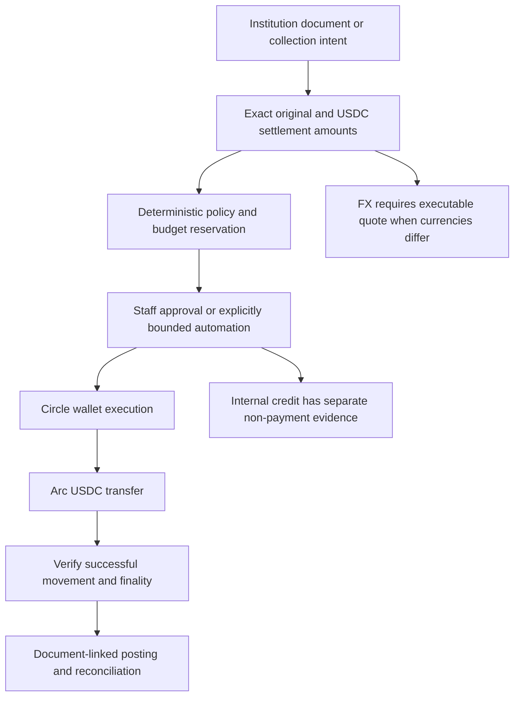
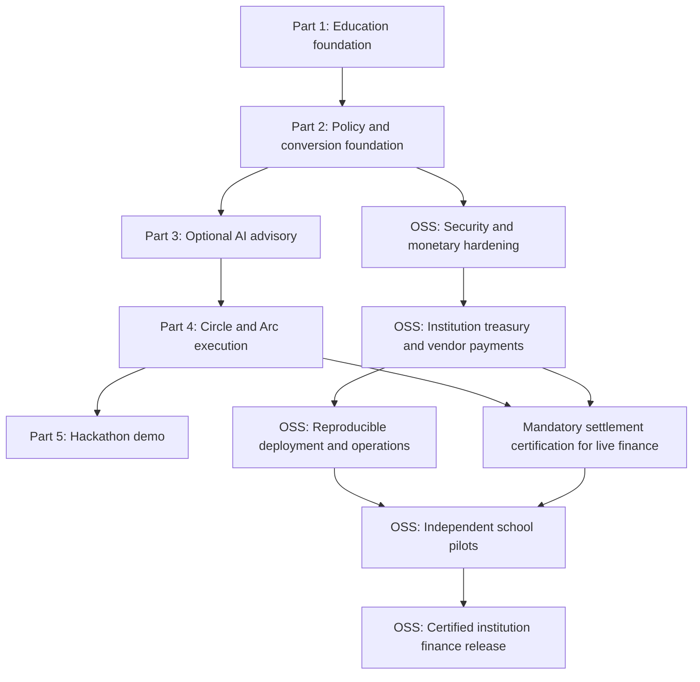
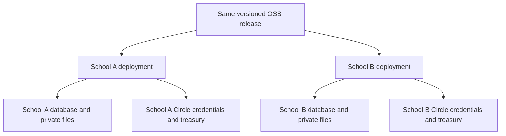
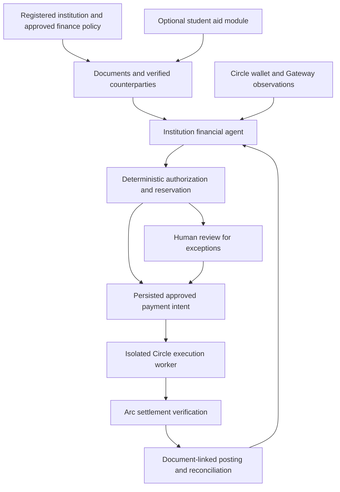
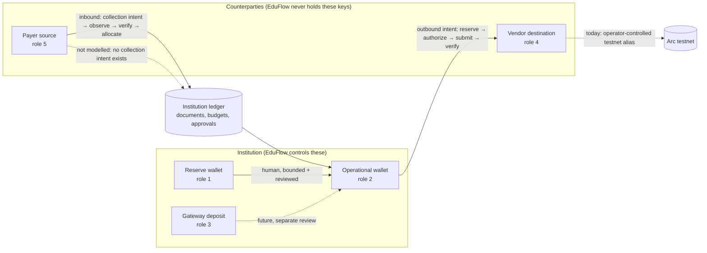
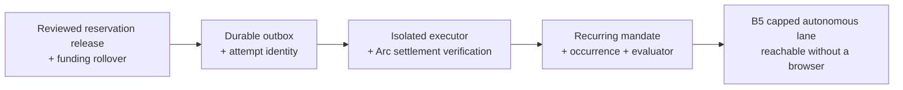

# EduFlow AI — Project Plan & Architecture Roadmap

**Tagline:** Open-source institutional finance agent and payment orchestration, powered by Circle Agent Stack and USDC settlement on Arc.

**Document scope:** Parts 1–5 describe the existing implementation and developer demos. Sections 5–11 define the institution-ready OSS release track; Section 12 records Circle/Arc research and the institution-first architecture; Section 13 catalogs wider operational events. **Section 14 is the authoritative current hackathon pilot scope, delivery order and acceptance contract.** It supersedes older demo priorities, not financial safety or production release gates. **Section 15 answers who holds a student or vendor wallet and why the two counterparty legs are unmodelled; it constrains Section 6.1's capability claims but does not expand the Section 14 pilot.** **Sections 16–18 record current delivery state: the rebuilt admin and finance dashboards (§16), the end-to-end fee-to-vendor trace with per-step build status (§17), and the bounded autonomous lane design and its blockers (§18).** Proposed capabilities are not shipped features; a completed demo milestone is not a production-readiness claim.

## Where Things Stand — Start Here in a New Session

**Delivered and tested (2026-10-10):** Section 16 — both Filament panels rebuilt against this
plan. 1282 Pest tests pass (3 skipped). No payment path was enabled by that work.

**Not built, in dependency order — this is the critical path:**

1. **Funding-window rollover** — still open. A window expires in 15 minutes and cannot be
   reopened; `PrepareFundingWindow` refuses while any approval exists. **This blocks the
   autonomous lane, not the human lane**: a supervised approval can use its window in place.
2. Durable **outbox + attempt identity** — **delivered**, see below.
3. **Isolated executor + Arc settlement verification** (§17 step 12). Every `evidence()`
   still hardcodes `can_execute: false`. This is now the only blocker to the §14.4 Step 4
   target.
4. **Bounded autonomous lane** (§18) — depends on 1 and 3.
5. **Inbound collection** (§12.5, §15.6) — entirely unmodelled; no payer identity exists.

**Ordering correction (2026-10-10):** an earlier revision listed rollover first. That was
wrong. Rollover is an unattended-operation blocker; the §14.4 Step 4/5 human lane already
has its 15-minute window in hand. The outbox was therefore built first, and the executor is
the single remaining blocker to the current delivery target.

**Delivered (2026-10-10): durable submission outbox and attempt identity.**
`PaymentSubmissionOutbox` is written inside the authorization's own transaction, so an
approved payment can never exist without a durable obligation to submit it — the
commit-to-broker gap is closed by construction rather than by a retry. Identity
(`request_key`, `provider_idempotency_key = eduflow:{request_key}`, and every bound digest)
is immutable and stable across replays; only queue progress moves, and a concluded entry can
never be reopened. `PaymentSubmissionAttempt` is append-only with dense numbering, so a gap
means a lost write rather than a silent skip. The submission key is a UUIDv5 derived from the
authorization digest, so re-running the same review recomputes the same identity instead of
minting a second owed payment. A simulated (fake-driver) approval is deliberately **not**
queued: rehearsal must never become work a rail could act on. The runtime
(`EDUFLOW_SUBMISSION_ENABLED`) defaults off and refuses a `sync` connection; the worker
re-reads authority rather than trusting the enqueue moment, treats an expired approval or
expired worker lease as `unknown` to be reconciled rather than retried blindly, honours the
stop switch without erasing evidence or releasing a hold, and **submits nothing** — no
executor ships, so each pass records one append-only attempt and concludes `blocked` with an
explicit reason. `can_execute`, `payments_submitted` and `external_funds_locked` stay false
throughout.

**Delivered since the dashboards (2026-10-10): reviewed reservation release.**
`PaymentReservationRelease` + `PaymentReservationReleaseReview`, append-only, maker/checker
where neither the proposer nor the original holder may decide. Capacity comes back without
rewriting the hold or its cumulative chain: `ReservationCapacity` distinguishes the
historical `chainTotal` (what was held, in order, reproducible forever) from
`consumingTotal` (what is unavailable now). An authorized hold can never be released, a
release frees capacity but never money, and `ProposePaymentIntentChange` now unblocks once
the hold is released. `can_execute` remains false throughout.

**Three corrections a new session must not regress on:**

- **The planner cannot choose bills.** `DepartmentBudgetPlanner` walks a closed, staff-selected
  set (`bill_ids`) in due-date order. It may only say *of the bills you approved, these fit
  today's headroom*. There is no bill discovery, ranking or selection anywhere.
- **No model runs in the finance decision path.** Every `AgentDecision::create()` site is the
  legacy *student assistance* path. The vendor-payment chain is deterministic PHP only.
- **A standing mandate, not an agent, decides automatic payments** (§18.1). The SDK's
  `Approvable` seam is for *interactive* approval; the autonomous lane must be sessionless
  and model-free.

**Open decisions for the owner:** §11 items 6 and 7.

**Product direction confirmed by the owner:** Circle Agent Stack and Arc USDC are the primary finance execution infrastructure, not an optional side feature. Keep MIT and one institution per self-hosted instance. Keep **Circle Agent Wallets through Lepton for this hackathon**; Developer-Controlled Wallets remain a later institutional deployment decision. The first finance pilot must operate with zero students. Installation, fake simulation and read-only previews must not submit payments; actual testnet execution requires separate explicit authorization. Mainnet and real college fund movement remain out of scope. LLM advisory stays optional.

**Operating model clarified by the owner:** cashier is the institution's receipt/transaction intake hub; finance/accounting staff supervises event-driven background work and receives approval notifications. Approved recurring bills may run automatically on testnet within a separately reviewed standing mandate. Background activity must not depend on an open browser or a human chat prompt. Sections 14.7–14.10 define this target; no scheduler, supervisor UI or payment authority is enabled by documenting it.

**Current hackathon focus:** Answer **what should the institution do with student fees already collected?** Review realized aggregate fee receipts and propose their use within an existing approved allocation; this is not an assistance-request workflow or a new student payment portal. Fee collections and budget planning run in shadow/parallel mode, starting with **one college department, its approved budget and approved bills due over the next couple of weeks**. Use staff-verified aggregate realized receipts or approved opening funds, not a new student payment portal. The college keeps collecting and paying in local currency through its existing process. Each eligible admin-approved bill must produce a linked, verified USDC mirror payment on Arc testnet; read-only analysis plus an unrelated transfer is not completion. Add a separately approved, small capped testnet-only lane for existing recurring obligations after the human-approved path is safe. Confirm the selected problem with college staff before expanding. See [Section 14](#14-college-shadow-pilot--hackathon-execution-contract).

---

## 1. Executive Summary & Core Concept

EduFlow is an institution-owned financial agent: it observes collections and obligations, plans cash use, applies approved spending policy, submits payments through Circle, and reconciles settlement on Arc. Student aid is one workload alongside vendor invoices, donations, subscriptions, and reimbursements—not the agent's identity or startup requirement.

USDC on Arc is the primary operational settlement asset. Institutions may still keep bills and statutory accounts in domestic currency. Current `CurrencyCode` supports USDC, USD, PHP, EUR, GBP, CAD, SGD, and INR; AUD and NGN remain expansion targets. Native-fiat accounting, executable FX and local-bank off-ramps are not complete. USDC settlement does not itself satisfy local payroll, tax, custody or accounting requirements.

Target architecture separates responsibilities:
- **EduFlow control plane:** Institution identity, counterparties, payable/receivable documents, budgets, reservations, approvals, bounded planning and document-linked accounting evidence.
- **Circle execution plane:** Agent Wallet operations through Lepton; product-specific Wallets, Gateway, CCTP and App Kit capabilities through reviewed adapters. These services move/sign value; they do not know the school's procurement or funding restrictions.
- **Arc settlement plane:** USDC movement, successful execution and deterministic finality. Independently reconcile intended payments against matching evidence; onchain correctness does not prove vendor ownership or goods delivery.
- **Currency/reporting plane:** Exact source/settlement amounts and fees with immutable quote snapshots when conversion occurs. Indicative display rates never authorize an FX trade. Internal tuition credits never imply a USDC or bank transfer.

The product serves school operations, not only accounting or student aid. Finance events
include an expiring learning-platform contract, urgent facility repair, conflicting
purchase commitments, restricted grant receipt, enrollment collection exception or
vendor destination change. Each needs a documented response and accountable owner;
not every event needs a payment or an AI model. Section 13 defines concrete examples.

EduFlow introduces an **institution-first bounded agent loop**:
> Observe verified balances and documents; reconcile collections; forecast liquidity; propose payment intents; authorize and reserve deterministically; request human review for exceptions; submit through Circle; verify Arc settlement; post accounting evidence.

The existing vendor cycle works independently of student records. C0 now also constructs
the AI operator without an assistance fund or policy and provides read-only institution
inspection. Live vendor-payment safety remains C1/C2 work; student aid is an optional
capability, not the general treasury context.

### Non-Negotiable Security Principles
1. **No Direct LLM Fund Control:** The Large Language Model (LLM) **never** has direct access to private keys or direct authorization to move funds. All decisions are evaluated against deterministic PHP rules and dual-ledger database state.
2. **Fixed-Point Base-Unit Math — Required Release Invariant:** Payment amounts use exact 6-decimal USDC units; currently supported fiat uses 2 decimals. Arc native balances, gas and residuals use 18-decimal integer quantities stored as strings/arbitrary-precision values, never PHP floats or 64-bit casts. Native and ERC-20 interfaces expose the same USDC balance. Legacy treasury/payment floats and two-decimal storage remain gaps.
3. **Locked Exchange Rate Snapshots:** Every decision, reservation, and transaction records an immutable snapshot of the exchange rate, rate provider, and timestamp.
4. **The LLM Is a Proposer, Not an Authoriser:** Model output is advisory only. It may tighten a decision but never loosen one. Every money-moving path is gated by a deterministic predicate evaluated in PHP — see Part 3 §3.1 and §3.2.
5. **A Stored Hash Is a Claim, Not Proof:** Settlement requires successful execution, matching chain/asset/sender/recipient/amount, and the rail's documented finality evidence. Transaction lookup alone is insufficient. Missing lookup results are pending or unknown until investigated, not automatically proof of fabrication. The database ledger is never presented as on-chain funds.

---

## 2. Multi-Currency Architecture



### Supported Currencies & Precision Matrix

| Currency | Code | Type | Minor Unit Decimals | Multiplier ($1.00$) |
|---|---|---|---|---|
| **USD Coin (Settlement)** | `USDC` | Stablecoin | 6 | `1,000,000` |
| **US Dollar** | `USD` | Fiat | 2 | `100` |
| **Philippine Peso** | `PHP` | Fiat | 2 | `100` |
| **Euro** | `EUR` | Fiat | 2 | `100` |
| **British Pound** | `GBP` | Fiat | 2 | `100` |
| **Canadian Dollar** | `CAD` | Fiat | 2 | `100` |
| **Singapore Dollar** | `SGD` | Fiat | 2 | `100` |
| **Indian Rupee** | `INR` | Fiat | 2 | `100` |

---

## 3. Multi-Part Implementation Roadmap



---

### Part 1: Education Data Foundation & Request Intake (COMPLETED)
- [x] **Data Foundation:**
  - `Student` model linked to `User` with student number, program, year level, academic status, and attendance rate.
  - `AcademicTerm` model with calendar boundaries and `isActive()` evaluation.
  - `TuitionAccount` model storing integer base-unit USDC amounts (6 decimal places) with computed remaining balance.
  - `AssistanceRequest` model with UUID `submission_key` idempotency constraints and non-negative database triggers.
  - Database migration `2026_09_27_090000_create_education_tables.php`.
- [x] **Access Control:**
  - Extended `RoleEnums` with `STUDENT` and `FINANCE_OFFICER`.
  - Restricted Filament panels: `/finance` for finance officers/admins, `/admin` for super admins only.
  - Allowlisted user activity logging to prevent credential/secret leakage.
- [x] **Student Interface (React / Inertia 3):**
  - Student dashboard at `/student/dashboard` displaying tuition balance and request history.
  - Assistance request form at `/assistance/create` with decimal USDC validation (up to 1,000,000 max).
  - Assistance detail page at `/assistance/{id}` with clear status tracking.
- [x] **Staff Review Panel (Filament 5):**
  - Dedicated `FinancePanelProvider` at `/finance` with `AssistanceRequestResource`.
  - Read-only table and infolist showing exact 6-decimal USDC values, student academic standing, and tuition accounts.
- [x] **Testing & Validation:**
  - Previously reported: 249 passing Pest tests (1,144 assertions) across unit, feature, authorization, and lifecycle suites.
  - Previously reported: clean TypeScript compilation (`npm run types:check`) and Vite asset bundling. Historical counts are not current OSS release evidence; each release needs fresh CI results.

---

### Part 2: Deterministic Policy Engine & Multi-Currency Conversion (COMPLETED)

#### Objectives
1. **Currency Conversion & Exchange Rate Layer:**
   - `CurrencyRate` model and repository storing live and fallback exchange rates against USDC.
   - `CurrencyConverter` service converting between USDC base units and any supported fiat/crypto currency using integer scaling.
   - Exchange rate quote expiration and locking (`quote_id`, `rate`, `quoted_at`, `expires_at`).
   - Multi-currency display formatting utility for frontend and Filament panel (e.g. `$100.00 USDC ≈ ₱5,750.00 PHP` or `€92.50 EUR`).
2. **Institutional Assistance Funds & Policies:**
   - `AssistanceFund` model with reserve threshold ($5,000 USDC$) and daily budget limits ($1,000 USDC$).
   - `AssistancePolicyVersion` model with versioned rules for enrollment, GPA, attendance, and semester caps.
3. **Deterministic `EvaluateAssistancePolicy` Action:**
   - Check enrollment status (`enrolled`).
   - Check academic status (`qualified` or threshold GPA).
   - Check attendance threshold (e.g. $\ge 85\%$).
   - Check outstanding tuition balance ($> 0$).
   - Check student semester assistance cap.
   - Check fund minimum reserves and daily budget.
4. **Autonomous Limit vs. Human Review Split:**
   - Single autonomous limit: **$100.000000 USDC** (or converted local currency equivalent at locked rate).
   - Example ($150 USDC requested / ~₱8,625 PHP):
     - Automatic approved portion: **$100.000000 USDC** (~₱5,750 PHP).
     - Escalated human-review portion: **$50.000000 USDC** (~₱2,875 PHP).
     - Status: `partially_approved` with pending escalation.
5. **Agent Decisions & Dual-Currency Audit Logs:**
   - `AgentDecision` capturing exact evaluation rules, pass/fail checks, locked exchange rates, and split amounts.
6. **Filament Staff Actions:**
   - Staff review and one-click approve/reject actions for the escalated human-review portion in the Finance Panel.

#### Planned Files
- `app/Enums/CurrencyCode.php`
- `app/Models/CurrencyRate.php`
- `app/Services/CurrencyConverter.php`
- `app/Models/AssistanceFund.php`
- `app/Models/AssistancePolicyVersion.php`
- `app/Models/AgentDecision.php`
- `app/Actions/EvaluateAssistancePolicy.php`
- `app/Actions/ApproveEscalatedRequest.php`
- `app/Filament/Resources/AssistanceRequests/Actions/ApproveEscalatedAction.php`
- `tests/Feature/CurrencyConverterTest.php`
- `tests/Feature/PolicyEvaluationTest.php`

---

### Part 3: AI Agent Layer (Laravel AI SDK)

**Status: SDK installed; advisory layer and approval seam shipped and tested.**

`laravel/ai` v1.0.1 is installed. The four agents, two tools, and advisory boundary exist;
the plan previously reported 27 adversarial tests. Advisory and conversational wiring
are described below. These implementation milestones do not certify production safety
or external-provider availability; fresh release CI remains required.

Shipped:
- `AssistanceAssessor`, `TreasuryAnalyst` — `HasStructuredOutput`, advisory only.
- `AskEduFlowAgent` — conversational, read-only, no tools.
- `SettlementOperator` — `Conversational` + `HasTools`, proposes via tool calls.
- `DisburseAssistance` — `Approvable`; `needsApproval()` **is** the policy engine, and
  `handle()` re-evaluates rather than trusting the earlier verdict.
- `RecordHardshipContext` — not approvable, writes advisory only.
- `AdvisoryEnvelope` / `AdvisorySanitizer` / `AdvisoryGate` — allowlist, fail-closed.

Two findings from reading the SDK rather than assuming it:
- An agent that pauses a tool must be `Conversational` (or be handed history via
  `withMessages`), or resuming throws `ApprovalNotResumableException`. `SettlementOperator`
  uses `RemembersConversations` for exactly this reason.
- `continue()` and `continueOrStart()` do **not** verify participant ownership. Any route
  resuming a conversation must call `ConversationStore::conversationBelongsTo()` first.

Also shipped: admin-configured providers. `ai_providers` holds endpoints with an
encrypted `api_key` cast, managed under `Settings -> AI Providers` (any SDK driver,
including `openai-compatible` for Ollama, LM Studio, vLLM, LiteLLM or a gateway).
`AiProviderResolver` resolves an admin provider ahead of `.env`, per request, and
`AiSettings` gates every call behind two separate switches plus an opt-in for settlement
proposals. Keys are never rendered back into the edit form.

The advisory gate is wired in. `EvaluateAssistancePolicy::recordDecision()` writes the
authoritative decision row first, then attaches commentary under a namespaced `advisory`
key. The existing implementation calls `AdvisoryGate::assessHardship()` synchronously;
that gate calls `prompt()`. Failure can leave the deterministic verdict intact, but a
slow provider can still delay the caller. Moving advisory work to a durable queue after
commit is an OSS release gate, not an already-satisfied invariant. Prior live gateway
checks are development observations, not reproducible release evidence.

Verified live against 9Router, which shaped two design decisions. It ignores
`response_format: json_schema`, so agents also request the JSON shape in their
instructions and the gate decodes a string response. And `AiProviderResolver` must return a
built `Provider` instance rather than the driver name, because a bare name resolves against
`config/ai.php` and fails with "requires a default text model".

`AskEduFlow` is now conversational. The deterministic answer is computed first and is always
the floor; `StudentBrief` hands the model the facts *and* that explanation, and `QnaGate`
replaces the text only when `BriefGuard` finds every figure in the response inside the brief.
Verified live against the configured gateway: it rephrases the split explanation correctly,
refuses to discuss moving funds, and a fabricated balance falls back to the computed figure.
`conversationBelongsTo()` is called inside the gate, not at the route, so no caller can skip it.

Replacing the matcher also surfaced a live routing bug. `str_contains($q, 'usd')` matched
"USDC", so any question quoting an amount was answered about exchange rates, and `'aid'`
matched inside "paid". `answer()` and `query()` also carried separate keyword chains that had
drifted apart, so a question could be answered from the policy and labelled `general`; there is
now one `classify()`.

The approval-resume endpoint is in place. `ApprovalResumeGate` is the only route from a human
decision to a paused tool call, and holds six checks: role through the Gate, conversation
ownership, pending-set subset, a tool allowlist that never constructs `Decision::edit()`, target
provenance read from the stored pause rather than the payload, and the settings gate. The request
body is only ever `id => bool`, so there is no field through which an amount or recipient could
arrive. A replay returns `nothing_pending` rather than paying again, and every settlement in the
response is flagged as requiring on-chain verification.

Verified by mutation: removing the ownership check turns 3 tests red, the tool allowlist 1, the
pending-set subset 1, and the replay short-circuit 1.

Building it surfaced a latent defect. `app(SettlementOperator::class)` returns an agent holding
*blank* Organization, AssistanceFund and AssistancePolicyVersion records, because Eloquent models
take no constructor arguments and the container instantiates them anyway. Its `primaryWallet()` is
null, so `DisburseAssistance::handle()` refuses with "The organization has no active wallet" — the
right outcome for the wrong reason, and it behaves differently once a wallet row exists.
`SettlementOperatorFactory` now refuses to build an operator from non-existent records. The SDK
also binds only `ConversationStore` while implementing `VerifiesConversationOwnership` and
`ResolvesPendingApprovals`; resolving those interfaces failed until they were aliased in
`AppServiceProvider`.

Remaining: decide whether to wire `TuitionSettlementService` into the settlement path or delete it.
It still has zero callers.

#### 3.1 Three-Tier Authority Model

The LLM is a *proposer*, never an authoriser. Authority is split into three tiers and the
boundary between them is enforced in PHP, not in a prompt.

| Tier | Owner | Examples | Can move funds? |
| --- | --- | --- | --- |
| **Deterministic** | PHP, non-negotiable | limits, reserve math, daily caps, FX rate locking, auto-vs-escalate, vendor allowlist, signing | Only after all checks pass |
| **Advisory** | LLM, clamped by PHP | hardship category, urgency, confidence, review priority, narrative, anomaly flags | Never |
| **Prohibited** | — | approved amount, policy verdict, key material, recipient selection | Never |

**One-way ratchet:** the LLM may only *tighten* a decision. If the deterministic engine
returns `ESCALATE`, no model response can downgrade it to `AUTO_APPROVE`. Any code path
where model output could loosen a decision is a defect.

#### 3.2 The Seam: `Approvable` Tools

The SDK's `Approvable` contract maps directly onto bounded autonomy. An `Approvable` tool
pauses the run before executing, and `needsApproval(Request): Approval|bool` is evaluated
**per tool call against its arguments**. This predicate *is* the policy engine:

```php
class DisburseAssistance implements Approvable, Tool
{
    use InteractsWithApprovals;

    /**
     * The deterministic policy engine, evaluated per call.
     * Within limits -> executes autonomously. Over limit -> pauses for a human.
     */
    protected function needsApproval(Request $request): Approval|bool
    {
        $result = $this->policy->evaluateStudentAssistance(
            requestedAmount: $request['amount'],
            org: $this->org,
            wallet: $this->wallet,
        );

        return $result->isAutoApproved()
            ? false
            : Approval::required($result->reasoning);
    }
}
```

The model decides *what to propose*; `needsApproval()` decides *whether a human must sign*.
This replaces the current arrangement where the agent writes directly to
`CircleWalletService` — the transfer becomes a tool call that cannot bypass approval.

#### 3.3 Structured Output as the Contract

`HasStructuredOutput` with `schema(JsonSchema $schema)` produces schema-validated output,
removing the hand-rolled `validateSchema()` in `DecisionExplainer`. The advisory schema is
an **allowlist** — advisory fields only, never `approved_amount` or `decision`:

```php
public function schema(JsonSchema $schema): array
{
    return [
        'hardship_category' => $schema->string()->enum([
            'medical', 'academic_materials', 'tuition_shortfall', 'living_costs', 'other',
        ])->required(),
        'urgency' => $schema->string()->enum(['standard', 'high'])->required(),
        'confidence' => $schema->number()->min(0)->max(1)->required(),
        'narrative' => $schema->string()->required(),
        'anomaly_flags' => $schema->array()->items($schema->string())->required(),
    ];
}
```

Unknown keys returned by the model are dropped before the payload reaches the policy
engine, so a prompt-injected `"approved_amount": 999999` is discarded.

#### 3.4 Agents to Build

| Agent | Type | Role | Authority |
| --- | --- | --- | --- |
| `AssistanceAssessor` | `HasStructuredOutput` | Classify hardship, score urgency, flag anomalies | Advisory only |
| `TreasuryAnalyst` | `HasStructuredOutput` | Forecast narrative, explain reserve risk | Advisory only |
| `AskEduFlow` | `Conversational` + `RemembersConversations` | Student Q&A over balance, rates, policy | Read-only |
| `SettlementOperator` | `HasTools` (Approvable) | Propose disbursements as tool calls | Gated by `needsApproval()` |

All four use `Promptable`. `AskEduFlow` uses `RemembersConversations` so chat history
persists to the SDK's `agent_conversations` tables, replacing the stateless `fetch()` POST
in `resources/js/components/ask-eduflow.tsx`.

#### 3.5 Non-Negotiable Invariants

1. **No tool reaches `CircleWalletService` without passing `needsApproval()`.** Every
   money-moving tool implements `Approvable`.
2. **No model output is trusted for arithmetic.** All amounts are integer base units
   computed in PHP. The model never sees or emits an approved figure.
3. **Rate locking stays in PHP.** The model may explain a locked quote; it cannot create one.
4. **The agent must not run in the synchronous settlement path.** Advisory calls use
   `->queue()->then()->catch()` so a provider timeout degrades to the deterministic path
   rather than blocking a payment.
5. **Fail closed.** A missing, malformed, or schema-violating response is treated as
   "no advisory available" and the deterministic engine proceeds alone.
6. **Conversations are not authorisation.** The SDK's `continue()` / `continueOrStart()`
   do not verify participant ownership; the app must call
   `ConversationStore::conversationBelongsTo()` before resuming.

#### 3.6 Provider Strategy

`config/ai.php` supports OpenAI, Anthropic, Gemini, Azure, Bedrock, Groq, xAI, DeepSeek,
Mistral, Ollama, OpenRouter, and `openai-compatible`.

- **Demo without a key:** the `openai-compatible` driver can target a local Ollama or
  LM Studio endpoint, so the AI layer runs in a hackathon demo with no paid API key.
- **Production:** `ANTHROPIC_API_KEY` or `OPENAI_API_KEY` via the SDK's **Failover**
  support, so a provider outage degrades instead of failing.
- Provider selected through the `Laravel\Ai\Enums\Lab` enum rather than raw strings.

#### 3.7 Testing Strategy

`Agent::fake()` removes the network from the test suite entirely — no API key, no cost,
no flakiness:

```php
AssistanceAssessor::fake([['hardship_category' => 'medical', 'urgency' => 'high', ...]]);

// Faking a paused tool call, to assert the human-in-the-loop path
SettlementOperator::fake([
    AgentResponse::fakeWithPendingApprovals([
        new PendingApproval(id: 'call_abc', tool: 'DisburseAssistance', arguments: [...], reason: '...'),
    ]),
]);
```

Faking a structured agent without explicit responses auto-generates schema-conforming
data. Required adversarial tests:

- Model returns `approved_amount` → assert it is discarded, not applied.
- Model returns a verdict of `auto_approve` for an over-limit request → assert the
  ratchet holds and the call still escalates.
- Model returns malformed JSON → assert fail-closed and deterministic fallback.
- Model times out → assert no payment is blocked and nothing is half-written.
- Prompt-injected student statement attempting to override policy → assert inert.

#### 3.8 Planned Files

All shipped. `tests/Feature/Ai/AdversarialAgentTest.php` covers the five scenarios in
3.7, `tests/Feature/Ai/ApprovalRatchetTest.php` the approval seam, and
`tests/Feature/Ai/AiProviderAdminTest.php` plus `tests/Feature/Filament/AiProviderAdminUiTest.php`
the admin provider configuration and key encryption.

Remaining release work:
- Move advisory calls out of synchronous evaluation and settlement paths.
- Approval-resume endpoint, verifying conversation ownership, staff authority, and fresh policy checks (3.5.6).
- Re-run advisory and conversational boundary tests with no provider configured.

---

### Part 4: Circle / Arc USDC Settlement Layer & FX Off-Ramp Rails (IN PROGRESS)

**Status: Circle / Arc transfer and hash-reconciliation integration exists; production settlement certification and local-currency off-ramping remain incomplete.**

Shipped:
- **Lepton Agent Wallet** via the published `yukazakiri/lepton-agent` package. No CLI
  strings in application code; gateways are injected via contracts.
- **Programmable Disbursements:** the autonomous $100 USDC portion dispatches through
  `CircleWalletService`; the $50 remainder dispatches only after a human authorises it in
  the `/finance` panel via `ApproveEscalatedAction`.
- **Settlement Provenance:** transactions record gateway, base units, explorer URL,
  and simulation metadata. `CircleWalletService::executePayment()` currently writes
  `CONFIRMED` immediately after the gateway returns; production must distinguish
  submission from verified settlement.
- **Reconciliation:** `php artisan lepton:reconcile` checks hashes via
  `eth_getTransactionByHash`, with a Circle history fallback. Existing verdicts are
  `verified` / `fabricated` / `unverifiable` / `ledger_only`; these legacy labels need
  stronger evidence and pending/unknown states before live use. See Sections 5 and 8.
- **Operations truth:** `php artisan lepton:doctor` reports CLIs, Circle auth, treasury
  identity, funding, chain reads, and ledger-versus-chain drift.

Outstanding:
- **Internal Tuition Credit:** `TuitionSettlementService` is now called by escalated
  assistance approval on this branch. It still requires a treasury wallet, uses USDC
  account amounts and lacks atomic/idempotent posting. This is an internal credit, not
  a wallet-free production rail or fiat off-ramp; it does not replace Arc settlement.
- Real Arc Testnet funding: the ledger balance is a demo figure, not on-chain funds.
  Reconciliation must stay honest about the difference rather than presenting the ledger
  as settled.

---

### Part 5: Hackathon Demo & End-to-End Verification

**Current college pilot:** Follow Section 14, not the legacy student-aid walkthrough below.
The target is staff using one department's real approved bills and budget, with each
permitted approval connected to a verified Circle Agent Wallet payment on Arc testnet.
C0 preview and C1 drafts/policy activation alone cannot execute this target.

- **Primary walkthrough (target; remaining C1/C2 work required):**
  1. Show the agreed departmental budget, staff-verified opening funds/realized receipts and
     anonymized bills, all retaining their original local currency and document references.
  2. Explain a pay/hold/escalate proposal with exact source amount, approved USDC mirror
     mapping, policy checks, remaining allocation, reserve/fee protection and due date.
  3. Let authorized finance staff approve or reject. A requested material edit requires a
     reviewed replacement proposal and fresh authorization, not mutation of an approved intent.
  4. Execute each eligible approval through the existing Circle Agent Wallet on `ARC-TESTNET`;
     keep the college's actual payable and bank-payment status unchanged.
  5. Verify successful matching Arc movement/finality, link explorer evidence to the decision,
     and repeat the cycle without another payment.
  6. After explicit standing-policy approval, show one eligible recurring bill using the small
     capped autonomous testnet lane and another requiring human review or a policy hold.
  7. Record staff usage with permission and report approve-as-is/edit/reject/hold counts,
     automatic-versus-escalated decisions and review time against a recorded baseline.

**Legacy assistance developer demo (retained; not current college pilot):** Amounts below
are illustrative policy examples, not installation defaults. Read the active policy and
current fixtures for the actual split. Fake and testnet runs must be labelled separately;
neither proves mainnet or local-bank readiness.

- **Legacy Assistance Walkthrough (3–5 Minutes):**
  1. **Student Login:** Juan logs in, seeing a tuition balance displayed in both local currency (e.g., `₱17,250 PHP`) and `300.00 USDC`.
  2. **Assistance Request:** Juan submits an emergency request for `150.00 USDC` (`₱8,625 PHP`).
  3. **Autonomous Evaluation:** Policy engine runs instantly:
     - Verifies enrollment (✓), attendance 95% (✓), academic standing (✓), outstanding balance (✓).
     - Checks autonomous limit ($100.00 USDC / ₱5,750 PHP).
  4. **The Split Decision:**
     - Deterministic policy approves `$100.00 USDC` immediately; the model has no approval authority.
     - Escalates `$50.00 USDC` to human review with exact policy reasons.
  5. **Disbursement & Conversion:**
     - Simulates or executes Circle/Arc testnet payment of $100 USDC to Juan's wallet.
     - Displays live conversion quote and transaction receipt.
  6. **Admin Review:**
     - Finance officer logs into `/finance` and views Juan's escalated request with complete AI reasoning and locked exchange rate.
     - Administrator approves the remaining $50 USDC.
  7. **Audit & Explanation:**
     - EduFlow answers: *"Why didn't you send the full $150 USDC initially?"*
     - Agent explains the institutional threshold and currency conversion breakdown.

---

## 4. Technology Stack

- **Backend:** Laravel 13, PHP 8.5, SQLite (dev/test) / PostgreSQL (production), Laravel Octane
- **Frontend:** React 19, Inertia.js v3, Tailwind CSS v4, Radix UI, shadcn/ui, Lucide Icons
- **Admin & Operations:** Filament v5, Spatie Permission & Shield, Spatie Activitylog
- **AI:** `laravel/ai` (official Laravel AI SDK) — agents, structured output, tools,
  human tool approval, conversation memory. See Part 3.
- **Agent Infrastructure:** `yukazakiri/lepton-agent` — Circle Agent Stack + Arc gateway.
  Contracts for wallets, Arc RPC, and x402; `circle` and `fake` drivers.
- **Testing:** Pest 5, Pest Agent Plugin, PHPUnit, `Agent::fake()` for AI
- **Routing & Types:** Laravel Wayfinder, TypeScript 5.9
- **Web3 & Currency:** USDC, Circle Agent Wallets, Arc Testnet, Multi-Currency Fixed-Point Math

---

## 5. OSS Readiness Review — Verified Gaps

**Review basis:** Repository source and configuration inspected on 2026-10-02. This is
not a full security audit, live settlement test, or PostgreSQL certification. `.env.example`
exists but editor privacy rules blocked reading it; its defaults are unverified. Existing
implementation work is preserved. Findings below describe the original review; implementation
progress is tracked immediately after the table. No item is closed solely by changing this document.

| ID | Observed gap and evidence | Required outcome | Gate |
| --- | --- | --- | --- |
| OSS-01 | `auto-release.yml` contains a literal Graphite credential. | Revoke/rotate with its owner, replace with Actions secrets or remove integration, scan working tree and history. Removing the string alone does not revoke it. | Before public release |
| OSS-02 | `DatabaseSeeder` always calls `RolesAndPermissionsSeeder`; that seeder creates `admin@admin.com` with password `password` and superadmin rights, outside a local/testing guard. | Production seeds create roles/settings only. First admin is explicitly bootstrapped with unique credentials or expiring invitation. Test production seeding creates no default users. | Before any school deployment |
| OSS-03 | `CircleWalletService::executePayment()` takes `float`; financial models cast money to floats; legacy financial tables store `decimal(15, 2)`. `EvaluateAssistancePolicy` converts base units to two-decimal floats and casts a daily sum before scaling. | Exact minor-unit money representation across decisions, caps, balances, postings, and gateways. Audit and migrate legacy precision; do not assume rounded historical values can be recovered. | Before production financial use |
| OSS-04 | Payment gateway call precedes wallet/transaction persistence; transfer options omit `idempotencyKey`. `ApproveEscalatedRequest` pays before its later state updates. | Durable payment intent, atomic reservation, unique fulfilment identity, stable provider idempotency, crash recovery and reconciliation before retry. | Before external payments |
| OSS-05 | `LeptonReconciliationService` marks any returned transaction array verified, without execution success or amount/recipient matching; null lookup becomes fabricated; Circle fallback searches only 200 records. | Successful receipt/finality plus expected payment matching; distinguish pending, unknown, reverted, and mismatched. Paginated provider evidence or unresolved status when evidence is incomplete. | Before live USDC |
| OSS-06 | Staff dashboards/widgets use `Organization::first()`; students and academic terms have no institution ownership column in the education migration. | Enforced one-institution installation for initial OSS release; explicit installation institution resolver. No shared-database multi-school claim. | Before school pilots |
| OSS-07 | `CurrencyConverter` uses static fallback rates, assumes USD parity, and creates a new 15-minute snapshot timestamp independently of the source rate expiry. | Separate indicative display rates from executable quotes; preserve source timestamps/expiry, rounding, fees and spread. Hold real FX when valid quote unavailable. | Before FX-sensitive payments |
| OSS-08 | Original review: `TuitionSettlementService` had no caller and wrote a two-decimal transaction amount. It is now wired on this branch but remains wallet-dependent and lacks atomic/idempotent fulfilment. | Tested internal credits with exact money, account ownership/term checks and no duplicate or excess posting; never label a ledger offset as external settlement. | Before enabling internal-credit module |
| OSS-09 | `EvaluateAssistancePolicy` invokes advisory synchronously through `prompt()`. AI switches default off in `AiSettings`. | Keep AI off by default; queue advisory after durable decision commit. Slow/unavailable AI must not delay approval or fulfilment. | Before enabling AI in pilots |
| OSS-10 | Dockerfile uses Bun without a frozen lock, frontend PHP from distro packages, `--ignore-platform-reqs`, starter-kit branding, and an amd64-only helper. Entrypoint checks `/var/www/html` while image root is `/app`. No Compose file found. | Clean, reproducible production image and deployment bundle; matching runtime paths, real platform checks, non-root operation, documented services and architecture support. | Before container release |
| OSS-11 | README is demo-focused; installation docs and `version.json` still identify KoamiStarterKit. Composer hooks enable Blog and run starter-kit setup. `.gitattributes` excludes README from archives. | Product identity and release metadata agree. School installation preserves application code, ships docs, and never invokes scaffold rewriting or demo provisioning. | Before OSS release |
| OSS-12 | CI tests SQLite through `phpunit.xml`; inspected CI has no PostgreSQL job. Auto-release runs independently of CI and tags prereleases as `latest`. Root PHP constraint/README say 8.3+, but locked Symfony 8.1 dependencies require PHP 8.4.1+. | Test actual production DB, concurrency and upgrades; publish only tested commits; isolate preview/stable channels; document a certified runtime baseline. | Before stable release |

### O0 Implementation Progress

- **OSS-01 source cleanup implemented:** Graphite integration and literal token removed.
  Workflow credential regression tests added. Owner revocation/rotation and historical
  exposure review are still required; this blocker is not fully closed.
- **OSS-02 seed safety implemented:** Role seeding creates no users in any environment.
  Explicit `DemoUsersSeeder` owns local/testing defaults; demo `DatabaseSeeder` invokes it.
  Production/staging seeding creates no users or
  demo records. `eduflow:bootstrap-admin` creates the first admin through hidden password
  prompts, refuses existing accounts/second superadmins, and records a secret-free audit.
  Existing default accounts are not deleted or reset; operators must remediate them.
- **OSS-12 release guards implemented in part:** CI no longer commits formatter/refactor
  changes. Preview publication requires successful same-repository push CI and checks out
  its exact commit. Manual publication requires exact-commit CI; preview/draft releases
  cannot update stable `latest`. Ad hoc Docker publication disabled. PostgreSQL coverage,
  runtime/image certification and supply-chain attestations remain open.
- Operator bootstrap/release notes added to README; source archives now retain README
  and changelog instead of excluding them. Foundation PR introduced no schema migration,
  dependency change, live payment or shared-institution tenancy.
- **OSS-06 selection/setup implemented in part:** `InstallationInstitution` uses persisted
  installer identity or matching explicit `EDUFLOW_INSTITUTION_ID`, and exactly one
  organization; missing/invalid/ambiguous context fails closed. Dashboards, wallet doctor
  and settlement operator factory no longer choose `Organization::first()`.
- **Installer foundation:** `eduflow:install` initializes institution/settings through a
  locked DB transaction, without migrating, demo seeding, admin creation or wallet/provider
  I/O. Identical retry preserves state; explicit adoption required for legacy institution;
  conflicting identity/metadata refused. Initial registration, impersonation and AI disabled.
  Settings migration adds persisted installation identity. Eloquent creation of a second
  institution blocked after setup; raw DB access is outside that guard.
- Registration GET/POST now respects disabled registration for installed schools; signup
  still cannot provision staff rights or enrollment. Country validation is code-format
  only. Native-fiat ledger, complete ownership/backfill, data imports and rail safety remain
  open; institution currency metadata alone does not convert legacy USDC accounting.
- **OSS-03 exact-money foundation implemented in part:** Readonly `Money` DTO parses
  plain decimal strings with currency precision/range checks, performs checked arithmetic,
  formats without floats and serializes minor units as strings. Intake uses it and rejects
  invalid amount limits even when called outside a Form Request. Converter uses existing
  Brick Math for overflow-safe integer intermediates. Legacy decision/treasury/payment
  float APIs and two-decimal DB columns remain open; no money schema cutover yet.
- **OSS-07 rate snapshots hardened in part:** Future/expired/over-age/non-positive sources
  excluded, source timestamps/expiry preserved, display rates marked indicative. USD can
  use an actual source rate instead of forced parity. `requireFreshQuote()` rejects fallback
  or unbounded rates; all external-currency snapshots remain indicative, not provider offers
  or executable FX. No live feed/off-ramp or settlement path is certified by this change.
- **Current branch follow-up:** Valid payout-address checks, a base-unit payment entry
  point, daily base-unit snapshots and tuition-credit wiring were added. Legacy float
  balances, provider submission before durable intent and immediate `CONFIRMED` remain;
  those additions do not close OSS-03/04/05 or certify live payments.
- Next: institution-first exact treasury/reservation/payment evidence foundations, then
  a zero-student vendor-payment pilot. O0 still needs credential-owner confirmation,
  dependency/asset review and named owners.

**Strengths to preserve:** MIT already exists; deterministic policy actions, student
intake, role separation, AI opt-in settings, encrypted provider keys, Lepton contracts,
quote snapshots, and fake gateways offer a useful foundation. Do not rewrite working
modules just to introduce a new framework.

**Meaning of “any institution”:** Download, inspect, adapt, and self-host without project
permission or a central account. It does not mean every jurisdiction, currency, school
policy, bank, or payment provider is certified on day one. Publish a capability/support
matrix and grow it through pilots.

---

## 6. Product, License, and Institution Boundary

### 6.1 Initial Product Scope

**First supported finance workflow:** An institution registers its identity, binds an
institution-authorized Circle treasury, imports one verified vendor/bill and budget,
reconciles available USDC, approves or holds deterministically, submits a persisted
payment intent, verifies settlement on Arc and exports document-linked evidence.
Zero `Student`, `TuitionAccount`, `AssistanceFund` or `AssistancePolicyVersion` rows must
be required for this workflow. An AI provider is not required to execute approved policy.

The core supplements existing accounting/SIS systems. It is not a payroll calculation
engine, complete ERP or statutory general ledger. Accept payable documents from those
systems rather than rebuilding tax, payroll or procurement in the first release.
Circle/Arc readiness is mandatory for live finance; installation, read-only operation
and fake-driver simulation remain available without a funded wallet.

| Capability | First finance release target | Later / separately gated |
| --- | --- | --- |
| Institution treasury, verified counterparties, vendor bills and budgets | Zero-student operating baseline | More payable types and country templates |
| Exact money, reservations, bounded approval and evidence exports | Mandatory shared controls | ERP/SIS adapters |
| Circle wallet execution and Arc USDC reconciliation | Primary live rail; certified before launch | More custody models and chains |
| Receivables and inbound matching | Referenced USDC collections and unmatched-funds queue | Crosschain collections and regional onramps |
| Gateway unified balance and x402 service spend | Explicitly separate capabilities | Enable only after capability-specific recovery tests |
| Students, aid and internal tuition credit | Reuse existing modules; never startup prerequisites | Module-specific school acceptance |
| AI document/treasury advisory | Optional; disabled by default | Approved cloud or local endpoint |
| FX/off-ramp, escrow, Earn or Borrow | Not automatic finance capabilities | Provider/legal/security approval per capability |
| Shared hosted multi-tenancy | Not initial scope | Separate isolation/custody review |

An internal tuition credit does not move USDC. Manual bank evidence is a separate record,
not independent bank proof. A local-currency recipient needs an approved off-ramp, not
an invented wallet address or a claim that Circle automatically pays every local bank.

**Counterparty wallets are not institution wallets.** Section 15 is authoritative for who
holds a student or vendor address. The institution provisions one wallet for itself and
never custodies a student's or a vendor's funds. "Receivables and inbound matching" below
additionally requires a §12.5 inbox and an explicit payer identity; "vendor bills"
additionally require a counterparty destination **type** and the settlement predicate that
type implies — an on-chain receipt cannot close a custodian or payout-partner obligation.

### 6.2 License and Sustainable OSS

- **Keep existing MIT license.** Schools may use, modify, redistribute, or sell their
  version while retaining required notices. Do not silently relicense contributors' work.
- Audit Composer/npm dependencies, bundled assets/fonts, model weights, generated UI,
  and container contents for redistribution terms. The root MIT license does not
  override third-party licenses or make Circle/AI services open-source.
- Publish third-party notices and a software bill of materials (SBOM) with release
  artifacts. Record provenance for imported starter-kit code.
- No EduFlow license server, per-student unlock, mandatory telemetry or maintainer login.
  The institution owns its Circle account/session and pays applicable external service,
  network and ramp fees. Self-hosted OSS does not mean Circle's hosted infrastructure
  becomes self-hosted, free or available in every jurisdiction.
- Revenue options: paid hosting, deployment help, training, migration, custom adapters,
  and support agreements. Hosted service is an operating model, not a separate mandatory
  code license. MIT permits competitors to host forks; accept that trade-off.
- MIT has no warranty or support SLA. Separate commercial agreements from community
  support. Maintainer bandwidth and financial/security expertise constrain release scope.

### 6.3 One Institution per Installation First

**Recommended v1 boundary:** One institution, one installation-owned database, storage,
queue/cache namespace, encryption key, mail configuration, and institution-owned treasury context.
Two schools run two instances, even when an IT provider manages both. Never share their
provider credentials or wallet sessions. Campuses inside one legal institution may share
an instance only under the same access/data policy; separate campus wallets and scoped
campus permissions require additional design.



Reuse `Organization` as the institution identity; do not add a competing `School` model.
Persist an explicit installation institution selection. Replace `Organization::first()`
and hardcoded IDs with a fail-closed resolver; reject a missing/ambiguous institution.
Setup must prevent creation of a second active institution on the single-school profile.
Future ownership migrations must backfill and validate existing records, not assign
ambiguous records to whichever organization appears first.

**Future shared hosting:** Do not advertise multi-tenancy because an `organization_id`
exists. It needs memberships, authorization, tenant-bound queries/unique keys, private
file paths, queues/cache, AI conversations, exports, provider sessions, and background
jobs, with negative cross-institution tests. Choose database-per-institution or shared
schema only after an explicit threat model and operational review. No tenancy package
or microservice split is required to ship the self-hosted core.

### 6.4 School Configuration Without Forking

Build on existing settings, `Organization`, and `AssistancePolicyVersion`:
- Name/logo, country, locale, timezone, default/display currencies, contact/privacy owner.
- Treasury network/account model, operational USDC limits, restricted funds, departmental
  budgets, counterparty verification, maker/checker routing and fee/reserve limits.
- Academic calendar, student ID format, tuition categories, attendance/academic eligibility
  and term caps belong to the enabled student-aid module, not institution startup.
- Mail, storage, retention, staff invitation, enabled integrations, and automation mode.
- Policy versions are immutable after activation. Record effective dates and approver;
  preview changes against fixtures/history before activation. Policy updates never
  silently expand an already-approved payment.
- Defaults are conservative: manual release, zero autonomous payout allowance, no
  enabled live rail, AI off, public registration off. Schools must consciously activate
  any automation. Attendance/GPA eligibility is configurable, not a universal rule.

Use typed configuration and existing contracts. Avoid arbitrary executable policy code,
per-school source edits, and a generic plugin marketplace in the initial release.

---

## 7. Distribution, Setup, and Data Portability

### 7.1 Supported Distribution Contract

1. **Primary: versioned OCI container plus Docker Compose deployment bundle.** Same image
   for HTTP, worker, and scheduler roles. Bundle defines PostgreSQL, Redis, persistent
   private files, secret injection, health/readiness, and reverse-proxy/TLS instructions.
2. **Secondary: tagged source release for experienced Laravel operators.** Include lock
   files, migration/upgrade notes, production configuration template, and built frontend
   assets or an exact documented build. Use `composer install`, not `composer update`,
   for a tagged release. No scaffold wizard or repository creation/push in school setup.
3. **Demo profile:** Disposable local deployment with synthetic accounts/data and fake
   gateways. Explicit testnet profile requires operator consent. Demo and production
   data/services must never share an instance. Testnet is not the default school path.

**Initial certification target:** PHP 8.5, Laravel 13, Filament 5, PostgreSQL, Redis,
FrankenPHP/Octane for the packaged runtime. Pin actual image/DB versions and extensions
only after clean-build and migration tests pass. SQLite stays development/test/demo.
MySQL, shared hosting, alternate Octane drivers and ARM64 are not advertised as supported
until their matrix passes. Provide an amd64 image first; remove architecture assumptions
before adding ARM64. Node/npm is build-time only for non-SSR production; SSR, if offered,
needs a separately tested Node runtime. Align toolchain versions and choose one lock-file
workflow; current npm/Bun divergence is not a release contract.

No `--ignore-platform-reqs` in a certified build. Run real platform checks in the runtime
image. Secrets, databases, uploaded files, debug tools, and development artifacts must
not enter an image layer; use an explicit build-context exclusion policy. Public source
archives must retain README and installation/security documentation.

**CLI progress:** `eduflow:install` now initializes institution identity, role-only seeds
and safe settings after separately applied migrations. `eduflow:bootstrap-admin` creates
first admin independently. Full workflow/data onboarding is not complete.
`eduflow:health` remains proposed, not an existing command. Planned health reports readiness
without changing balances or broadcasting payments. Installer never calls `eduflow:demo`.

### 7.2 School Onboarding Flow

1. An operator chooses a supported tagged release, deployment host, data location, and
   internal/external domain. Verify checksum/image digest and follow the production guide.
2. Provision private DB/cache/storage and unique secrets. Set production mode, disable
   debug, configure TLS and SMTP, and generate `APP_KEY` exactly once for a new instance.
3. Run a controlled one-off migration/installation task. Create institution identity,
   unique first-admin credentials or an expiring invitation; lock first-run setup afterward.
   Never ship a public unauthenticated setup wizard or reusable bootstrap token.
4. Admin completes MFA, sets school details/calendar/currency/retention, and invites
   finance reviewers. Run readiness checks and a mail-delivery test. Installation cannot
   be marked ready while password reset/invitations are unusable.
5. Import vendors, payable documents and budgets through a dry-run preview; reconcile
   opening totals with the source system. Student imports are optional module onboarding.
6. Bind an institution-authorized Circle wallet/session to an explicit network; verify
   real balance, signing readiness, recovery owner and applicable policies. Test one complete
   zero-student vendor-payment cycle with fakes, then a separately approved capped testnet
   cycle. Installation never creates, funds or broadcasts a wallet action automatically.
7. Confirm backups, restore/reconciliation, staff roles and live-rail acceptance before
   activating real payments. Start with explicit human release and zero autonomous limits;
   approve bounded automation and AI separately.

Setup is re-runnable without duplicating institution/admin/roles or resetting secrets,
policy, opening balances, or existing records. A partially completed setup can resume.
Production setup never executes `migrate:fresh`, demo seeders, or key regeneration on an
existing instance. Migration and seeding are not HTTP/worker startup side effects.

### 7.3 Imports, Exports, and Local Adaptation

- Start with UTF-8 CSV templates for counterparties/vendors, payable documents and
  institutional budgets; optional student-module templates cover rosters, terms and tuition
  opening balances. Version formats and preserve authoritative external document IDs.
- Require exact decimal strings plus currency code at input; validate exponent/limits,
  duplicates, foreign keys and active term. Preserve stable external IDs and leading
  zeros in student numbers. Parse money without floats; reject ambiguous formatted input.
- Dry-run shows mappings, counts, errors and reconciliation totals before commit.
  Import batches have identity/checksum and row outcomes; safe retries must not duplicate
  students, tuition obligations, or postings. Detect conflicting updates, not overwrite
  financial history. Escape spreadsheet formula injection in exported CSV cells.
- Export records, decision policy snapshots, posting/payment evidence and audit history
  in documented CSV/JSON schemas. Restrict exports to authorized staff; log requests;
  exclude keys/tokens and unnecessary hardship text.
- Provide data exit path independent of a hosted subscription. A school can leave without
  losing its financial/audit records. Integrate SIS/accounting APIs later through scoped,
  documented adapters; do not require a bespoke integration for the first pilot.
- Initial language support is English. Plan translation catalogs, timezone-aware academic
  dates, localized display and accessible/mobile forms; publish actual language coverage.
  Current eight-currency enum is not worldwide accounting support. New currencies with
  zero/three decimals require precision and formatting tests before enabling them.

### 7.4 Cost and Responsibility

OSS source is free; operation is not automatically free. Schools or their IT partners
provide hosting, storage, backups, mail, admin/security time, and Circle/Arc/provider fees.
AI adds optional model/API or local hardware costs. USDC adds network, custody-service,
conversion and off-ramp costs when applicable; gas sponsorship is capped and changeable.
Publish measured pilot sizing and an example monthly cost breakdown; no unsupported
student-capacity or “runs on any server” claim.

| Party | Responsibilities |
| --- | --- |
| Maintainers | Source/releases, supported matrix, security process, migration notes, contract tests |
| School operator / hosting partner | Infrastructure, secrets, TLS, patches, backups, recovery, incident response |
| School finance/privacy owners | Policy approval, segregation of duties, legal basis, retention, reconciliations |
| External provider | Contracted availability, custody/settlement, geography and account eligibility |

---

## 8. Financial Safety and Circle/Arc Execution Boundaries

### 8.1 Exact Money, Ledger, and Currency Semantics

Use exact minor units plus currency for obligations, budgets, decisions, reservations,
postings, payment intents and fulfilment. Reuse existing integer fields where appropriate;
consolidate legacy float APIs behind one money representation. Use PostgreSQL `BIGINT`
with explicit range checks; use existing exact math support for intermediates that may
overflow, not multiplication that silently becomes a float. Never send large integer
money values as unsafe JavaScript `Number`s; expose decimal strings or integer strings
and format at the display edge.

**USDC execution, domestic reporting:** Operational payouts/reservations use exact
USDC amounts. Preserve each bill's original currency/amount and the institution's reporting
currency separately. If currencies differ, record source/settlement amounts and executable
quote, fees, spread and rounding; do not silently turn a display estimate into authority.
USDC is not guaranteed to trade at exactly USD 1; a stablecoin is not an FX provider.

Arc native quantities use 18 decimals, the ERC-20 USDC interface uses 6, and both expose
one balance. Native amounts/gas can exceed `PHP_INT_MAX`: use arbitrary-precision integer
strings, not `BIGINT` for all chain quantities. Convert a 6-decimal payment to native units
by multiplying by `10^12`; preserve native residuals rather than silently dropping them.
Never sum native and ERC-20 balances or count their paired Transfer logs twice.

Do not call the current mutable balances a complete double-entry ledger. Add a focused,
balanced posting journal for budget reservation/release, aid fulfilment, tuition credits,
fees and reversals; link each event to decision/policy/payment evidence. No destructive
balance overwrite as reconciliation. Record adjustments with actor, reason and evidence.
Prevent cascading deletion from erasing financial history. Integrate accounting exports,
not a speculative full ERP/general-ledger rewrite.

Legacy migration requires preflight reconciliation, staging backup, additive fields,
explicit rounding mapping and verified cutover. Existing two-decimal values cannot prove
original six-decimal payments; flag uncertain historical records for review.

### 8.2 Payment Lifecycle and Failure Recovery

Separate **request**, **decision**, **approval**, **reservation**, and **fulfilment/payment**.
Approval is not payment; provider acceptance is not settlement; simulated settlement is
not real settlement. A partially approved request tracks autonomous and human-reviewed
portions separately; a denied remainder cannot roll back an already-settled portion.

Target external-payment states: `created`, `reserved`, `submitted`, `pending`,
`settled`, `failed`, `unknown`, `cancelled`. Keep simulation and internal/manual evidence
types distinct. Do not map the legacy `CONFIRMED` field to successful chain evidence.

1. Authorize caller; validate institution, beneficiary, amount, currency, policy version,
   quote and approval. Verified enrollment/identity and payout destination changes are
   school-controlled; address syntax alone does not prove recipient ownership.
2. In one DB transaction, lock budget/fund/request rows in a consistent order, check
   available funds/caps including reservations, persist intent/reservation and an outbox
   event. Unique keys identify request portion and fulfilment attempt. Commit before
   external I/O; do not hold DB locks over a slow provider call.
3. A worker submits the persisted intent with a stable provider idempotency key. Serialize
   conflicting wallet spends where needed; recheck remaining balance, fees/gas, policy,
   quote and beneficiary authorization. A changed material input needs a new review.
4. Save provider evidence; reconcile before completing ledger postings or tuition fulfilment.
   Crashes, timeouts and ambiguous submissions stay `unknown` until resolved. Queue
   uniqueness alone does not guarantee exactly-once external payments.
5. Retry known-safe operations with the same identity. On provider success plus DB failure,
   recover the existing payment, not send another. Release reservations only after safe
   cancellation/failure proof; failed/unknown payments never become extra spending room.

Human approval cannot bypass authorization, recipient validation, reservations, currency
integrity or available funds. Changing an eligibility rule belongs in a new approved
policy version, not an undocumented `human_override` that skips safety checks. High-risk
payments, payout-address changes and policy changes require configured maker/checker
separation; no self-approval. Read-only auditor role and privileged-action MFA are release
requirements. Provide an immediate stop for new submissions while preserving read-only
access and reconciliation of in-flight payments.

### 8.3 Settlement Evidence

For Circle / Arc, certification needs successful execution receipt/provider settlement
status, inclusion/finality, correct chain and asset, matching treasury, beneficiary,
amount and payment identity. Decode native/system and ERC-20 movements with their
respective emitters/precision; `tx.from` may be a relayer rather than the economic payer.
Gateway/x402 evidence needs its transfer ID, authorization nonce and lifecycle in addition
to any shared batch hash. Provider acceptance or pending credit is not final settlement.
A transaction array returned by `eth_getTransactionByHash` may be pending, reverted,
unrelated, or for a different amount; it is insufficient by itself.

A null RPC result may reflect propagation delay, provider indexing, wrong network or an
unknown transaction. Do not label it fabricated solely from one lookup, and never repay
on that assumption. RPC/history outages leave an unresolved state. History fallback
must account for pagination and verify successful matching payment evidence, not a hash
in a truncated list. If the configured Arc proxy cannot expose the required proof, the
live rail stays disabled until another reviewed evidence source is available.

### 8.4 AI and Provider Boundaries

- Reuse `AiSettings`, encrypted `AiProvider`, advisory DTOs and deterministic explanations.
  AI is off by default and never required for intake, policy evaluation, review or exports.
- Queue advisory after decision commit; bound timeouts, retries, spend and retention.
  Students can still get the deterministic explanation while an optional AI job is pending.
  Later advisory cannot silently rewrite approval or cancel already-settled funds.
- Enabling AI requires institution approval of data handling, legal basis, provider terms,
  retention and approved region. The existing disclosure toggle is acknowledgement,
  not automatically student consent or a lawful basis.
- Minimize/anonymize prompts; hardship text may contain health/family data. No secrets or
  unrestricted student documents in prompts. No provider failover outside the school's
  approved list/regions. Local providers need explicit deployment and model-license review.
- Provider endpoint configuration creates an outbound-request trust boundary: restrict it
  to trusted admins, validate TLS/redirects and egress targets, block metadata-service
  access, and allow private local endpoints only through reviewed policy.
- Agent conversations and approval resumes must check owner, role, institution, current
  policy and request state. Never treat knowledge of a conversation/approval ID as authority.

### 8.5 Rail Enablement and Jurisdiction

No mainnet by default and no silent testnet-to-mainnet switch. A school owns its provider
account/treasury and credentials. Funding and human OTP login remain operator tasks,
never installer/queue side effects. Plan provider-session expiry alerts, restricted session
storage, volume permissions, recovery and monitoring. Official Circle Agent Wallet docs
checked on 2026-10-05 specify 28-day sessions, separate mainnet/testnet sessions and an
OS secure keychain. Actual deployed CLI status is authoritative for expiry; older local
notes saying seven days must not define service behavior. Operator OTP renewal and
headless-container keychain support are readiness gates, not assumed unattended support.

Agent Wallets are user-controlled 2-of-2 MPC, not unilateral Circle custody. Their native
spending-policy changes require another OTP and are documented for mainnet only. The
institution must approve the responsible operator/recovery process. Developer-Controlled
Wallets are a distinct server-side alternative, not a drop-in use of an Agent Wallet
session; their authority and secret custody require separate implementation/review.

Document each rail's countries/currencies, account/KYC requirements, permitted custody,
fees, limits, finality, dispute/refund paths and school approval. Do not promise automatic
fiat off-ramping until a real partner integration and end-to-end proof exist. Financial,
sanctions, privacy and education rules require jurisdiction-specific institutional/legal
review; OSS licensing does not waive them.

---

## 9. Privacy, Operations, and Release Governance

### 9.1 School Data and Security Baseline

- School controls its records; no hidden central telemetry or maintainer access. Optional
  support bundles need explicit opt-in and redaction. Use synthetic public demo data.
- Separate applicant, reviewer, approver, institution admin, infrastructure operator and
  read-only auditor capabilities. Test object-level access for records, private files,
  exports and conversations, not only panel visibility. Disable or strictly audit
  impersonation on financial/AI paths; no silent approval under an impersonated user.
- Require HTTPS, secure session settings, staff MFA, login throttling and tested recovery.
  Public self-registration does not create staff privileges or verified student enrollment.
- Keep hardship evidence private with authorized, short-lived download access, upload
  validation/scanning and access logs. No sensitive proof documents on a public disk.
- Encrypt backups and secrets; document `APP_KEY` custody/rotation/recovery. Never regenerate
  it during upgrade: encrypted provider keys and other protected data depend on it.
- Define retention by data class. Preserve legally required financial evidence while
  deleting/anonymizing unnecessary personal/advisory content. Provide access/correction/
  export/deletion workflows and exception handling. Avoid claiming automatic GDPR/FERPA
  compliance; document responsibilities and deployment-specific controls.
- On-chain addresses/payment amounts are public and cannot be erased. Never place student
  names, IDs, hardship text or private documents on-chain. Explain linkability before
  offering that rail, especially when minors are involved.

### 9.2 Deployment, Backups, and Recovery

A production bundle needs separate HTTP, durable worker and scheduler processes using
the same release. DB and cache stay private; only the TLS entrypoint is public. Configure
worker restart/recycle limits, request-scoped institution/provider state, bounded network
timeouts, queue isolation, logs and graceful shutdown. Reload Octane workers and restart
queue workers after code/config updates. Test consecutive requests for state leaks.

Health must distinguish app liveness from readiness of DB, storage, mail, queue/scheduler
heartbeats and enabled integrations. An optional AI outage is degraded advisory, not
core downtime. A missing payment dependency disables that rail. Monitor failed jobs,
reservation age, unresolved payments, reserve drift, SMTP and provider-session expiry;
never expose secrets/student details through a public health endpoint.

**Proposed small-pilot targets:** RPO at most 24 hours for core school records; RTO at most
4 hours. These are acceptance targets, not current guarantees. Live funds need a separately
approved tighter recovery policy, durable payment identity and reconciliation before
resubmission. Measure both targets through restore drills rather than citing backup success.

Back up DB, private uploads, required configuration, encryption-key material and release
identity with separate access controls. Store encrypted off-site copies; define ownership,
retention and restore instructions. School operators rehearse restoration to an isolated
host. After restore, pause external payments and reconcile with external providers first;
restoring yesterday's DB must not repeat yesterday's settled transfer.

### 9.3 Upgrade and Support Policy

1. Review release notes/support matrix; stage the upgrade against an anonymized copy.
   Check migration preflight, schema and integration compatibility.
2. Freeze conflicting submissions, settle or preserve in-flight intent/reservation states,
   and take a verified backup. Record the current image digest and schema version.
3. Run migrations once through a controlled deployment task. Do not auto-migrate from
   every HTTP/worker replica, seed demo data, reset policies or regenerate keys.
4. Deploy the tested image, refresh configuration caches, reload/restart long-lived
   processes, and run core/rail readiness and reconciliation smoke tests.
5. Resume intake/automation only after checks pass. Prefer forward fixes for applied
   migrations. Code rollback is safe only with a documented compatible schema; restoring
   a pre-upgrade DB is not a safe financial rollback without external reconciliation.

Use additive expand/contract changes and an explicit migration path from the existing
demo schema to the first supported school release. Backups are not a substitute for an
upgrade test. Test the previous supported release upgrading to each new one. Do not
retroactively edit published migrations to repair school databases.

Recommend semantic versioning with separate `preview` and `stable` channels. Choose the
first EduFlow version after reviewing repository tags; `version.json` currently belongs
to the starter kit, not a certified EduFlow release. A preview must never update the
stable `latest` image. Operators pin a version/digest; no automatic financial production
upgrade from a moving tag. Release artifacts must identify source commit, SBOM, license
notices, checksum/signature, runtime matrix and known limitations.

**Proposed support promise:** Supported stable minor lines receive critical security fixes
for at least 12 months, subject to compatible dependency support. Name maintainers and
fund that commitment before publishing it; if unavailable, publish a shorter honest
window. Preview releases have no production support promise. Paid SLAs are separate.

### 9.4 Community and Supply Chain

- Add `CONTRIBUTING.md`, `SECURITY.md`, a code of conduct, issue templates, changelog,
  public roadmap and operator guides when the release work is executed. Update existing
  `docs/` instead of keeping starter-kit instructions as the school manual.
- Name a security contact and private disclosure process. Proposed response targets:
  acknowledgement within 3 business days and initial triage within 7; agree maintainer
  coverage first. Payment/authorization/migration changes need two reviewers.
- CI for pull requests validates without committing formatter/refactor changes. Restrict
  workflow permissions; pin trusted build actions, audit dependencies and scan for secrets.
  Never publish from untrusted PR code or accept external credentials in demo fixtures.
- Build/release from the exact commit that passed mandatory CI. Publish tested containers,
  signed provenance and release notes; identify vulnerabilities and unsupported features.
  Keep changelog/README in distributable archives.
- Accept contributions under the project license; document contributor sign-off/provenance
  without introducing a restrictive CLA by default. School user group guides priorities.
  No secrets, student records or real credentials in bug reports or community chat.

---

## 10. OSS Roadmap, Owners, and Acceptance Gates

**Scheduling rule:** Gates before dates. No fixed launch promise until the blockers are
estimated by named maintainers. Finance foundations, Circle/Arc certification and school
procurement run at different speeds. A read-only/simulated preview can ship before live
certification, but a production payment-agent claim cannot. Do not wait for AI, Earn,
Borrow or local-bank off-ramps to prove the primary USDC cycle. Assign phase owners first.

| Phase | Work and dependencies | Accountable owner | Exit evidence |
| --- | --- | --- | --- |
| O0 — Repository safety | Rotate exposed credential; production-safe seeds; review tracked history/assets/license notices; choose scope/support owners. No dependency on demo completion. | Security maintainer + project lead | Secret scan clean; token revocation confirmed; production seeding has no known-password/default users |
| O1 — Finance foundation | Exact money/legacy migration, reservation/posting journal, explicit institution context, policy/approval boundaries. Follows O0; precedes school financial use. | Backend/finance maintainer | Precision, authorization, atomicity and policy replay tests pass on PostgreSQL |
| O2 — Institution finance core | Decouple assistance context; treasury observation, verified vendors, payable/collection intents, policy, reservations and evidence exports. Uses O1; can run alongside O3. | Backend + institution finance owner | Zero-student vendor cycle passes with fake rails and no AI; student-module absence cannot disable treasury |
| O3 — Distribution/operations | Clean image/Compose, production template, locked build, health, TLS/mail, backup/restore/upgrade guides, gated releases. Starts after O0; validates O2 release candidate. | Release/operator maintainer | Independent clean install, restart, restore and previous-version upgrade pass |
| O4 — Independent pilots | Two institutions with different budgets/reporting currencies; named finance/privacy/IT owners. Uses O1–O3 and R1 for live payments; start read-only/fake, then capped testnet/live with approval. | Pilot coordinator + school owners | No-student operations, balances, approvals, settlements and exports reconcile; no duplicates; recovery drill and signed review |
| O5 — Stable institution finance | Resolve pilots and mandatory Circle/Arc gates; publish capability matrix, notices, operator docs, owners and signed artifacts. | Release maintainer | O0–O4 and primary live-rail acceptance pass; uncertified advanced capabilities remain disabled |
| R1 — Primary Circle/Arc certification | Durable intents/recovery, Arc-specific evidence, provider policy/session operations, jurisdiction review and capped opt-in live verification. Requires O1/O2; mandatory before live O4/O5. | Payment/security maintainer + institution finance owner | Duplicate/crash/unknown cases tested; real evidence matches; institution approves custody, rail and limits |
| R2 — Optional AI and wider adoption | Async advisory, approved providers/regions, retention, spend limits, translations, SIS/accounting adapters. | AI/privacy + integration maintainers | Core unaffected by provider failure; data/cost controls and per-adapter acceptance pass |

### 10.1 Required Release Test Matrix

Existing tests are a foundation, not proof of the new guarantees. Extend Pest/browser
and CI coverage as each feature is built; use fresh synthetic data, fakes and no payment
credentials in default CI. Real rails use controlled opt-in certification outside routine CI.

| Area | Required assertions |
| --- | --- |
| Clean install | Empty production DB, no API keys or Circle binaries/session, no default users; setup resumes and locks; no network payment occurs |
| Institution/auth | Explicit institution context, missing/ambiguous institution refused, no second-school setup; reviewers/auditors cannot release funds or edit secrets; students cannot read others' records |
| Zero-student treasury | No students, tuition accounts, assistance fund or assistance policy; forecast, vendor review/payment, reconciliation and export still work; empty payable cycle is an audited no-op |
| Money/currency | One minor unit, six-decimal USDC, 18-decimal native gas/residuals, cap boundaries, fractional totals, overflow, quote rounding/expiry and reporting currency; JS precision preserved |
| Concurrency | Concurrent requests/approvals reserve once and cannot overspend fund/daily/term caps; same fulfilment key produces one posting/payment; production DB behavior tested |
| Fulfilment | Internal credit cannot exceed tuition balance; declined remainder preserved; manual evidence/export states honest; reversals append instead of deleting history |
| Provider recovery | Timeout before/after acceptance, worker crash, provider success/DB failure, duplicate delivery and replay after restore cannot create a second payment |
| Settlement | Pending/reverted/wrong chain/asset/recipient/amount/incomplete history stay unsettled; success requires matching finality evidence; dual Arc event streams counted once; fake results never real |
| Gateway/x402 | Correct deposit methods, pending vs available balances, transfer-ID/nonce deduplication, nonunique batch hashes, fee/spend caps, expiry/revocation and replay tested before enabling |
| FX/AI disabled | No required quote for native-currency flow; invalid real FX quote holds payment; disabled AI sends no prompts; slow/malformed/injected AI cannot alter or delay core execution |
| Privacy/operations | Private documents/exports/conversations enforce authorization; keys redacted; backup restore decrypts keys without exposing them; health contains no PII; worker/scheduler recovery tested |
| Distribution | Clean locked production image/platform checks, tagged source archive contains docs; liveness/readiness, persistent volumes and non-root operation pass |
| Upgrade | Previous supported schema upgrades with policies/provider keys/ledger intact; in-flight intent recovery and rollback compatibility documented |
| Accessibility | Keyboard/mobile request and review flows, form errors, contrast and WCAG 2.2 AA target verified in browser checks |

### 10.2 Stable Core Go / No-Go

- [ ] OSS-01 and OSS-02 resolved; dependency/asset licenses and source provenance reviewed.
- [ ] Production money/cap/posting behavior exact; PostgreSQL concurrency tests pass.
- [ ] Single-institution boundary and object-level authorization verified.
- [ ] Institution can install without maintainers or demo seeding; unconfigured Circle stays read-only/simulated, never claims ready for payments.
- [ ] Complete zero-student Circle/Arc vendor-payment/reconciliation/export flow passes, with no AI and human release first.
- [ ] SMTP, MFA/recovery, private storage, import reconciliation and audit export verified.
- [ ] Backup/restore and previous-supported-version upgrade rehearsed within declared targets.
- [ ] Independent pilots approve workflows and documented limits; blockers resolved.
- [ ] Tagged artifacts trace to passing CI; preview cannot replace stable; docs/support owners named.
- [ ] Primary Circle/Arc live-rail gate passes; AI, Gateway/x402, escrow, off-ramp, Earn and Borrow remain disabled unless their own gates pass.

**Mandatory primary live-rail gate:** OSS-03/04/05 resolved; OSS-07 resolved wherever FX
is involved; institution/provider/legal approval recorded,
unknown-payment recovery tested, beneficiaries verified, restrictive limits and stop switch
proven, and successful real settlement reconciled. A green fake test suite alone never
satisfies this gate.

---

## 11. Next Work and Decisions Requiring Approval

**Next implementation batch:** Use Section 14's one-department college pilot as the
current product priority. Confirm the college's problem, consent, budget and source records;
finish required O0 checks and the remaining C1/C2 exact treasury, destination, reservation,
approval, submission/recovery and settlement-evidence gates. C0 already decouples the
institution operator from assistance; C1 draft/policy foundations are partial, not execution.
Prove each eligible staff-approved bill produces its linked testnet payment, then add the
opt-in capped recurring-payment lane. Keep existing working modules; broad inbound, student
aid, Gateway, x402, escrow, a generic ERP and a shared SaaS rewrite are not this batch.

Decisions to confirm before implementation:
1. Keep MIT and accept permissive forks/competing hosting, or seek a separately reviewed
   license change. Existing released MIT rights remain; no relicense in this planning change.
2. One institution per installation remains the proposed boundary. Institution-first,
   zero-student finance and Circle/Arc as primary settlement are confirmed product direction.
3. Hackathon wallet choice is settled: keep the current Circle Agent Wallet/Lepton path.
   Developer-Controlled Wallets may be reviewed after the hackathon. Obtain explicit testnet
   authorization, approved mirror-rate/rounding rules and controlled recipient mappings.
   Autonomous limits start at zero; staff may separately authorize only Section 14's capped
   testnet lane after its safety checks pass. Domestic payments remain separate.
4. Assign security/release/finance and college pilot owners; confirm one department, its
   bills, standing-policy limits and evidence/publication permissions with the interested
   college. Two independent institutions remain a later OSS O4 gate, not a hackathon prerequisite.
   Agree runtime, recovery and maintenance commitments from measured results.
5. Authorize credential remediation, seed safety changes and schema/payment refactoring
   as implementation work. This document does not execute those changes or transactions.
6. Decide the counterparty model before any inbound or live-vendor work (§15.9): whether
   aggregated collection is in scope at all, whether custodian/payout-partner settlement
   is in scope for any target jurisdiction, whether an institution-custodial ledger
   product is explicitly out of scope, and whether `Student.payout_address` is confirmed
   legacy. These decisions are what make EduFlow a two-legged system or confirm it stays a
   one-way payment-mirroring tool.
7. Confirm the bounded autonomous lane framing and its dependency order (§18.8): a standing
   mandate decides the class of payment, deterministic PHP decides each occurrence, the model
   never authorises, the initial allowance is zero, and the executor chain (§18.7) precedes
   the mandate rather than running alongside it. Also confirm that retrospective agreement
   (§18.6) is acceptable hackathon evidence provided it is always labelled retrospective.

**Next implementation batch, concretely:** §17.3 — reviewed reservation release and funding
rollover, then durable outbox and attempt identity, then the isolated executor and Arc
settlement verification. Only after those does §18's mandate work become meaningful. Do not
start the mandate first; a lane that authorises payments it cannot execute is worse than no
lane, because the dashboard would report auto-authorized against money that never moves.

**Plan outcome:** Distribute an institution-owned Circle/Arc financial agent, not a
student-only demo. Keep one maintained codebase, configuration-driven policies, honest
capability limits and auditable USDC settlement. Self-hosted code does not remove Circle
service dependencies, custody duties or live-payment certification.

---

## 12. Circle/Arc-First Institution Financial Agent — Research and Build Plan

**Research date:** 2026-10-05. Official documentation and public sample source were read;
no wallet was provisioned/funded, no dependency installed and no transaction submitted.
Capabilities below are vendor-documented, not verified against this deployment. Mainnet
support does not certify EduFlow or establish institution-specific service eligibility.

### 12.1 Responsibility Split and No-Student Baseline

Circle/Arc is the financial execution backbone; EduFlow is the institution's orchestration
and control layer. Neither a wallet balance nor an LLM replaces accounting policy.

| Layer | Responsibility | Must not be mistaken for |
| --- | --- | --- |
| EduFlow | Documents, institution permissions, budgets, approvals, reservations, bounded plans, postings and reconciliation | Unrestricted model authority or a complete ERP |
| Circle Agent Stack / Wallets | Signing and wallet operations, supported spending controls, provider screening | School procurement validation, universal KYB or complete institution compliance |
| Arc | USDC transfers, execution evidence and deterministic finality | Proof that the intended legal beneficiary delivered goods or owns an address |
| Gateway / App Kits | Explicit crosschain liquidity and payment capabilities | Automatic local-bank settlement or an unlimited delegated spending budget |
| x402 | Payment negotiation for paid HTTP resources | A requirement for ordinary vendor invoice payments |



**Existing legacy seam, not the background execution contract:** `EduFlowAgent::runAutonomousCycle(Organization)` forecasts and processes
vendor `Invoice` rows before assistance. It is invoked by the developer command/dashboard,
not a safe scheduled departmental executor. Do not schedule this legacy float-based cycle
or reuse its assistance approval path to implement Sections 14.7–14.10. A `Student` is not required for that vendor path.
`SettlementOperatorFactory` previously required an assistance fund and policy. C0 now
builds an institution operator without them; active institution-scoped aid setup enables
those tools separately. No fake student or duplicate finance application is introduced.

**C0 implemented in part:** `eduflow:finance-preview` and `InspectInstitutionFinance`
use persisted installation identity, recorded treasury, Arc network checks and read-only
vendor reviews. CLI records `finance_previewed`, including `no_op` for no open bills.
No students, tuition accounts, aid fund/policy or AI provider required. The report always
has `can_execute=false`; legacy policy/forecast results are explicitly indicative. Native
18-decimal balances/residuals are exact strings and fake observations marked simulated.
Ambiguous identity, untrusted network/address or inexact monetary storage fails closed.
Paused aid approvals are refused before attribution if aid setup is unavailable.

**C1 draft foundation implemented in part:** `PrepareVendorPayment` and operator CLI
persist an exact full-bill `PaymentIntent` in `draft` state with stable UUID/provider
identity, canonical document/policy/destination digest and attributed audit. Identical
retry returns the same record; changed evidence or conflicting key is refused.
`VerifyVendorPaymentDraft` reloads current/stored documents and fails closed on drift or
integrity mismatch. Eligible staff may prepare/view; no actor may execute. DB uniqueness,
bounds and restrictive foreign keys protect basic identity/state and evidence; model
updates/deletes refused. Empty-table rollback is tested; populated-table rollback refuses
to erase evidence. Malformed snapshot shape is invalid, not an inferred approval. Canonical
hashes are independent of JSON object-key order and bind intent identity/original preparer.
No external call, reservation, approval or invoice change occurs.

**C1 reviewed policy foundation implemented:** exact six-decimal USDC reserve, auto/daily
limits and fee ceiling are stored as immutable `FinancePolicyVersion` content. Preparation
and append-only activation use separate maker/reviewer identities; super admins cannot
self-review. CLI preparation requires an explicit reserve with zero spending defaults;
activation requires explicit expected-current evidence (`none` only for initial activation).
Retries preserve original audit; policy replacement stales old drafts, never reapproves them.
Each activation binds predecessor digest and verifies actual policy content throughout the
recorded institution history, bounded at 10,000 entries and fail-closed beyond it. New drafts
require restrictive version/activation references and verified active evidence; no legacy
policy fallback. Existing drafts remain nullable/unapproved rather than guessed/backfilled.
Database guards reject negative/fractional/currency/cap violations; SQLite table alterations
restore monetary triggers. Empty rollback and retained-evidence refusal are tested.

Policy activation does not approve payments or change legacy execution paths. CLI staff IDs
are host-operator attribution, not personal authentication/MFA. Hashes are change detection,
not signatures; privileged DB rewrites with recomputed digests remain outside this guarantee.

**Reviewed beneficiary foundation delivered:** `VendorDestinationVersion` records institution,
vendor, recorded nonzero address, exact Arc chain identity and control-evidence reference.
Separate authenticated admin approval binds expected content/current approval, independent
verification reference and predecessor digest. Same retries preserve audit; self-review,
foreign/stale evidence, revoked vendors and corrupt predecessor history fail closed.
Approval is staff attestation of offchain verification, not cryptographic control proof or
payment authority. Native addresses alone are not proof; no gateway calls occur.

New drafts require current reviewed destination evidence and restrictive version/approval
references. A replacement approval stales existing drafts even if address stays the same.
Legacy vendor-address conflict is held for master-data review, never silently adopted.
Reviewed exact USDC `InvoiceVersion`/review evidence may bind a draft at full six-decimal
precision without reading legacy invoice floats. Local reference valuations remain
non-executable: no FX or real local-payable settlement inferred. Upgraded drafts retain
nullable evidence rather than fabricated approval; an intact legacy draft can now be retired
through reviewed recovery, while its replacement must bind current policy/destination evidence.
SQLite monetary guards are restored after additive FK changes; populated rollback refused.

**C1 draft recovery delivered:** immutable `PaymentIntentChange` proposals bind the original
draft ID/digest, attributed maker, UUID and reason. Replacement proposals additionally bind
an exact server-built current snapshot and fresh intent/provider identity. A separate
`PaymentIntentChangeReview` requires authenticated admin/super-admin role, exact proposal
digest and independence from both the original draft maker and proposal maker. Rejecting
leaves the original draft untouched. Accepting cancellation closes this document's draft
lineage; another UUID cannot reopen it. Accepting replacement atomically retires the source
and creates one immutable non-executable successor; it does not approve payment or reserve
funds. Original snapshots and feedback remain intact. Exact retries return recorded evidence,
including after later corrections, without reactivating old drafts or repeating audit events.

Document/revision uniqueness, unique predecessors/review links and unique accepted retirement
prevent duplicate roots, branching and conflicting accepted proposals. A bounded history
resolver validates every recorded proposal/review and contiguous successor link; cancelled,
superseded, incomplete or tampered history fails closed in preparation and verification.
Pending/rejected proposals never create a successor. Bills with any recorded legacy payment
outcome require investigation rather than draft cancellation or blind resend. Authenticated,
verified and throttled JSON endpoints are `finance.payment-intent-changes.*`; no staff-ID
approval CLI or dedicated shadow/demo domain is introduced. SQLite upgrade/rollback preserves
original digests and restores monetary guards; rollback refuses existing recovery evidence.
Staff recovery UI/import, invoice-source-version successors and safe recovery after reservation
or external submission remain separate work.

**C1 reviewed reservation release delivered:** `PaymentReservationRelease` and
`PaymentReservationReleaseReview` return held bill+capacity fee to a department without
ever editing the reservation or its cumulative chain. `ReservationCapacity` keeps two
totals deliberately apart: the historical chain total, which every hold recorded as
`prior_reserved_base_units` and which must reproduce exactly forever, and the consuming
total, which subtracts approved releases. Release is therefore an append-only fact rather
than a correction, so an auditor can still see the hold, its position in the sequence, who
took it and who ended it. Maker/checker applies twice over: neither the proposer nor the
staff member who took the hold may decide a release, and a hold with any authorization
decision is not releasable at all, because committed funds are not spare capacity and
release must not become an un-commit path. Decided releases are final, identical retries
return recorded evidence, and released capacity unblocks draft recovery. Release frees
capacity, never money: `payment_approved`, `external_funds_locked`, `can_execute` and
`local_accounts_changed` are all false, and the reservation chain is re-verified after an
approval so a release that would leave history unreproducible is refused. **Funding-window
rollover remains undelivered**, so an unattended lane still cannot renew its evidence.

**C1 bounded funding/reservation foundation delivered:** `FundingWindow` binds an existing
exact **USDC** `BudgetSnapshot`, its closed set of reviewed invoice versions, current finance
policy, Circle treasury identity and fresh block-bound Arc balance. `ArcBalanceObservation`
checks RPC chain identity and matching committed block hash, reads native USDC at that block,
and preserves 18-decimal quantities/residuals as arbitrary-precision strings. Native and
ERC-20 interfaces are not added together. RPC failures/malformed/stale quantities fail closed;
no legacy wallet float supplies exact funding. Balance reads are not settlement proof.

A separate verified admin approves expected window digest and attests allocation, disjoint
exclusions and exclusive treasury use; neither budget-evidence nor window maker can review.
Capacity is the lower of exact realized cash and observed Arc cash, after restricted cash,
other commitments and the higher of policy/snapshot reserve. Total bill **plus maximum fee**
consumes allocation and cash conservatively. `ReserveVendorPayment` rechecks current evidence
and a fresh balance before taking institution-serialized, uniquely identified immutable holds.
Cumulative arithmetic includes every prior hold; corrupt/missing intermediate evidence blocks
new capacity. Exact retries preserve original hold/audit and work without RPC availability.

**Deliberate initial limit:** one approved funding window per institution, for one department,
closed bill set and Circle wallet; maximum 15-minute observation window. No refresh, second
wallet/department window, automatic expiry release, or rollover can reset held capacity.
Expiry/drift blocks new holds while preserving previous holds. Reserved drafts cannot accept
cancellation/replacement until reviewed release exists. Preparation/review/reservation use
normal `finance.funding-windows.*` / `finance.payment-reservations.store` JSON workflows,
not a shadow/demo domain. Fake observations/holds carry explicit `is_fake`. Application
capacity hold is **not** a Circle wallet lock, payment approval, bank balance or statutory
posting. Outside wallet activity remains a risk requiring exclusive-use attestation and fresh
execution preflight later. No transfer, invoice-payment-state or legacy balance mutation occurs.
SQLite independent-worker contention is covered; PostgreSQL/provider production concurrency
and external withdrawal races remain uncertified. Empty rollback is supported; retained funding
or reservation evidence refuses destructive rollback.

**README scope alignment:** fee evidence now precedes planning; zero students remain required.
Local collection review is not treasury observation or FX. New funding windows require the
review-bound schema-v2 budget contract; legacy unbound receipts cannot be promoted. Review
UI/import and local-to-testnet authority remain immediate product gaps alongside safe release.

**Still proposed:** reviewed reservation release and funding rollover, multi-department shared
capacity, exact legacy treasury migration, selected account roles, MFA-backed payment approval,
outbox/attempt identity, settlement verification and posting. Draft/recovery/funding digest is
not payment approval, proof of ownership or a digital signature. Raw DB writes/admin access
are not covered by model immutability. SQLite float storage cannot recover exact values.

### 12.2 Wallet Ownership, Authorization and Operational Budget

Official Agent Wallet docs describe user-controlled **2-of-2 MPC**: key shares are not
exposed to the agent, users retain custody and Circle cannot unilaterally move funds.
Authentication creates a **28-day** session in the OS secure keychain, with independent
mainnet/testnet sessions. Documented native policies cover transfer caps and recipient/
contract lists; policy changes require a second email OTP and are **mainnet-only**.
Do not advertise testnet policy enforcement or blindly apply outdated seven-day notes.

**Current hackathon pilot:** keep the existing Circle Agent Wallet/Lepton path; do not
switch wallet models mid-hackathon. Use an approved operator, recovery process and limited
faucet-funded `ARC-TESTNET` allowance. Check CLI/session/network compatibility, expiry,
limits and keychain operation in the deployment container. Testnet application caps remain
mandatory; do not claim Circle's mainnet-only native policies enforce the pilot.
**Later server treasury alternative:** Developer-Controlled Wallets are designed for backend
operations; the treasury sample uses this model. Their API key/entity-secret authorization
is a separate post-hackathon integration/review, not an Agent Wallet session or an automatic multisig.

The agent must not have access to the institution mailbox, OTPs, private keys, entity
secret or unrestricted shell. Only the isolated executor receives signing authority.
Never fund an automated operational wallet with the entire unrestricted treasury.
Reserve custody/recovery remains under institution control; replenishment requires
approved policy and human review initially. Independent EduFlow limits remain mandatory.

Each treasury account records provider/account identifier, address, network, account type,
role, ownership approval and readiness state. Roles distinguish reserve, operational and
Gateway-deposited funds. Departmental envelopes can be ledger allocations; they do not
require a wallet per student or department. Agent CLI wallet-count limits and deployment
costs must be verified before promising mass provisioning.

**Counterparty addresses are not treasury accounts.** Section 15 is the authoritative
statement of who holds a student or vendor address, the five wallet roles, the
destination-type discriminator and why an institution wallet cannot stand in for a
counterparty one. Nothing in this section authorises the institution to custody a student's
or a vendor's funds, and no counterparty wallet provisioning exists in the installed
gateway contract.

### 12.3 Arc Integration Rules That Change the Implementation

| Concern | Verified documentation | EduFlow requirement |
| --- | --- | --- |
| Networks | Mainnet chain ID `5042`; testnet `5042002`; USDC gas | Pin environment/chain/provider; verify RPC chain ID; never silent mainnet fallback |
| Precision | Native USDC 18 decimals; ERC-20 interface 6; one underlying balance | Payment units stay 6; preserve 18-decimal native balance/gas/residual strings; no floats or double-counted balances |
| Events | System emitter `0xffffFFFfFFffffffffffffffFfFFFfffFFFfFFfE` logs native/explicit USDC movement; ERC-20 emitter `0x3600000000000000000000000000000000000000` also logs ERC-20 transfers | Index canonical system events at 18 decimals or use an explicitly deduplicated strategy; do not add paired event streams |
| Finality | Final on inclusion in a committed block; included execution may still revert | Require successful receipt and matching economic movement, not hash or block number alone |
| Gas | USDC gas; documented `maxFeePerGas` minimum 20 Gwei | Estimate/cap fees, reserve gas, distinguish sponsored fees; unsupported/dropped/pending stays unresolved |
| Memos | Predeployed Memo wrapper preserves EOA sender; not a universal transaction memo field | Use opaque payment reference with verified Memo event/calldata association; direct EOA compatibility required |
| Batches | `Multicall3From` preserves EOA sender; `allowFailure` controls per-call failure | Future adapter must verify each intended transfer; successful batch hash alone cannot settle every payable |

Native gas fees are not Transfer events; derive actual fees from receipts and reconcile
fee sponsorship separately. Block timestamps can repeat; checkpoint by block/log position,
not timestamp alone. Use an RPC/indexer with required method/history support; the Lepton
proxy's `rpc()` method does not guarantee every RPC method is allowlisted.

Arc Foundry is the documented Arc-specific local testing/deployment tool. Use it for
future contracts rather than claiming standard Anvil simulates every Arc behavior. Review
contract addresses and supported wallet type against current official docs for each chain.

### 12.4 Three Distinct Money Flows

**A. Direct institutional USDC payments — first delivery**
- Vendor invoices, approved subscriptions, reimbursements, refunds and student grants.
- Create document-linked payment intent with source account, verified beneficiary,
  network/asset, exact amount, purpose, due date, approved policy and fee ceiling.
- Reserve once, approve when required, submit through Circle, verify Arc and post once.
- Payroll calculations/tax filings remain in existing payroll systems; import approved
  obligations only where recipient and jurisdiction permit the chosen settlement asset.

**B. Gateway / App Kits — crosschain treasury liquidity**
- Gateway forms a unified balance from deposits finalized and processed on source chains.
  Wallet funds, pending deposits, spendable Gateway balance and pending destination funds
  are separate buckets. A deposit/bridge is asset movement, not fresh institutional income.
- Deposit only through supported Gateway deposit methods. A normal ERC-20 transfer to
  the Gateway Wallet contract does not create a deposit and can lose the funds.
- Delegates have full allowance over authorized deposited balance, not a departmental
  spending cap. Do not delegate the main reserve to an unrestricted agent. Removing a
  delegate does not cancel already-signed burn intents before their expiry.
- Record source/destination chain, transfer ID/spec hash, attestation/expiry, source burn,
  destination mint, fees and recovery state. No duplicate bridging after an uncertain call.
- Recovery includes Gateway's documented seven-day trustless withdrawal path. That delay
  is not the Agent Wallet session lifetime and is not an instant cash reserve.

**C. x402 / Gateway Nanopayments — bounded paid services**
- Agent may buy approved FX data, document OCR or other HTTP services; x402 negotiates
  price and payment after HTTP `402`. It does not replace payables/document accounting.
- Direct facilitator settlement and Gateway batching are separate x402 mechanisms. The
  latter requires prefunded Gateway balance and compatible seller support.
- Persist request identity, seller/network/asset, quoted maximum, authorization nonce,
  expiry and provider transfer/settlement ID before retry. Restrict hosts, methods,
  redirects/egress and approved service catalog; model-supplied URLs are untrusted.
- Set per-call `maxAmount`, total daily/monthly API budgets and concurrency caps. A small
  per-call ceiling alone does not prevent cumulative wallet drainage.
- Gateway acceptance can serve a resource before batch settlement. Maintain accepted,
  pending and completed states; a batch transaction can include unrelated applications
  and many transfers. Never deduplicate these payments by batch hash alone.

### 12.5 Inbound Collection and Institution Payment Orchestration

Receivables may belong to a sponsor, donor, external organization or student. Student
identity is optional; institution ownership, business document and payment reference are
not. Use collection intent/payment link with opaque reference, permitted asset/network,
amount/expiry and institution-controlled destination.

1. Ingest verified Circle notifications and Arc observations into a durable inbox. Verify
   raw-body signatures before processing; deduplicate events and support replay/backfill.
2. Verify network, successful movement, destination ownership, asset, amount and finality.
   Sender address alone does not identify a student/vendor; relayer and economic sender
   can differ. Wallet balance increases without attributable evidence do not close invoices.
3. Allocate only from a bound collection/provider reference or verified compatible memo
   plus matching transfer. Reference is correlation, not authorization. Handle partial,
   excess, duplicate, expired and wrong-asset payments explicitly.
4. Ambiguous payments enter an **unallocated/suspense ledger**, with suggested matches for
   staff review. This is accounting classification, not smart-contract escrow. Fuzzy or
   LLM matches cannot automatically mark a receivable paid.
5. Issue receipt and document-linked postings once after verified allocation. Refunds
   create a separately approved outbound intent; never trust an unverified return address.

Do not assume unlimited per-invoice wallets, automatic bank VANs or a memo on every direct
send. Onramp Kit is a separate capability for acquiring stablecoins; local-bank off-ramp
availability requires another approved provider. Neither is proved by USDC transfer alone.

**Payer identity is not student identity.** Section 15.6 records why the student/payer
relationship must be explicit before inbound work begins: the party that owns the funds is
frequently not the beneficiary of the education, `Student.payout_address` attributes funds
to the wrong side of that relationship, and inbound models differ so widely in cost and
attribution (staff-recorded, custodial credit, aggregated collection, payer self-custody)
that the choice belongs in the plan rather than in an implementation.

### 12.6 Durable Institution Cycle and Accounting Controls

Proposed `eduflow:financial-cycle` dispatches durable work; it is not claimed to exist.
Use Laravel scheduler and queue workers, not an indefinite request or Octane callback.
Use overlap/single-server controls with shared lock store, plus authoritative DB unique
intent identities. Queue uniqueness is not external exactly-once payment safety.

1. **Observe/reconcile:** Refresh wallet/Gateway observations and process inbox; complete
   verification of prior attempts before proposing more payments. Preserve unknown states.
2. **Forecast:** Compute current unrestricted spendable funds by bucket/currency, committed
   reservations, gas/fee allowance, approved obligations and protected reserves. Do not
   count unpaid receivables, pending deposits or restricted endowments as spendable cash.
3. **Plan:** Deterministically prioritize due/authorized obligations; optional model can
   explain or suggest a plan but cannot invent documents, recipients or funding sources.
4. **Authorize/reserve:** Apply immutable institutional policy, verified vendor master,
   budget, reserve/daily limits and maker/checker controls. Bind approval to a digest of
   material fields; amount/address/chain/policy changes invalidate previous authority.
5. **Execute:** Outbox worker loads the authorized intent, rechecks readiness/stop switch,
   fees and policy, and submits with stable provider identity. Auto portion, remainder,
   refund and separate instalments require distinct intent IDs—not one ticket-based key.
6. **Verify/post:** Match rail-specific settlement and append balanced document-linked
   postings, fees and allocation evidence. Provider success plus DB failure recovers the
   same payment; unknown results cannot release funds or cause another transfer.

**Accounting defenses:** Three-way match for applicable procurement (purchase order,
receipt and invoice); vendor destination change approval and cooling-off policy; duplicate
invoice detection; restricted funds; period close/lock; reversals and FX/dust entries with
explicit evidence. Balanced debit/credit arithmetic alone cannot detect a wrong payee or
fictional invoice. Chain proof verifies movement, not the business entitlement.

Reserve floor, payroll commitments and due-date priority are institution policy, not
universal hardcoded rules. Unspent departmental/grant money must not be swept automatically
unless funding restrictions, fiscal closure and authorized policy allow it. Earn/Borrow or
FX rebalancing of reserves requires separate risk approval; default is observation/advice.

### 12.7 Installed Bridge Coverage and Data Model

Installed `yukazakiri/lepton-agent` **2.6.0** contracts were inspected:

| Existing contract | Available methods | Missing from that contract |
| --- | --- | --- |
| `WalletGateway` | `transfer`, `balance`, `transactions`, `limits` | Wallet provisioning, arbitrary signing/contract execution, budget reservation |
| `ArcNetworkGateway` | Network/explorer helpers and read `rpc` | Guaranteed RPC allowlist/history support, a settlement predicate |
| `AuthGateway` | Session inspection and human-assisted OTP flow | Institutional roles, unattended credential renewal |
| `X402Gateway` | `searchServices`, `inspectService`, `payService`, `gatewayBalance` | Full Gateway deposit/delegate/withdrawal/transfer lifecycle API |

`executePaymentBaseUnits()` is only an entry-point improvement: current wallet/model
floats and two-decimal transaction columns still lose precision. Current immediate
`CONFIRMED` and hash-only reconciliation remain live-payment blockers. Ticket-based
idempotency does not distinguish assistance auto portion from human remainder.

Reuse Laravel actions/models, `InstallationInstitution`, `Money`, finance policy and
forecast services. Partial foundations already shipped: read-only Arc observations,
immutable `FinancePolicyVersion` content/activation and document-bound vendor
`PaymentIntent` drafts (Section 12.1). These do not provide payment authority or execution.
Remaining proposed records/lifecycle work:
- Destination suspension/revocation lifecycle, cooling-off and independent control evidence certification beyond shipped versioned staff approval.
- Durable treasury account observations with network/provider, balance bucket, units/precision
  and freshness; reporting values must not overwrite actual asset balances.
- Receivable collection intents, executable payment-intent lifecycle and attempt records.
- Unique reservation, approval-digest, outbox/inbox and allocation/posting records.
- Gateway transfer/deposit evidence and x402 request/nonce/provider-transfer records,
  with nonunique batch-hash links and distinct settlement states.

Each record carries institution ownership and authoritative document/intent identity.
Avoid polymorphic unvalidated IDs as permission bypasses. Retain evidence through deletion
or archival; financial history must not disappear via cascading model deletes.

App Kits are TypeScript SDKs; `@circle-fin/app-kit` is **not installed** here. If required
capability is absent in Lepton, propose an explicit adapter extension or isolated TS worker
using the documented Circle Wallets adapter. Worker accepts allowlisted authorized intents,
not arbitrary calldata or shell from the model. Pin/test SDK and chain compatibility;
package/architecture additions require approval. Do not invent PHP methods for TS SDKs.

### 12.8 Reference Apps: Borrow Patterns, Not Production Guarantees

| Supplied resource | Verified material | Safe use in EduFlow |
| --- | --- | --- |
| `circlefin/arc-fintech` | Next.js/Supabase treasury, Developer-Controlled Wallets, App Kit Send/Bridge/Swap, Gateway balances and notifications; testnet sample, Earn rewards mocked; Apache-2.0 | Wallet/available-balance separation, estimate-before-send, provider IDs and webhook-driven updates; port domain patterns, not framework/security assumptions |
| `circlefin/arc-escrow` | Arc testnet escrow with Circle contract execution; `validate-work` releases after LLM `valid`/`HIGH`; Apache-2.0 | Study escrow/refund lifecycle only. Never use model confidence as institutional release authority; use approved evidence, authorization and audited contract conditions |
| `the-canteen-dev/circle-agent` | Working testnet x402/Gateway trace, settlement UUID then batch; hardcoded demo snapshots and timestamp/amount heuristics | UX explaining wallet vs Gateway funds and pending vs completed. Heuristic batch pairing is not unique settlement proof; license not established by reviewed README |
| `circlefin/arc-x402-circle-wallets` | At review time repo contains README only, describing autonomous x402 with a developer-controlled wallet | Concept reference only; no runnable integration/code or production proof to copy |
| Canteen “Agents and Ledgers” | Editorial source analysis of nine ledgers and agent boundaries | Document provenance, three-way matching, visible repair, shared validation path and idempotency. Specific third-party findings need independent verification before adoption |

Apache-2.0 code reuse requires license/notice review; EduFlow's MIT does not override it.
None of these testnet samples proves institution eligibility, statutory accounting,
production custody, security audit or an end-to-end regional fiat off-ramp.

### 12.9 Ordered Delivery and Acceptance

| Stage | Deliverable | Gate before next stage |
| --- | --- | --- |
| C0 — Institution context (read-only slice implemented) | Aid-independent operator/factory, finance-preview CLI, Arc observation and indicative vendor review | Zero-student/no-aid tests, read-only/replay/network/precision/ownership checks and audited no-op pass; immutable finance policy and payment authority remain C1 work |
| C1 — Safe direct USDC (non-executable draft and reviewed policy foundation implemented) | Exact draft/snapshot/retry identity, immutable policy versions, separate activation, reviewed vendor destinations and exact USDC invoice evidence binding now; legacy migration, destination revocation/cooling-off, reservation/payment-approval/outbox/attempts, Arc verification and postings remain open | Draft/replay/staleness/ownership/DB-bounds/history/CLI tests pass on SQLite; PostgreSQL races/upgrades/recovery, authenticated privileged review and live settlement gates still required |
| C2 — Circle operations | Chosen account model, policy coverage, recovery, expiry/keychain checks and stop switch | Capped testnet proof then separately authorized institution live certification; no unattended mainnet assumption |
| C3 — Referenced collections | Circle/Arc inbox, USDC collection intents, deterministic allocations and suspense queue | Duplicate/partial/extra/native-vs-ERC20/replay cases pass without students |
| C4 — Crosschain and paid APIs | Gateway lifecycle/fees/recovery plus allowlisted x402 service spend | Transfer ID/nonce dedup, batch evidence, expiry/delegation and daily spend ceilings proven |
| C5 — Wider finance modules | Procurement escrow, refunds, subscriptions and aid through same shared intent engine | Human-approved business evidence and module-specific acceptance; no model-only escrow release |

Current first demonstration follows Section 14: one college department, its approved budget
and anonymized bills; staff-verified opening funds or aggregate realized fee receipts; policy
reasoning, holds and human review; each eligible approval connected to an actual Circle Agent
Wallet payment and verified Arc **testnet** evidence. Fake runs are development checks, not
payment-flow evidence. Add the separately authorized capped recurring-payment lane after the
human path passes. Repeat without paying again. Entire pilot must run with **zero students**;
a student collection portal and C3 inbound automation are not prerequisites.

**Production limits:** Circle screening is not complete KYB, beneficiary verification or
regulatory certification. Obtain institution/product/jurisdiction approval and establish
fund ownership/recovery before live use. Public-chain identifiers/amounts are linkable;
keep student names, IDs, private documents and hardship text offchain. Do not auto-invest
payroll/restricted reserves through Earn/Borrow because the SDK makes it possible.

### 12.10 Research Sources

Primary documentation:
- [Circle Agent Stack](https://developers.circle.com/agent-stack)
- [Agent Wallets and MPC](https://developers.circle.com/agent-stack/agent-wallets)
- [Authentication and 28-day sessions](https://developers.circle.com/agent-stack/agent-wallets/wallet-operations/authenticate)
- [Mainnet spending policies](https://developers.circle.com/agent-stack/agent-wallets/wallet-operations/custom-policies)
- [Developer-Controlled Wallets](https://developers.circle.com/wallets/dev-controlled)
- [Gateway technical guide, deposit/delegation/recovery](https://developers.circle.com/gateway/references/technical-guide)
- [Gateway nanopayment batching](https://developers.circle.com/gateway-nanopayments/concepts/batched-settlement)
- [Agent Wallet fees and sponsorship](https://developers.circle.com/agent-stack/agent-wallets/fees)
- [Arc connection and chain identifiers](https://docs.arc.network/arc/references/connect-to-arc)
- [Arc EVM differences](https://docs.arc.network/arc/references/evm-differences)
- [USDC system events](https://docs.arc.network/arc/references/usdc-system-events)
- [Arc transaction lifecycle](https://docs.arc.network/integrate/wallets/transaction-lifecycle)
- [Transaction memos and wallet restrictions](https://docs.arc.network/arc/concepts/transaction-memos)
- [Batched transactions and failure handling](https://docs.arc.network/arc/concepts/batched-transactions)
- [App Kits capabilities](https://docs.arc.network/app-kit)
- [App Kit adapter setups](https://docs.arc.network/app-kit/tutorials/adapter-setups)

Reviewed samples/article and concrete source:
- [Treasury sample](https://github.com/circlefin/arc-fintech) and [App Kit send adapter](https://github.com/circlefin/arc-fintech/blob/master/lib/circle/app-kit-send.ts)
- [Escrow sample](https://github.com/circlefin/arc-escrow) and [LLM-triggered release path](https://github.com/circlefin/arc-escrow/blob/master/app/api/contracts/validate-work/route.ts)
- [Working Gateway trace](https://github.com/the-canteen-dev/circle-agent) and [server/heuristic batch lookup](https://github.com/the-canteen-dev/circle-agent/blob/main/server.ts)
- [x402 Circle Wallets concept repository](https://github.com/circlefin/arc-x402-circle-wallets)
- [Agents and Ledgers editorial](https://thecanteenapp.com/analysis/2026/09/12/agents-and-ledgers.html)

---

## 13. School-Wide Finance Events, Feasibility and Measurable Value

### 13.1 Recommendation and What Has Been Verified

**Recommendation: proceed as institution-owned finance orchestration, not an unrestricted
AI treasurer or a replacement for the school's ERP, procurement staff or governing board.**
Student requests are one event source. Institutional operations, funding conditions,
contracts and payment exceptions are equally important sources.

**Technical feasibility checked on 2026-10-06:** Circle's official
[Developer-Controlled Wallet documentation](https://developers.circle.com/wallets/dev-controlled)
explicitly supports treasury management and scheduled/event-driven payouts, while requiring
application-owned policies and approvals. [Agent Wallets](https://developers.circle.com/agent-stack/agent-wallets)
provide bounded wallet operations; [Arc's transaction lifecycle](https://docs.arc.network/integrate/wallets/transaction-lifecycle)
provides execution/finality evidence. None of these products knows which school invoice,
purchase, grant condition or academic service justifies a payment.

**Repository evidence:** C0 tests exercise institution treasury observation and vendor-policy
review without students, aid funds or aid policies. Reviews cover holds, escalation, budget
failure, invalid destinations, institution/network mismatch and replay without payment.
This verifies a read-only foundation, not institution-wide live execution. C1 now adds bounded,
reviewed USDC funding and cumulative capacity holds for one closed department bill set.
Receipt verification, exact legacy treasury migration, reviewed release/rollover and durable
submission/recovery are still required.

**Benefit verification is separate:** The owner reports a local college agreed to explore
EduFlow, with concern about AI handling money. This is an interested pilot partner, not a
completed deployment, adoption metric or public endorsement. No completed college pilot,
measured savings, improved retention or lower outage rate is claimed. Section 14 defines the
current shadow/testnet pilot; wider benefits below remain hypotheses with observable measures.
A passing test suite cannot prove adoption, provider eligibility, compliance or financial return.

| Decision | Recommended scope | Boundary |
| --- | --- | --- |
| Observe and explain | Due documents, stored commitments, verified balance observations, exceptions and evidence-linked summaries | State freshness, missing data and indicative results; never infer funds from forecast revenue |
| Prepare and route | Draft payment plans, reminders, exception cases and human approval packages | Human-owned policy, beneficiary master and permitted event sources; model cannot invent obligations |
| Execute bounded payments | Existing approved obligation, verified destination, allowed USDC rail, reserved budget and current authority | Only after C1/C2; zero autonomous allowance initially; revalidate material changes and stop switch |
| Change school policy or business entitlement | Procurement award, fee waiver, grant reallocation, payroll approval, borrowing or investment | Accountable staff/board decision; no model-only release or silent policy override |

### 13.2 Operational Use-Case Catalog

All event-specific modules below are **proposed** unless the status column says C0 review.
A generic `Invoice` can represent an approved bill today; it does not implement the named
business process, document checks, reminders, commitments or beneficiary verification.

| Event / difficulty | Proposed agent response and required evidence | Authority limit / dependencies | School-wide benefit to test | Status / acceptance signal |
| --- | --- | --- | --- | --- |
| **Learning-platform or internet renewal approaching expiry** | Read approved contract, service dates, renewal bill and departmental budget; flag deadline, prepare payment and request IT confirmation | Cannot renew unwanted services, accept price changes or assume supplier accepts USDC; C1/C2 execution, contract/deadline module | Keep teaching systems available; IT and teachers see funding/release blockers before expiry | C0 can review imported bill; later measure finance-caused service interruptions and proportion reviewed before cutoff |
| **Laboratory supplies or cafeteria replenishment** | Match purchase order, received quantities and invoice; detect duplicate bill; reserve approved allocation before release | Procurement confirms goods/quality; no duplicate payment or unreceived-goods release; supplier/local-ramp eligibility required | Reduce lesson or meal disruption caused by finance delay, not promise to solve inventory shortages | Bill review only today; later measure approved orders paid on time, stockout cause and unmatched delivery exceptions |
| **Emergency generator, water-system or storm-damage repair** | Link authorized facilities incident, quote and emergency budget; show cash impact and route expedited review | Emergency priority never bypasses reserve, verified recipient or maker/checker checks; repair necessity stays with facilities owner | Faster accountable response and fewer facility-related class cancellations attributable to funding delay | Urgency routing not shipped; measure incident-to-finance-decision time separately from vendor repair time |
| **Term-start collection rush and unidentified receipts** | Match verified incoming payment to bound collection reference; handle partial/excess amounts and queue uncertain allocations | No fuzzy/LLM auto-match; cashier reviews suspense cases; admission/enrollment eligibility remains SIS-owned; C3 | Less cashier rework and fewer incorrect unpaid flags for families; faster reliable registration processing | C3 planned; measure unmatched-receipt age, manual corrections and time from verified receipt to correct allocation |
| **Payroll deadline with delayed tuition or sponsor income** | Compare approved payroll obligations, actual unrestricted cash, commitments and forecast scenarios; hold discretionary releases and alert finance leadership | Do not count promised income as available; do not calculate payroll/taxes, borrow, liquidate reserves or pay staff in USDC without approved lawful arrangement | Earlier warning before operational disruption; leadership receives concrete choices rather than an unexplained low balance | C0 stored-ledger forecast only; restricted-cash/commitment model planned; measure warning lead time and forecast error |
| **Restricted research grant or donor-funded equipment** | Record award/donation conditions, permitted categories, milestones and separate fund allocation; block incompatible spending | No end-of-term sweep to general funds unless donor/legal conditions permit; research/grants owner validates use; restricted-fund module | Protect research delivery and donor trust; reduce questioned expenditure and repayment risk | Not shipped; acceptance requires prohibited-category and overcommitment tests plus fund-owner sign-off |
| **Field trip, tournament or graduation event deposits** | Link approved event budget, supplier contract, due instalments, participant collections and cancellation/refund terms; track total exposure | Never create travel commitments, substitute vendors or approve safety decisions; cumulative instalments need distinct intent identities | Avoid preventable event cancellation and explain outstanding costs to event owners | Generic bill review only; later measure deposit timeliness, budget overruns and refund exceptions per event |
| **Duplicate payment, course cancellation or dorm-deposit refund** | Verify original receipt, refund entitlement/credit note, previously refunded totals and return beneficiary; create separate refund intent | No new destination from an email/model; no refund beyond eligible received amount; admissions/housing approves entitlement; C3/C5 | Faster, traceable resolution for parents/students and fewer disputes | Refund workflow not certified; measure refund completion time, repeated refunds and disputed balances |
| **Vendor payout-address change or suspected duplicate invoice** | Compare approved vendor destination version and invoice identifiers; pause affected intent and route independent verification | A PDF, message or valid address syntax cannot update trusted destination; CFO/procurement confirm change outside the requester's channel | Protect school operating funds and preserve trusted supplier relationships | Versioned separate destination review and draft binding delivered; cryptographic/control certification, duplicate detection and cooling-off still planned |
| **Overlapping departmental purchases near term end** | Aggregate commitments, pending approvals and reservations across departments; show affordable options and blocked obligations | Never treat independently passing invoices as a cumulatively funded plan; staff approves trade-offs; C1 atomic reservations | Fewer last-minute cancellations and fairer, visible resource allocation to teaching departments | C0 independent reviews only; require concurrent-overcommitment tests and measure planned-versus-real spending |

Student hardship and scholarships remain supported module targets, but are not the trigger
for starting the institution agent. School operations, staff, parents, donors and students
benefit through different workflows; do not measure success only by number of aid requests.

### 13.3 Event Handling Without Turning Every Signal Into a Payment

Proposed workflow reuses Section 12's document-linked intent engine:

1. Capture an event from an authenticated institution action, imported approved document,
   due-date schedule or verified provider notification. Record institution, source event ID,
   document identity, owner, occurred/received times and applicable policy version.
2. Validate source/provenance, ownership, current document state and required business
   evidence. Webhooks and schedules may repeat or arrive out of order; deduplicate identity
   and recheck current state rather than blindly repeating an action.
3. Classify the response: informational alert, request for missing evidence, human exception
   review, proposed payment intent, or no-op. LLM interpretation is a suggestion; deterministic
   rules determine whether a proposed financial action is even permitted.
4. Show the accountable owner a package containing deadline, affected school service,
   exact amount, funding restrictions, relevant commitments, balance freshness and failed
   checks. Unknown or inconsistent evidence produces an explicit unresolved case.
5. Route a permitted financial action through C1 reservation and approval controls, then
   C2 Circle submission and Arc verification. Reminders, incident triage and document matching
   must not invoke a transfer merely because an event is called urgent.
6. Close the case only with appropriate evidence. A settled payment closes payment execution,
   not goods delivery, repair completion, enrollment approval or legal dispute resolution.

The main agent coordinates institution-owned work queues; no extra AI agent is required
per department. Humans remain accountable for business decisions. Read-only dashboards
can serve directors and department heads with role-scoped data; salary, personal hardship
and donor-sensitive information must not become broadly visible.

### 13.4 Concrete Walkthroughs and Failure Cases

**Class continuity under competing bills — hypothetical C1 example, not defaults:**
Treasury has `500.000000 USDC`, protected reserve `100.000000`, existing commitments
`350.000000` and fee allowance `5.000000`, leaving `45.000000` available. An approved LMS
bill for `25.000000` and facilities bill for `30.000000` cannot both be released. Once one
is reserved, the other requires a funding/trade-off decision. The agent shows affected
services, deadlines and alternatives; it cannot raid reserves, assume a tuition payment
will arrive, or let two workers reserve the same money. The school—not the model—chooses
which service obligation takes priority under approved policy. Reserve and commitment
figures must not overlap; C1 defines those accounting semantics explicitly.

**Grant-funded laboratory purchase:** A donor receipt is verified but restricted to lab
hardware. A lab supplier bill can be proposed against that fund after order/receipt checks;
a cafeteria bill cannot. Moving USDC successfully would not make the cafeteria spending
permitted. A spending hold protects the school and donor conditions, while the research
owner decides amendments through a recorded approval—not a model confidence score.

**Enrollment payment exception:** A parent pays the correct amount but supplies an invalid
reference. The collection is recorded as verified but unallocated; cashier receives a case
with candidate documents. No guessed allocation, automatic enrolment denial, late penalty
or hold on essential education services follows. After authorized matching, receipt and
SIS/accounting allocation are updated once; duplicate webhook replay cannot allocate again.
This illustrates C3 work, not an existing C0 collection feature.

### 13.5 Where Circle/Arc Fits—and When Not to Use It

Circle/Arc remains the primary programmable USDC rail. Its strongest fit is an institution
and counterparties approved to hold/receive USDC, especially when a real settlement or
crosschain liquidity need exists. End-to-end benefit depends on approved recipients,
funding, FX/ramp availability, support/recovery and local requirements—not chain speed alone.

Do **not** force parents, staff, domestic utility providers or public-sector suppliers into
stablecoins to satisfy the architecture. If they require local bank money, an approved
regional conversion/payout provider is necessary. No reviewed docs or code prove universal
bank coverage, lower total fees or permissible USDC payroll. Compare complete round-trip
cost and timing: acquisition, spreads, network/provider fees, payout, reconciliation and
operator effort, against the institution's existing route.

Not recommended:
- Model-only procurement awards, payroll approval, tuition penalties/waivers, fee changes,
  grant reallocations, investments or borrowing.
- Autonomous emergency overrides, arbitrary contract calls, unrestricted service purchases,
  or wallet-session/email access by a model.
- Replacing statutory accounting/SIS/payroll before data, controls and jurisdiction-specific
  workflows are independently validated.
- Live use of legacy execution just because C0 tests pass; float storage, intent/recovery
  and settlement-evidence gaps still block production financial authority.

**If USDC is not suitable for the pilot institution:** retain Circle/Arc in an isolated
simulated/testnet evaluation and keep production finance observation/review read-only.
Integrate approved obligations/reconciliation with the existing accounting/bank workflow;
a future reviewed local-bank export/adapter can serve it. This is a fallback operating
recommendation, not a claim that such an adapter ships today. Do not enable live money
movement until the institution approves a viable end-to-end rail.

Section 15.5 turns this from a caution into a design constraint: because most domestic
vendors will need a `custodian_account` or `payout_partner_account` rather than a
self-custody address, the **settlement predicate itself becomes type-specific**. An
on-chain receipt closes a self-custody destination and cannot close a custodian or payout
one, so a "verified on Arc" label is only meaningful for the destination type that
produced it.

### 13.6 Pilot That Proves Value Beyond Bookkeeping

Current hackathon scope is **fee collections and budget planning in shadow/parallel mode**,
narrowed to one department's approved budget and bills, as specified in Section 14. Staff-verified
aggregate receipts/opening funds can feed planning without student records or a collection
integration. Deliver the remaining C1/C2 lifecycle next: every eligible admin-approved item
must produce its linked, verified testnet payment; an unrelated transfer does not prove the
workflow. Then add the separately approved capped recurring-payment lane. Confirm value with
the college, expand departments first, and add C3 collections and later assistance only after
validation. The wider catalog is not a requirement to build all modules before the pilot.

Pilot sequence:
1. Record baseline for one institution's approved vendor bills, critical-service deadlines,
   manual review effort, exception age and current all-in payment cost. Agree case definitions
   with bursar, IT/facilities and academic operations; do not invent improvement percentages.
2. Start with C0 read-only reviews. Staff compares recommendations with authoritative records
   and policy. Log false holds, false approvals, missing data and useful alerts. C0 alone is
   not the organizer's payment-flow deliverable.
3. Resolve C1/C2 gates; test duplicate, crash, unknown outcome, reserve drift and restore
   cases. Obtain explicit testnet authorization and link each eligible approved bill to its
   exact USDC mirror payment. Real-money trials remain a separate post-hackathon decision.
4. Keep testnet release human-approved initially. Introduce an opt-in capped lane only for
   existing approved recurring obligations after all budget/destination/recovery/evidence
   checks pass. Policy failures stay blocked; a human cannot approve past a hard limit.
5. Compare approve-as-is versus edited/rejected proposals and review time against baseline;
   report automatic/escalated/held outcomes separately. Capture college-authorized video of
   staff using the workflow, collaboration proof and linked testnet/audit evidence. Publish
   only with consent and expand only when college owners confirm useful results.

| Owner / beneficiary | Evidence to collect | Acceptance / stop condition |
| --- | --- | --- |
| Accounting/cashier | Manual touches per correctly reconciled payment, correction rate and unresolved receipt/refund age | Exact reconciliation and no fabricated/duplicate posting; pause when unexplained balances persist |
| IT/facilities/academic operations | Finance-attributable service interruptions, deadline review coverage and incident-to-finance-decision time | Demonstrable useful warning/routing; do not blame unrelated stock/repair delays on finance |
| Department/research leaders | Approved commitments versus available allocation, prohibited-fund use and blocked overcommitments | Restricted spending never bypassed; no silent reallocation or reserve double-counting |
| Institution leadership | Forecast error/alert lead time, exception backlog, all-in cost, staff workload and recovery results | Improvement against agreed baseline without weakened controls; stop if burden/cost outweighs benefit |
| Families/students/vendors | Correct allocation/receipt or refund time, disputes and on-time approved payments | No automatic adverse school decisions from uncertain payment data; protect privacy and recipient choice |

Absolute live-pilot stop conditions: unauthorized release, duplicate charge, beneficiary
mismatch, breached reservation/reserve boundary, lost approval evidence, unresolved signing
ownership, or missing trustworthy settlement proof. Freeze new submissions while preserving
in-flight reconciliation and investigation. A benefit claim requires measured school
results; technical feasibility alone is not proof of adoption or financial value.

---

## 14. College Shadow Pilot — Hackathon Execution Contract

### 14.1 Decision, Authority and Current Status

**Source:** Organizer Aljosa [Arc]'s feedback supplied by the owner: focus on one workflow,
prefer fee collections and budget planning in shadow/parallel mode, start with one department,
connect approved items to actual Arc testnet payments, include a small capped autonomous
lane, collect real-user evidence and keep Circle Agent Wallets for the hackathon.
This is product guidance, not a waiver of safety gates, official judging rules, guaranteed
endorsement or a promise of social promotion.

**Pilot partner status:** The owner reports one local college said yes to exploring EduFlow.
The college remains skeptical of AI handling institutional funds. Department, primary pain
point, authorized finance owner, records, limits and publication permissions still require
confirmation. Do not describe this as a completed pilot or production adoption.

**Scope precedence for implementation agents:** This section governs current hackathon
priorities when older student-aid demos or the broader OSS roadmap suggest different work.
Sections 8–10 still govern financial safety and production release. The user college decides
which useful, feasible problem to validate; organizer preference does not replace discovery.

| State | What exists or is required | What it does not prove |
| --- | --- | --- |
| C0 foundation | Read-only institution observation, indicative vendor review and audited no-op; no student/aid/AI requirement | `can_execute=false`; not an approved-payment pilot |
| C1 foundation, partial | Independently reviewed aggregate collections bound to local departmental plans; exact non-executable vendor drafts, reviewed cancellation/replacement, immutable policy activation, invoice evidence, reviewed USDC funding window and cumulative bill/fee holds | No payment approval, external wallet lock, reservation release/rollover, outbox, safe execution or settlement certification |
| Current delivery target | Departmental source records, policy-linked proposals, authenticated staff review, each eligible approval's actual testnet payment, verified evidence and capped automation | Target is not shipped by this documentation update |
| Later institution release | Exact legacy migration, production concurrency/recovery and full operational/provider/jurisdiction gates | Testnet success does not authorize mainnet, college treasury custody or local-bank payments |

**Application boundary:** shadow pilot names the demo practice only. Reuse normal invoice,
budget, review and payment-intent workflows; do not add a dedicated shadow feature or
parallel finance domain. Testnet execution is separately configured and authorized.

### 14.2 One Workflow, One Department

**Product wedge:** cashier-confirmed fees already collected, then background proposals for
their permitted use under finance supervision. Students continue paying through the college's
current process and keeping official receipts. Cashier records/reconciles intake; separate staff
verifies aggregate received funds; a student-uploaded receipt or expected payment is not cash.
Agent proposes which existing approved obligations fit available cash and allocation, not
new percentage splits, fee policies or interdepartmental transfers. Assistance stays deferred;
no student record or assistance request starts this loop.

**First executable slice:** one
college department, its already-approved budget and approved vendor/service bills due over
the next couple of weeks. Use the college's most important feasible problem, confirmed by
its finance owner. Do not begin with a generalized agent handling every inflow/outflow.

Minimum inputs, supplied or confirmed by authorized staff:
- Department and budget period, approved allocation, already-spent/committed amounts and
  any restricted funds or protected reserves. Budget allocation is not proof of cash.
- Staff-verified aggregate realized fee receipts or approved opening funds, with source/date
  evidence. Aggregate source stream/reference, nonoverlapping collection interval, source-document
  digest, exact original currency/received amount, restrictions and independent review bind
  receipts to a plan. Opening funds must exclude the same receipts. Expected tuition, promised
  grants and forecast revenue are not available funds.
- Anonymized approved bills: stable source reference, original amount/currency, due date,
  budget category, vendor alias, business approval and recurring-obligation evidence if relevant.
- Current approved finance policy, authorized reviewers, exact mirror-rate/rounding rule,
  allowlisted controlled testnet recipients, spend/fee caps and stop/recovery owner.

Planning proposes payment order and use of the existing approved allocation. It explains
budget conflicts, reserve holds, due dates and missing evidence; it cannot reallocate funds
between departments, change restricted-fund uses or approve new business obligations.
A finance administrator must authorize those business decisions separately.

**No student dependency:** staff-verified aggregate inputs suffice for the first slice.
Do not build a student fee portal, individual payer matching, grade/attendance imports or
new SIS/bank integration before proving this department's bill lifecycle. A manual/import
input and staff review UI are delivery work, not existing capabilities assumed by this plan.

### 14.3 Parallel Operation and Exact Testnet Mirroring

1. Keep the college's actual collections, statutory accounts and payments in local currency
   through its existing process. Pilot access is read-only or approved anonymized extracts;
   EduFlow has no authority to debit the college's bank account or mainnet treasury.
2. Preserve each source amount/currency and reference. Use an immutable, staff-approved
   reference-rate snapshot, source/time and explicit rounding rule to derive exact
   six-decimal USDC mirror units. Do not assume one local-currency unit equals one USDC.
   This mapping is a **testnet representation**, not executable FX or fiat settlement.
3. Link the source bill and original proposal to the staff decision or approved standing
   policy, exact payment intent, provider attempt and verified Arc testnet transaction.
   Each eligible approved item must reach verified mirror settlement once; failures remain
   visible unresolved cases, never silently reported as paid. An unrelated token transfer
   or fake-driver receipt cannot satisfy this requirement.
4. Send only through the existing Circle Agent Wallet/Lepton path on `ARC-TESTNET` with
   checked chain ID `5042002`. Use actual faucet-funded balances and protect fee allowance;
   no implicit mainnet fallback or authority derived from seeded ledger funds.
5. Map each vendor alias to an explicitly approved, operator-controlled testnet recipient.
   Verify ownership/control and record the mapping offchain. Do not invent addresses or
   imply the real vendor accepts USDC or received the college's real payment. Section 15.2
   classifies this recipient as a `pilot_testnet_alias` — an institution-operated address
   standing in for a counterparty, permanently labelled simulation, not a vendor wallet.
6. Keep **local actual-payment state separate from testnet mirror state**. A verified mirror
   may consume its pilot reservation, but must not settle the real local payable, create
   college income or replace its accounting/bank evidence. The same separation applies to
   imported collections and budgets; a mirrored allocation is not new cash.

**Funding feasibility:** preflight the actual USDC total plus fees before selecting bills.
Faucet amounts/rate limits may block full-value mirroring; do not loop faucet requests,
seed imaginary funds or silently scale the college's numbers. Select smaller real bills or
obtain sufficient verified testnet funding with operator approval. If a scaled synthetic
demo is needed, label it separately and disclose it to the college/organizer; it is not
full-value settlement evidence for the real-bill pilot.

### 14.4 Human Approval and Capped Autonomous Lanes

**Default lane: agent proposes, authorized finance staff approves.** Show original/local
and mirror amounts, due date, source evidence, policy version, passed/failed checks,
remaining allocation, commitments, reserve/fee impact and destination before review.
Approve/reject requires authenticated role/ownership checks and auditable staff identity;
a supplied CLI staff ID alone is not proof of personal approval.

Staff edits count as feedback, not permission to mutate an approved intent. Preserve the
original proposal and reasons for changes; use the delivered independently reviewed draft
replacement workflow, then separately authorize payment when that gate exists. C1 drafts
cannot be edited or executed. Reviewed cancellation is terminal for this document; replacement
creates a fresh draft only. A second key alone cannot bypass either boundary.
Rejection and a policy hold cause no transfer. Human approval cannot bypass a hard rule.

**Opt-in autonomous lane: testnet only, zero allowance until staff approves standing policy.**
After the human path passes its gates, allow recurring payments without per-item review
only when all deterministic checks pass:
- Existing business-approved recurring obligation within the agreed department/period;
  no new purchase, inferred recurrence or LLM-created debt.
- Approved vendor alias and versioned, verified controlled testnet destination; destination
  changes require independent review, not an emailed address or model suggestion.
- Exact amount at or below the reviewed per-payment cap, within cumulative daily/pilot
  limits, available departmental allocation, verified wallet funds, reserve and fee ceiling.
  Count settled spending and outstanding reservations; concurrent proposals cannot reuse funds.
- Current policy, source document, mirror snapshot and authority match the approved intent;
  revalidate before submission. Stale or changed evidence requires fresh review.
- Durable retry identity, reservation and attempt state; enabled stop switch and known
  outcome. Missing, conflicting, suspicious or unknown evidence stays held/unresolved.

An otherwise valid bill outside the autonomous lane goes to human review. Budget/reserve,
destination, network or integrity failures stay blocked until corrected and re-evaluated;
not every failed automatic check is an approvable exception. Model output may propose or
explain, never authorize, loosen limits, access keys/OTPs or acquire unrestricted shell access.
Application enforcement is mandatory; do not advertise Circle's mainnet-only native
wallet policies as testnet enforcement.

### 14.5 Ordered Implementation Work and Exit Gates

No new feature is complete merely because its checklist appears here. Reuse institution
context, `Invoice`, budget, finance policy, draft intent and Lepton seams; extend only what
this slice requires. No wallet-model migration, parallel ERP or required extra AI agent.

**Implementation clarification from the owner:** shadow/parallel is a demo operating
practice, not an application domain. No dedicated shadow models, tables, routes, screens
or testnet-only finance feature. Build reusable institutional invoice/budget/review/payment
workflows; the demo exercises those same workflows with explicitly authorized testnet
configuration and controlled recipients. Keep real local accounting separate from network
payment evidence; a testnet transaction must not settle a real payable.

**Delivered normal finance evidence/planning foundation (partial Step 2):** `InvoiceVersion`
and `InvoiceVersionReview` bind exact source money in supported currencies (including USDC),
source/business-approval references, department/period, an explicit USDC reference rate,
source/time and rounding to an existing institution `Invoice`. A separate authenticated
admin approves evidence, rejects or holds it against the expected digest. Evidence review
is not business entitlement verification, payment approval or executable FX. No chain or
demo payment state is hardcoded into these records. Source money is staff-supplied exact
input, never inferred from legacy floats. A change fingerprint detects legacy document
edits without pretending to recover original precision. Conflicting retries, self-review,
foreign/stale/tampered evidence fail closed. Invoice-source-version successors still require
implementation; payment-draft successors are delivered separately below.

`BudgetSnapshot` captures exact staff-attested approved allocation, already-spent and other
budget commitments separately from opening funds, realized receipts, actual outflows,
restricted cash, protected reserve and other cash commitments. Allocation is not cash;
forecast revenue cannot fund a plan. All inputs use exact decimal strings/integer units;
headroom uses arbitrary precision and preserves deficits. Each capture binds a closed set
of invoice-version/review digests, department/period, source references, as-of/expiry and
budget change fingerprint. Staff attests that selected bills are excluded from other
commitments and protection buckets are disjoint.

`DepartmentBudgetPlanner` applies cumulative allocation/cash checks by due date and ID.
Drift, expiry or corrupt bound evidence blocks the entire plan rather than freeing uncertain
cash for another bill. Authenticated JSON input/show/review/planning routes are
`finance.invoice-versions.*` and `finance.budget-snapshots.*`; staff UI/import files remain
open. Evidence is immutable with restrictive FKs and populated-rollback refusal. Versioned
invoices remain blocked from legacy float policy/payment execution. Independently reviewed
exact USDC invoice versions now bind non-executable drafts; local reference valuations do
not become USDC payment authority. Reviewed vendor destination versions/approvals bind
draft recipients and chain identity. No invoice payment state, wallet or budget is changed by capture,
review or planning. Outputs remain `can_execute=false`, no reservation, no verified funding,
no payment approval or transfer. Staff attestation is not independent bank/rate verification.

**Delivered collections-to-budget foundation (partial Step 2):** `CollectionBatch` captures
exact aggregate received fee money and restrictions in supported currencies, source stream,
canonical reference, SHA-256 source-document digest, half-open collection interval and source
cash evidence. Separate verified admin `CollectionBatchReview` records `approve_receipts`,
`reject` or `hold`, expected digest, independent verification reference and reason. Self-review,
conflicting retries, duplicate source documents/references and overlapping intervals within
one declared stream are refused. Held/rejected/unreviewed batches cannot fund a plan. Source
streams must be genuinely disjoint; staff attestation and document hashes cannot detect the
same underlying receipts repackaged into a different report/stream. No individual matching,
bank API reconciliation, official receipt issuance or student adverse decision is introduced.

New schema-v2 `BudgetSnapshot` binds reviewed collection IDs/digests through restrictive FKs.
Gross realized receipts must equal the exact sum; restricted cash must include every bound
restriction. Opening funds explicitly exclude selected receipts. Planner rechecks complete
bindings and blocks the whole plan on missing/tampered evidence. Schema-v1 snapshots remain
readable as `legacy_staff_attestation`; they are not backfilled with inferred reviews and
cannot create new funding windows. Reusing receipts across alternative read-only snapshots
is not duplicate income or a funded allocation; institution-wide posting/department allocation
and rollover remain future controls. JSON endpoints are `finance.collection-batches.*`.
No gateway call, currency conversion, new cash, wallet mutation or transfer occurs. PHP/local
fee evidence does not become USDC; approved testnet mirroring still needs separate mapping
and funding authority. Staff review UI/import and collection correction/revocation remain open.

**Delivered draft recovery foundation (partial Step 3):** `PaymentIntentChange` and separate
`PaymentIntentChangeReview` preserve staff correction/rejection reasons, independently
accept terminal cancellation or create an exact fresh successor, and prevent new-key bypass.
Payment draft replacement rechecks current bill, treasury, policy and destination at review;
material drift requires a fresh proposal. Review, successor and audit commit together.
Outputs remain `payment_approved=false`, `funds_reserved=false`, `can_execute=false`.
No gateway call, invoice-payment-state change or balance mutation occurs. Source-version
replacement, staff UI and post-reservation/submission recovery are not delivered by this slice.

**Delivered bounded funding/reservation foundation (partial Step 3):** one independently
reviewed `FundingWindow` binds exact USDC departmental evidence and block-bound native Arc
balance, then `PaymentReservation` holds cumulative bill and fee capacity atomically.
No local reference-rate valuation becomes executable FX or a testnet mirror funding lane.
One approved window per institution prevents cross-window/cross-wallet capacity reuse until
reviewed rollover exists. New holds require fresh matching treasury/policy/evidence; expiry
and conflicts keep previous holds counted. Independent SQLite-worker contention is tested;
PostgreSQL production concurrency is not certified. Reserved drafts require future reviewed
release before cancellation/replacement. Fake evidence stays labeled; hold output is
`funds_reserved=true`, `external_funds_locked=false`, `payment_approved=false`, `can_execute=false`.

**Delivered payment review foundation (partial B4):** `PaymentAuthorization` records an
independent `approve_payment`, `reject_payment` or `hold_payment` for an exact reserved bill.
`PaymentReviewerEnrollment` pins an existing authenticator after another verified admin's
password/TOTP-backed identity/control attestation. Payment reviewer needs verified email,
finance/admin role and directly assigned `AuthorizePayment:PaymentIntent`; role inheritance
or seeding cannot grant it. Draft/reservation maker cannot review own payment. Factor
replacement/disablement or permission removal invalidates current payment eligibility.
Review requires fresh password/TOTP, exact bound digests, current policy/document/destination/
funding and all cumulative held costs against fresh Arc cash. Approval expires within five
minutes and funding expiry. Replay steps persist atomically with review; login markers are
checked; authentication attempt counters survive failed transactions. Safe evidence excludes
passwords, OTPs and factor fingerprints. `PaymentReviews` uses ordinary finance panel and
same action as authenticated JSON endpoints, not a dedicated demo workflow.

Same-key retry returns historical evidence without renewal; changed decisions/new keys are
refused. Reject/hold never frees reservations. Fake evidence remains simulation-only;
mainnet is blocked and every output retains `can_execute=false`. This first slice permits
one review per reserved bill: append-only renewal/withdrawal, reviewed factor recovery and
cross-endpoint MFA race certification remain gates before any execution. No outbox, transfer,
local accounting mutation or settlement proof is introduced.

Step 1 still requires college confirmation and separate permissions. Destination suspension/
cooling-off and control certification, source-version successors, reviewed reservation release/
funding rollover, local-to-testnet mapping authority, approval renewal/withdrawal and factor
recovery, durable attempts/recovery, execution-time fees/funding, verified Arc settlement and
production concurrency remain gates. Model immutability/digests do not protect against privileged DB
rewrites with recomputed hashes. No completed staff pilot or actual payment is claimed.

**Background/supervision delivery overlay:** Sections 14.7–14.10 extend this sequence with
cashier handoff, durable event-driven work, a finance supervisor dashboard and notifications.
Build non-executable background planning/approval routing before enabling payments; then
prove the human payment lane before the separately reviewed recurring lane. Cashier receipt
entry, business approval, payment authorization and notification acknowledgement are different
acts. A browser button or chat prompt is an optional trigger, never the runtime requirement.

1. **Confirm pilot with college.** Name finance/department/operator owners; agree problem,
   baseline, records, budget, dates, permissions, reference-rate mapping and limits. Record
   separate consent for external AI processing, testnet transfers and public evidence.
2. **Bind collected-fee evidence and proposals.** Capture/review exact aggregate receipts and
   restrictions; bind them to local approved bills, allocation, opening-fund exclusions and
   commitments. Next add staff input/review UI/import and explicit approved local-to-testnet
   mapping with separate actual/mirror states. Resolve
   required legacy float/storage gaps on this path; preview cannot supply guessed exact funds.
3. **Complete C1 authorization.** Reviewed destinations, authenticated staff review, immutable
   decision/proposal history, safe successor workflow, atomic cumulative reservations and
   durable intent/outbox/attempt identity. Test same-item retries and simultaneous approvals.
4. **Complete C2 execution and evidence.** Explicit testnet-only opt-in, checked wallet/chain,
   fee preflight, isolated executor, stop switch and recovery. Verify successful receipt,
   matching chain/asset/sender/recipient/amount and finality before marking mirror settled.
   Null RPC, timeout or uncertain provider response stays pending/unknown; reconcile the
   existing attempt rather than submitting a blind retry or declaring fabrication.
5. **Prove human lane end to end.** Staff uses a real approved bill; its approved proposal
   produces one verified testnet transfer with audit/export evidence. Repeat review, job and
   reconciliation without duplicate payment; show rejected/held bills cause no transfer.
6. **Enable capped lane separately.** Staff approves narrow recurring-payment policy and
   limits. Demonstrate an eligible automatic testnet payment, a human escalation and a hard
   policy hold; verify cap boundaries, cumulative overspend/concurrency and stop behavior.
7. **Capture pilot evidence and decide expansion.** Compare decisions/time with baseline;
   obtain authorized staff-usage video and collaboration proof; review value with the college.
   Expand departments first, then deeper collections/C3, then optional student assistance
   only when users need it and privacy/business approvals permit it.

Required automated tests use synthetic records and fake gateways by default. Cover exact
source/mirror precision and rounding, source/approval drift, roles/ownership, zero-student
operation, local/testnet state separation, approve/reject/hold and autonomous boundaries,
duplicate/concurrent/crash/unknown/restore cases, reverted or mismatched receipts, fake
labelling and stop behavior. Real testnet proof is a separately consented run, not routine CI.
Existing student-aid tests/features stay intact; their existence is not pilot acceptance.

### 14.6 Traction Evidence and Honest Metrics

Priority evidence, collected with the college's permission:
- **Staff-usage video and collaboration proof:** actual finance staff operating the tool,
  not only a developer demo. Obtain permission for recording and public name/logo/quotes;
  willingness to explore does not authorize an endorsement claim.
- **Connected payments:** anonymized bill/proposal reference, reasoning and policy checks,
  reviewer decision or standing-policy authority, exact local/mirror mapping, verified
  transaction/explorer link and audit record for every executed item. Show unresolved
  attempts honestly; fake or scaled synthetic examples are separate.
- **Human review quality:** record original proposals approved as-is, edited, rejected,
  held and pending. Define approval-as-is rate as approved-as-is / resolved human-reviewed
  original proposals (approved-as-is + edited + rejected); report holds/pending separately
  and prevent repeated reviews or revisions from inflating counts. An edit is not approval
  of the original proposal and needs its own successor authorization.
- **Review effort:** measure comparable staff review time against the agreed baseline,
  include data-entry/correction overhead and sample sizes, and distinguish active review
  time from waiting/settlement delay. Do not invent savings or percentages.
- **Autonomy and escalation:** count auto-authorized, human-review, held/rejected, submitted,
  verified and pending/failed outcomes separately. Post-run staff agreement with automatic
  decisions is retrospective feedback, not per-item approval or proof of correctness.
- **Staff feedback:** collect permissioned quotes and concrete examples of useful reasoning,
  wrong recommendations or remaining work. Report limitations alongside successes.

Keep identifying student/vendor data, invoice text, bank details and private documents
offchain. Even public wallet addresses and amounts can be linkable; explain this before
consent and do not assume anonymization removes all privacy risk. Public proof may use
opaque references and permitted redacted excerpts. No student grades, attendance, hardship
or subjective "morals" assessment is needed for this pilot.

**Pilot done means:** confirmed useful departmental problem, staff-operated workflow,
linked successful testnet payments for eligible approved items, separately authorized capped
lane demonstrated, rejected/held paths safe, replay/recovery checked and permissioned
user/payment/metric evidence collected. It does **not** mean real college bills were paid
by EduFlow, student fees were collected onchain, production/mainnet readiness, measured
adoption beyond the observed pilot, or a guaranteed Arc/Circle shoutout.

**Deferred scope:** all-institution autonomous treasury; full student payment intake and
bank/FX adapters; payroll execution/tax calculations; assistance eligibility, discounts,
installments and student employment; grades/attendance/hardship assessment; Developer-Controlled
Wallet migration; Gateway/x402/escrow/Earn/Borrow. Preserve existing modules and revisit them
only after college validation, not because the broad architecture makes them possible.

### 14.7 Cashier Intake, Policy Decisions and Bounded Autonomy

**Status: operating contract and implementation targets, not delivered cashier screens or
background payment execution.** Tuition is the first example; the institution's intake can
later cover laboratory/registration/examination fees, service charges, donations, grants,
rentals and other approved receipts. Different receipt types must not be collapsed into
unrestricted tuition revenue. Refundable deposits, overpayments, restricted gifts and
unidentified receipts require separate liability/restriction/suspense treatment.

**Cashier is a workflow hub, not the destination of every payment rail.** Physical cash,
bank deposits and supported electronic payments stay in institution-approved accounts and
processes, not a cashier's personal wallet. Cashier records the official reference, source,
exact amount/currency, category, time and reconciliation evidence. Finance/accounting sees
incoming and outgoing evidence in one supervised workspace; collection entries, approved
payables, refunds, transfers and accounting adjustments remain distinct document types.
Do not force supplier payments, payroll or every source system through a new cashier app.

| Owner | Permitted responsibility | Prohibited shortcut |
| --- | --- | --- |
| Student/payer | Pay through approved college channels; retain official receipt/reference | Uploading a receipt cannot declare funds reconciled or approve spending |
| Cashier/intake staff | Record/import received money, classify against approved categories, flag unmatched or reversed items and prepare reconciled collection batches | Cannot independently verify their own batch, alter budget policy or grant payment authority merely by entering money |
| Accounting/reconciliation reviewer | Independently verify collections, restrictions, opening-fund exclusions, receipt matching and source consistency | Does not infer bank balance from an upload or treat a testnet transfer as real tuition revenue |
| Finance officer/supervisor | Review proposals, funding and exceptions; authorize permitted payments or submit policy/mandate changes for independent review | Dashboard access is not universal payment approval; no approval overrides a hard rule |
| Authorized policy/mandate reviewers | Approve allocation, reserves, limits, vendor/destination versions and recurring scope with maker/checker separation | No agent or policy maker may self-authorize a mandate |
| Background workflow service | Observe approved evidence, calculate exact headroom, prepare bounded proposals and route tasks under explicit institution-scoped service permissions | Must not impersonate a human admin, invent approver IDs, verify cashier evidence or change its own privileges |
| Isolated executor/reconciler | Submit authorized exact intents through Circle/Lepton and independently verify Arc outcomes | No unrestricted shell, arbitrary beneficiaries, silent mainnet fallback or hash-only settlement |

Cashier/accountant are business responsibilities above, **not newly shipped role enum values**.
Initial staff can receive explicit capabilities under existing roles; add dedicated roles
only with policies, scoped queries and separation tests. A read-only accountant/auditor may
supervise without release permission. Optional later individual student matching must be
institution-owned and must not make the zero-student aggregate pilot depend on a student row.

Target lifecycle for receipts:
1. Record a received or reported receipt against its authoritative source. Expected fees,
   pending bank transfers and uploaded claims remain unverified; do not count them as cash.
2. Cashier reconciles sources and prepares aggregate batches. Independent reviewer approves,
   holds or rejects source evidence; unresolved items remain outside available funds.
3. Committed review triggers background re-evaluation of affected approved departmental plans.
   Preserve exact original currency, collection references, restrictions and as-of/expiry.
4. Compute cash and allocation separately; deduct commitments, protected amounts and active
   reservations without overlap. Student payment does not authorize a new spending split.
5. Classify each existing approved obligation as hard-blocked, eligible for human review,
   or eligible under a previously authorized recurring mandate. Store rule results/reasons.
6. Submit only after payment/mapping/funding/identity gates exist and pass. Pilot receipts
   remain local; a separately funded Circle wallet pays approved USDC mirrors on Arc testnet.
7. Reconcile outcomes and notify owners. Receipt corrections/reversals create new evidence,
   re-evaluate dependent proposals and freeze unsafe new releases; do not rewrite history or
   undo a settled transfer. Current collection correction/revocation remains implementation work.

**Two authorization levels, not two kinds of safety:** humans first authorize institution
policy and recurring mandate. Eligible occurrences can then run without another approval;
other otherwise-valid bills require per-item authorization. Cashier receipt review, business
approval, policy/mandate approval, funding review and payment approval remain separate.

Proposed recurring mandate must bind institution, department/budget, business-approved
contract/obligation, vendor and independently reviewed destination, exact `ARC-TESTNET` /
`5042002` identity, currency/mirror mapping, start/end dates, due window, allowed frequency,
per-occurrence amount ceiling, fee ceiling, cumulative daily and mandate-period limits,
policy version, independent reviewers and revocation state. Initial allowance is zero.
Missing evidence means no automatic payment; an LLM cannot infer that a bill is recurring.

An occurrence is automatically authorized only when **every** check passes:
- It corresponds to an actual approved bill/contract period, within mandate dates and due
  window, with a unique obligation-plus-occurrence identity and no prior fulfilment.
- Exact bill/mirror amount is at or below the approved ceiling; changed price/scope or
  destination is held for renewed review, not guessed from last month's payment.
- Current source/collection/policy/destination evidence and separately approved mapping
  remain valid. The bill fits approved budget and actual available USDC after reserves,
  restrictions, commitments, all active holds and fee protection.
- Per-payment and cumulative caps count submitted/unknown attempts, settled spending and
  outstanding reservations without double-counting. No bill splitting or mandate reset
  bypass; retries of one occurrence retain provider identity, even across multiple triggers.
- Rail/session/funding readiness and stop switch permit new submission. Reserve and record
  durable authorization/outbox before external I/O; revalidate in the isolated executor.

At the exact cap boundary `amount <= ceiling` is permitted if all other checks pass.
Eligible bills outside mandate scope go to human review; invalid destination, restricted-use,
insufficient budget/cash, integrity or network failures are **blocked**, not approvable overrides.
Missed cycles do not auto-pay an unbounded backlog; catch-up requires reviewed scope and caps.
A recurring schedule creates a work item, not a new debt, price agreement or consent.

### 14.8 Background Operation and Safe System-Generated Prompts

**Requirement:** work continues while no one is chatting or viewing the dashboard. Use one
institution orchestration service with persisted specialist tasks; several AI processes or
one autonomous LLM per department are not required. Separate task ownership from reasoning
technology: deterministic workers can perform most finance tasks without an AI provider.

| Logical worker/task | Wake condition | Result / authority |
| --- | --- | --- |
| Collections observer | Cashier capture/review, approved import, receipt reversal or reconciliation event | Identify missing evidence, summarize reviewed totals; never verify itself |
| Budget planner | Reviewed collection, approved bill/budget/policy change, scheduled due-date scan | Exact pay/hold/review proposals and cash-impact evidence; no allocation change |
| Approval coordinator | New review-required proposal, reviewer decision, deadline/reminder | Durable approval work item and role-scoped notification; silence never means consent |
| Recurring payment operator | Approved mandate occurrence becomes due or an eligible hold is explicitly re-evaluated | Deterministic automatic authorization within mandate after all release gates; no model-only authority |
| Circle execution worker | Durable authorized outbox item, not an arbitrary prompt | Idempotent submission through Lepton, bounded fee/chain checks and stored attempt |
| Settlement reconciler | Submitted/pending/unknown attempt, provider event or scheduled sweep | Matching receipt/finality evidence or unresolved case; no blind new transfer |
| Optional AI analyst | New material facts/proposal or authorized staff question | Evidence-grounded explanation and allowed next-task suggestion; no direct signing or policy edits |

These names describe proposed capabilities, not seven shipped agents or required new models.
Reuse existing planner, reviewed records and gateway seams; add only durable event/run/work-item
records needed for restart-safe coordination. Human chat may ask for explanation or request a
recheck, but must call the same authorization and deduplication path as background events.

**Event and runtime contract:**
- Persist source event and workflow/outbox entry atomically with the domain change. Dispatch
  only after commit; a periodic sweeper recovers committed-but-undispatched work. Laravel
  `afterCommit` prevents early reads but alone does not close the commit-to-broker crash gap.
- Bound each event by institution, source event ID/type, affected document/version/digest,
  actor or service principal, occurred/received times and correlation ID. Reload current
  evidence/permissions in the job; stale events never replay an outdated approval.
- Use a supervised durable database/Redis queue, not `sync`, request-only `defer`, or the
  non-durable `background` driver for financial work. Initial target: scheduler tick every
  minute enqueues bounded scans; choose institution-approved due windows and reconciliation
  intervals instead of treating every tick as authority. HTTP, scheduler and worker processes
  share the release but run independently; production supervisors restart failed processes.
- Apply scheduler overlap/single-server controls and shared per-institution/resource job
  locks where relevant. DB uniqueness, atomic reservations and durable transitions remain
  authoritative: queue uniqueness/cache locks alone cannot guarantee one payment.
- Persist run state (`queued`, `running`, `waiting_for_approval`, `blocked`, `completed`,
  `failed`, `paused`), current stage, last heartbeat, attempts, last error and bounded next
  wake time. Keep external payment states separate; a completed planning run is not paid.
- Bound documents per pass, execution time, retry count/backoff and AI tokens/tool steps/cost.
  Set queue visibility/retry delay longer than job timeout. Exhausted or uncertain work opens
  an explicit investigation case, rather than creating a new payment identity.
- Approval wait is a persisted pause, not a sleeping worker or repeated model polling.
  Only a scoped reviewer decision, relevant evidence change or bounded reminder wakes it.
- Multi-step work can enqueue an allowlisted dependent task after durable completion. A model
  may suggest an allowed follow-up, but PHP chooses whether/when it runs, validates its
  context, caps task depth and deduplicates the dependency. No arbitrary cron, shell command,
  web target or self-spawn loop may be accepted from model output.

**Meaning of “prompt themselves”:** authenticated events and the scheduler create bounded
work automatically; PHP builds a task-specific prompt from institution-owned evidence when
optional AI is enabled. A recurring bill can be detected, checked, authorized and paid under
standing policy without any chat prompt or synchronous LLM call. Agent initiative is deciding
which eligible work to process or escalate inside approved authority—not inventing goals,
obligations, recipients or spending policies. Documents/messages remain untrusted prompt data.
AI disclosure/provider controls still apply; no secrets, OTPs or unrestricted financial data
are passed to the model. Unavailable AI degrades explanations, not deterministic finance checks.

**Delivered background foundation:** `FinanceWorkflowRun` persists cashier-review/budget-plan
work, bounded attempts/heartbeat/backoff, review wait and notification delivery state.
`ProcessFinanceWorkflow` uses durable `finance-planning` queue; per-minute
`eduflow:dispatch-finance-workflows` recovers committed work with scheduler overlap controls.
Finance Supervisor/Collections pages inspect evidence and record independent plan/receipt
decisions. Runtime defaults off and refuses `sync`. None of these tasks submits payments.

**Current blockers:** existing `EduFlowAgent::runAutonomousCycle` and dashboard button use
legacy execution and must not be scheduled as this workflow. New model/sessionless work needs explicit institution-scoped
service authority, not a fabricated human actor passed to current staff actions. Current
one-window/15-minute funding holds cannot roll over unattended: build reviewed release,
rollover and fresh funding authorization first. Do not silently refresh expiry, re-review
collection evidence or reset cumulative caps on each scheduler tick. Background read-only
planning can ship before these payment gates; signing remains disabled meanwhile.

**Resolved into a delivery order:** §17.3 traces the end-to-end flow step by step and shows
that steps 2–11 of the authorization chain are already built and tested, leaving the executor
and settlement verification as the only blocker to the §14.4 Step 4 target. §18.7 orders the
remaining work: reviewed release and rollover → durable outbox and attempt identity →
isolated executor and Arc verification → standing mandate. **Do not build the mandate before
the executor chain** (§18.8).

### 14.9 Finance Supervisor Dashboard and Approval Notifications

**Target:** normal finance workspace for cashier, accounting and finance operations. Start
with the existing Filament finance panel rather than a parallel demo app; reuse existing
notification storage. Finance Supervisor, Collections and Payment Reviews now expose normal
planning/intake/review workflows. Run polling is not worker execution, and configured panel
login MFA alone does not prove privileged-action MFA or vendor-payment approval.
Existing legacy Approval Center must not be presented as the new safe authorization path.

Dashboard must show:
- Collections by source/type/currency: reported, reconciled, independently reviewed,
  restricted, suspense/unmatched and reversed; no fabricated available balance.
- Exact approved allocation versus local cash, commitments and held capacity, plus separate
  observed Arc testnet balance/fees, network, source time, freshness and fake labels.
- Work by logical worker/run: task purpose, triggering event, affected document, stage,
  last/next run, queued/running/waiting/blocked/failed state, last heartbeat and actionable error.
- Approval inbox with assigned owner, age/deadline, exact original/mirror amounts, due date,
  policy/mandate version, source evidence, checks, reservation impact and destination version.
- Automatic lane with mandate owner/expiry, per-item/daily/period remaining allowances,
  upcoming occurrences and auto-authorized/submitted/verified/held counts. Automatic work
  remains visible even when no approval notification is needed.
- Evidence-linked timeline: source event, deterministic decision, optional AI summary,
  human/standing authorization, reservation, provider attempt, verification and follow-up.
  Show recorded rule results and public summaries, not hidden model chain-of-thought.
- Operations health: scheduler/worker heartbeat, queue lag, stale funding, notifications
  awaiting delivery, provider-session readiness and unresolved payment outcomes.

Supervisor actions: inspect evidence, assign/reassign work, approve/reject within capability,
request correction through reviewed successor workflows, retry known-safe read/reconciliation
work, suspend a mandate and pause new submissions. Changing policy needs its own independent
review. Approval binds an exact immutable version and fresh step-up/MFA evidence; changed
payloads require new authorization. Batch approval must validate each item, never bypass caps.
A service principal cannot approve its own run; maker/checker follows evidence makers, not
merely whoever clicked the last UI button.

**Notifications:**
- Persist an approval/investigation work item before sending. Target currently authorized
  institution reviewers who can act independently; no eligible reviewer is itself an alert.
- In-app database inbox first, with bounded polling in the finance panel; queued email is
  optional. Reuse Laravel/Filament notifications, not a new messaging dependency. WebSockets
  may follow later; polling updates visibility and never drives background finance execution.
- Queue delivery after commit through durable notification/outbox work, deduplicate by work
  item/version, recipient and alert stage, retry delivery independently of payment processing.
- Notify for approval required, approaching cutoff, hard hold/shortfall, worker/provider
  failure, unknown/mismatched payment or integrity incident. Group routine automatic successes
  into a digest; preserve their detailed timeline without flooding supervisors.
- Reminder intervals, quiet hours, escalation owner and maximum reminders are configurable.
  Failure to open/read/respond must never approve, submit, refresh funding or release holds.
- Email/push contains minimal opaque references; authenticated dashboard resolves sensitive
  content. Reading/dismissing notification is not approving work. Links recheck role, institution,
  current version and MFA; no money-moving approval by GET link or trusted email reply.
- Stop switch blocks newly queued and already queued-but-not-submitted releases at executor
  time. Preserve in-flight reconciliation, evidence and read access; do not erase unknowns or
  assume stopping a worker reverses a submitted transfer.

### 14.10 Delivery Order, Example and Acceptance Tests

**Priority now:** cashier handoff and background read-only planning with supervised approval
routing, while completing the C1/C2 safety gates. Do not implement an autonomous execution
shortcut to make a dashboard look active. Proposed delivery batches:

| Batch | Deliverable | Exit evidence |
| --- | --- | --- |
| B1 — cashier handoff | Role-scoped collection capture/review screens or approved import; source/category/reference and restrictions visible; approved bill/budget inputs | Tuition aggregate reaches reviewed local plan with zero student rows; duplicate/unverified/restricted money cannot increase spendable cash |
| B2 — background coordination | Durable finance event/run records, after-commit dispatch with recovery sweep, bounded planning jobs and explicit service permissions | Reviewed receipt or scheduled due scan creates one non-executable proposal without chat/browser; crash/replay produces no duplicate work |
| B3 — supervision | Finance dashboard, evidence timeline, assigned approval work and queued in-app notifications; safe pause/retry controls | Authorized supervisor sees active/waiting/failed work, gets one actionable notification and can review exact version; unauthorized actor cannot see/approve |
| B4 — human execution | MFA-backed exact reserved-payment review/enrollment delivered; reviewed release/rollover, approval renewal/withdrawal, factor recovery, explicit local/mirror authority, durable outbox/attempts and certified Arc evidence remain | One permitted staff authorization produces one matching verified testnet payment; rejection, drift, crash and unknowns cannot pay twice |
| B5 — standing automation | Independently approved recurring mandate, due occurrence identity, cumulative caps and isolated scheduled execution. Design in **§18**; dependency chain in §18.7 | Scheduler pays one eligible approved occurrence automatically on testnet without chat/per-item click; over-limit valid bill routes to staff and hard failure stays blocked |
| B6 — college evaluation | Permissioned staff demo, background/approval/autonomy evidence and agreed value metrics | Staff confirms usefulness; record baseline, corrections, delays and unresolved cases without claiming bank settlement or production readiness |

**Hypothetical walkthrough; figures are not defaults:** cashier reconciles `PHP 50,000.00`
of tuition receipts, including `PHP 10,000.00` restricted funds. Separate reviewer confirms
source and restrictions. With no opening funds, outflows or other commitments, and protected
reserve `PHP 15,000.00`, local available cash is `PHP 25,000.00`. Approved department allocation
is independently `PHP 20,000.00`; neither number is the Circle wallet balance. A background
planning run observes the review without anyone asking it a question and considers existing
approved bills within those two limits. It never chooses a new percentage split of tuition.

For an approved recurring internet bill of `PHP 1,000.00`, a separately approved hypothetical
mirror rate `50 PHP per USDC` gives `20.000000 USDC`. If a current standing mandate permits
that exact obligation/destination, at most `25.000000 USDC` per occurrence plus a separately
bounded fee, and cumulative limits/reservations/actual testnet funds all pass, the future
executor may submit its one testnet payment without a new approval click. Record standing
mandate authority visibly. No conversion of tuition or local bill settlement is claimed.
Another approved one-off laboratory bill goes to a supervisor; insufficient budget, altered
recipient or restricted use stays blocked regardless of bill size. Notify the responsible
staff and retain the reason/evidence; do not make an urgent label bypass controls.

Required additional acceptance tests:
- Cashier maker cannot self-verify collections or authorize spending; accountant read access
  does not imply payment permission; institution/service identity survives queued execution.
- Events after rollback produce no work; committed events survive broker failure through
  recovery sweep. Duplicate/out-of-order events and multiple scheduler instances do not
  duplicate proposals, alerts, reservations, occurrence fulfilment or payment attempts.
- With browser closed and no user prompt, reviewed collections produce a plan, a due scan
  opens eligible work and a review-required item reaches the correct supervisor inbox.
- Approval waits consume no occupied worker or repeated model call. Delivery failure retries
  notification only; stale links, duplicate decisions and unanswered reminders cannot release funds.
- Same occurrence triggered by chat, import, due scan and retry is fulfilled once. Boundary,
  cumulative/period limits, price/destination drift, revocation, expiry, insufficient reserve,
  stop switch and catch-up backlog behave correctly under concurrent workers.
- AI disabled/unavailable or malicious document instructions cannot alter exact amounts,
  beneficiaries, policy, authority, scheduling privileges, caps or signing access; autonomous
  deterministic lane remains testable without an LLM.
- Pause prevents new submissions but allows reconciliation. A restart/timeout after provider
  acceptance recovers existing attempt; unknown outcome retains capacity until resolved.
- Dashboard scopes financial data and fake/network labels correctly, reports stale/failed
  heartbeats honestly and distinguishes planning completion from verified settlement.

These are proposed acceptance gates. Existing tests/legacy demo do not prove background
execution, this dashboard, notification routing or the recurring lane. No payment path is
enabled by this plan update.

---

## 15. Counterparty Wallets — Who Holds What, and the Two Missing Legs

**Status: design section. Nothing here is implemented, and nothing here changes the Section 14
pilot.** It answers a question the rest of this document leaves implicit: the installation
provisions exactly one Circle wallet — the institution's — so what, if anything, does a
student or a vendor hold, and how does money actually reach them?

### 15.1 The honest answer to "what do counterparties hold today?"

**Nothing.** Today the institution holds the only wallet the system controls, and the two
counterparty legs of the flow are not merely unfinished — they are *unmodelled*.

| Leg | Current state | Why |
| --- | --- | --- |
| Institution **outbound** (agent pays a vendor) | Structurally designed, deliberately simulated | `VendorDestinationVersion` binds a reviewed address, but §14.3.5 requires that address to be an **operator-controlled testnet recipient** mapped to a vendor *alias*. The real vendor holds nothing and receives nothing. |
| Institution **inbound** (a payer funds the institution) | **Not modelled at all** | §12.5 — collection intents, payment links, inbound verification, allocation and suspense — is entirely proposed. There is no `CollectionIntent`, no receivable, no payer identity. |
| Student | No on-chain presence by design | §14.2 forbids a student fee portal. `Student.payout_address` exists from the legacy aid module and is **not** evidence of a student-held wallet. |
| Vendor | A free-text alias plus a reviewed address | `Vendor.wallet_address` is legacy master data. The reviewed path is `VendorDestinationVersion`, whose address is operator-controlled during the pilot. |

The consequence is the important part: **EduFlow today is a one-legged system.** It can
prepare, reserve and (nominally) submit an outbound transfer to an address that a human
operator controls. It cannot yet receive USDC from anyone, and it cannot attribute an
inbound transfer to a payer. An institution adopting it as described would be able to *send*
money to addresses it chose itself, while its actual collections continued through a bank
channel it already had. That is not a payments product; it is a payment-mirroring
observability tool — which is exactly what §14 asks for, and exactly what it must not be
presented as beyond.

### 15.2 Five wallet roles, and who holds the key

Every address the system touches has exactly one role and one custody answer. Conflating
them is how an agent ends up signing for someone else's funds.

| # | Role | Key holder | Who can move funds | EduFlow stores | Can the model touch it |
| --- | --- | --- | --- | --- | --- |
| 1 | **Institution reserve** | Institution, human 2-of-2 MPC (Circle Agent Wallet) | Named humans only, with OTP | Provider/account id, address, chain, custody attestation, recovery owner | **Never** |
| 2 | **Institution operational** | Institution, human 2-of-2 MPC | Named humans; the agent may submit a bounded, authorized intent | Same, plus allowance, policy ceiling and funded amount | Proposes only; cannot sign, change limits or move funds |
| 3 | **Gateway deposit** | Circle Gateway contract | Delegates over deposited balance | Transfer id/spec hash, source/destination chain, fees, recovery state | **Never** (delegate scope is balance-wide, not a departmental cap) |
| 4 | **Counterparty destination** | **The counterparty or its custodian — never the institution** | The counterparty | Reviewed, versioned destination with a *type* and its own verification predicate | Proposes an intent against it; cannot create, rotate or control it |
| 5 | **Payer source** | **The payer (or their custodian) — never the institution** | The payer | Opaque reference + verified inbound observation, attribution evidence | **Never** |

Rules that follow directly and are non-negotiable:

- **EduFlow never holds a student's or a vendor's funds.** Roles 4 and 5 are, by definition,
  addresses the institution does not control. An institution-custodial product is a
  different business (a remittance or stored-value institution) with different licensing;
  it is not this codebase.
- **EduFlow never creates a counterparty wallet.** §12.7 records that the installed
  `WalletGateway` contract exposes `transfer`, `balance`, `transactions` and `limits` and
  **no wallet provisioning**. Provisioning would require a separately reviewed adapter with
  its own custody, consent and revocation duties. Inventing an address is forbidden by the
  lepton rule and by §12.5.
- **An institution-operated address standing in for a vendor is role 4 only in appearance.**
  While a vendor alias maps to an operator-controlled testnet recipient, the system must
  label it as simulation on every surface — dashboard, export, screenshot and audit — and
  must never describe it as the vendor being paid.

### 15.3 Topology



The two dotted edges are the gaps. The bottom-left edge is *simulated by design for the
pilot*; the bottom-right edge is *absent by design for the pilot and unbuilt for later*.

### 15.4 Why a single institution wallet cannot substitute for counterparty wallets

Three independent reasons, each sufficient on its own:

1. **Custody.** A vendor's invoice is payable to *that vendor's* legally controlled
   account. An institution-held address cannot receive it; the institution would be paying
   itself and then carrying a vendor payable as an internal balance — which is a different
   product with its own credit, liquidity and licensing consequences.
2. **Attribution.** §12.5.2 already establishes that a sender address does not identify a
   payer. If inbound funds arrive from addresses EduFlow itself provisioned, attribution
   becomes circular and unprovable: the system would be matching its own outputs as though
   they were third-party receipts.
3. **Attestation.** Circle's 2-of-2 Agent Wallet means each counterparty address has a human
   and a device behind it. Per-student Agent Wallets (§15.6) are therefore operationally
   out of reach at enrolment scale, and the wallet-count limits and per-user cost are
   explicitly unverified (§12.2). An institution cannot enrol a department, let alone a
   campus, on unverified per-person custody economics.

### 15.5 Outbound — how a vendor actually receives payment

A vendor's settlement destination is **not a bare address string**. It is a discriminated
record with a type, because the type determines the evidence required to call it settled
and determines who is exposed if it is wrong.

| Type | Who holds the funds | Verified settlement predicate | Friction | Appropriate for |
| --- | --- | --- | --- | --- |
| `self_custody_address` | Vendor's own Arc address | Successful Arc movement to the reviewed address + finality | Vendor must already hold USDC and control a key | Vendors already inside a stablecoin economy |
| `custodian_account` | A licensed exchange/custodian | Provider callback or statement tied to a transfer identity, **not** Arc finality alone | Vendor needs an account and KYC; institution buys USDC from a custodian | Realistic for most domestic vendors |
| `payout_partner_account` | A regulated payout/off-ramp provider | Payout API idempotency key, provider reference and bank credit | Requires an approved partner, jurisdiction review and an FX quote | Vendors who insist on local bank money |
| `internal_ledger_credit` | Nobody — an institution-side payable | **Never settled on any rail** | None on-chain | Vendors paid through the existing bank process, which the pilot is actually doing |
| `pilot_testnet_alias` | The institution operator | Arc testnet movement to an approved recipient | Simulation only | Section 14 hackathon, permanently labelled simulation |

Three rules that the type discriminator makes enforceable:

- **The settlement predicate is type-specific.** An `approve_payment` authorization and a
  verified Arc receipt settle a `self_custody_address`. They do **not** settle a
  `custodian_account` or `payout_partner_account`, where the evidence is provider-side and
  must be reconciled separately. A future implementation must never let an on-chain receipt
  close a fiat-payout obligation.
- **A destination-type change is a new version requiring independent review and a
  cooling-off period**, not an edit. Changing `custodian_account` → `self_custody_address`
  is a change of who can lose the money and must clear maker/checker like any other
  destination change (§12.6).
- **Suspension is first-class.** Destination suspension, cooling-off and control-evidence
  recertification are named open work in §12.2. An unrecertified destination blocks new
  holds; it must not merely warn.

**Recommended order:** ship `internal_ledger_credit` and `pilot_testnet_alias` first
(the pilot needs nothing else), then `self_custody_address` for institutions whose vendors
are already on-chain, and treat `custodian_account` and `payout_partner_account` as
separately reviewed integrations with their own jurisdiction gates (§8.5). Never make
`payout_partner_account` the default on the assumption that an off-ramp will exist.

### 15.6 Inbound — how a payer actually funds the institution

The current `Student` model conflates two legally distinct parties, and the plan should say
so before any collection work begins.

- **`Student`** — the beneficiary of the education. Usually not a contracting party. In
  jurisdictions where minors cannot contract, a student's fee obligation is the *payer's*
  legal liability.
- **`Payer`** — the person or entity that owns the funds, signs, pays, and is credited.
  Frequently a parent, frequently a different person from the `Student` row, and sometimes a
  employer, sponsor or scholarship fund.

`Student.payout_address` encodes a wallet on the wrong side of that relationship: it
attributes funds to a beneficiary rather than to the party that can lawfully dispose of
them. Any future inbound design must introduce an explicit `Payer` linked to a `Student`
(and to an institution), and must never infer a payer from a student record.

| Model | Who holds the address | Attribution | Blocker |
| --- | --- | --- | --- |
| **A. Existing channel, cashier-recorded** (the pilot) | Nobody; the bank holds it | Staff-verified aggregate receipts | None — already the Section 14 path. Receipts never become Arc funds |
| **B. Institution-custodial credit** | Institution ledger only | Exact internal posting | Not a payment and not a rail (§6.1). Must never be labelled USDC settlement |
| **C. Aggregated processor / Gateway collection** | One institution address | Per-payer reference inside a single verified inbound | Needs the §12.5 inbox, then a processor contract. **Lowest per-payer friction** |
| **D. Payer self-custody** | Payer's own Agent Wallet / address | Payer-supplied opaque reference | 2-of-2 MPC per payer; enrolment, KYC, minors, devices, unverified wallet-count and cost limits |
| **E. Individual matching to student accounts** | Institution | Per-student chain identity | §12.5 and §14.2 defer this; it must not be a prerequisite for any earlier option |

**Recommendation, in order:** A (already proven for the pilot) → C, because it gives each
payer a real USDC receipt while the institution operates exactly one address and one
counterparty relationship → B, which is useful and cheap but must never be called
settlement → D only where a payer already holds USDC and asks for it. **E is explicitly not
recommended** until A–C are stable, because per-student chain identity is the highest-cost,
highest-privacy-risk option and the plan has already deferred it twice (§12.5, §14.2).

Inbound invariants that must hold regardless of model:

- An unrecognised inbound transfer enters **unallocated/suspense** and nothing more
  (§12.5.4). A matching reference is correlation, not authorization.
- A payer-uploaded receipt, an expected fee, or a pending bank transfer is **not cash** and
  cannot increase spendable funds.
- The institution never refunds to an unverified address; refunds use a separately reviewed
  outbound intent against a currently reviewed destination (§12.5.5).
- Charging a student in USDC does not create a new fee policy, change tuition amounts, or
  convert the college's existing statutory accounts. §13.5 and §6.1 still govern.

### 15.7 Data model consequences

The current schema cannot express any of this and would mislead an implementer who tried:

| Gap | Today | Required shape |
| --- | --- | --- |
| Wallet roles | `wallets` is organization-scoped only; no role, no custody, no counterparty linkage | Add `role`, `custody_mode`, `counterparty_type`, `counterparty_id`, `readiness_state`, `ownership_approved_by`. One table, discriminated — a second table invites the two-ledger confusion of §1 |
| Counterparty identity | `Vendor` has a bare `wallet_address`; no legal-entity type | `Vendor` needs a legal-entity type; the address moves to a versioned destination record |
| Destination type | `VendorDestinationVersion` records an address and chain only | Add a **destination type** and bind the type-specific evidence required by §15.5 |
| Settlement evidence | Verdict is Arc-shaped (`verified`/`fabricated`/`unverifiable`/`ledger_only`) | The predicate must become type-specific; an Arc receipt cannot close a custodian or payout obligation |
| Payer | No concept; `Student.payout_address` conflates payer and beneficiary | Explicit `Payer` linked to institution, with its own identity, consent and destination evidence |
| Inbound | None | `CollectionIntent`, verified inbound observation, allocation/suspense record — §12.5, unbuilt |
| Counterparty ownership | `Wallet` has `organization_id`; role 4/5 rows have no legitimate institution FK semantics | Counterparty destinations are **not** institution wallets. Referencing them through `wallets` would imply custody the institution does not have |

None of these are hackathon work. They are the schema the institution release would need,
and writing them down now prevents the migration from being discovered as an incident.

### 15.8 What this changes, and what it does not

- **The Section 14 pilot is unchanged.** Students still pay through the college's existing
  channel; the cashier still records aggregate receipts; vendors still map to an
  operator-controlled testnet alias labelled as simulation. This section documents why that
  is honest rather than expanding the pilot.
- **No dashboard, screen or table claims a counterparty has been paid.** A verified mirror
  transfer settles an on-chain intent to a testnet alias; it is not a vendor receipt, not a
  collection, and not college income (§14.3.6).
- **Two product claims become explicitly conditional** in Section 6.1's capability table:
  "receivables and inbound matching" requires §12.5 plus a payer identity; "vendor bills"
  require a counterparty destination type and its matching settlement predicate.
- **A future "EduFlow pays any vendor in USDC" claim is not supportable from this codebase**
  without either an approved payout partner or counterparties who already hold USDC. Both are
  named in §13.5 as not proved.

### 15.9 Decisions this section requires

1. Whether the institution release may ship **model C (aggregated collection)** at all, or
   whether inbound stays staff-recorded indefinitely. This is the single decision that
   determines whether EduFlow is ever a two-legged system.
2. Whether `custodian_account` / `payout_partner_account` are in scope for any target
   jurisdiction, and who owns that integration and its compliance review.
3. Whether an institution-custodial ledger product is explicitly out of scope. This section
   assumes it is; saying so prevents it being built by accident.
4. Confirm that `Student.payout_address` is legacy and will be superseded by an explicit
   `Payer`, rather than being reused for the inbound path.

---

## 16. Delivered Dashboards — Admin Installation Console and Finance Supervisor

**Status: implemented and tested 2026-10-10.** 1282 Pest tests pass (3 skipped). This
section records what shipped so a later session does not rediscover it or mistake a
delivered surface for a design proposal. **No payment path was enabled by this work.**

### 16.1 What changed

| Before | After |
| --- | --- |
| `/finance` returned 404 — no dashboard existed | `App\Filament\Pages\FinanceDashboard` is the panel root |
| Finance panel had **zero** widgets and **no** theme | 8 stat/table widgets, 4 charts, dedicated `resources/css/filament/finance/theme.css` |
| Admin dashboard titled "Autonomous Financial Operator", offered **"Record Tuition Revenue (+10,000 USDC)"** which wrote a ledger row with no chain transfer | Title "Installation & operations"; the fabricated-revenue action is removed |
| Admin dashboard rendered **every** registered widget, putting activity-log heatmaps beside settlement figures | Widget list pinned explicitly in `Dashboard::getWidgets()` |
| `TreasuryOverviewWidget` summed float invoice amounts and reported "AI Autonomy" as though a payment lane were running | Rewritten as "Money posture": counts evidence records and resolved decisions instead of balances |
| `Approval Center` banner read "Human-in-the-Loop Safeguard Active" | "Legacy Approval Center" with a banner stating it is **not** the authorized vendor payment route |
| Admin nav group `Financial Operations` duplicated the finance panel's meaning | Renamed `Finance records`; explicit `navigationGroups()` on both panels |

### 16.2 Finance supervisor: one widget per §14.9 requirement

| Widget / chart | §14.9 bullet | Design rule it encodes |
| --- | --- | --- |
| `ApprovalInboxWidget` | Approval inbox | Three authorities listed **separately** — receipt review, plan acceptance, payment authorization are different acts held by different people |
| `CollectionsOverviewWidget` | Collections by source/currency | Evidence buckets, never one "available balance" total: unreviewed and restricted money cannot fund a plan |
| `CollectionsTrendChart` | (same) | Stacked by review state so a reviewer can see the spendable segment; bars keyed by **currency as well as day**, because stacking two currencies would be an unauthorised conversion |
| `BudgetCapacityWidget` | Allocation vs local cash | `BudgetSnapshot::headroom()` exact strings; budget and cash headroom never merged; schema-v1 attestation badged apart from reviewed v2 bindings |
| `BudgetHeadroomChart` | (same) | Allocation and cash plotted as two series because they legitimately disagree |
| `ArcSettlementWidget` | Arc balance/fees/network/freshness/fake | Block-bound exact observation, 18-decimal native gas rendered from a string, `is_fake` stated in the stat body, stale never silently refreshed |
| `WorkflowRunWidget` | Work by logical run | Logical worker, triggering event, affected document, state, heartbeat staleness, next run, actionable error. A run is not a payment |
| `WorkflowRunStateChart` | (same) | Makes "nothing to do" distinguishable from "worker is dead" |
| `AutonomyLaneWidget` | Automatic lane | Reports `None approved` / `Zero allowance` and `0 auto-authorized · 0 submitted · 0 verified · 0 held` as the zeros they are. Deliberately **unlinked** — no mandate screen exists (§18) |
| `EvidenceTimelineWidget` | Evidence-linked timeline | Recorded rule results and public summaries only; stops visibly at "No executor is shipped" |
| `PaymentDecisionChart` | (same) | Approved + rejected + held together — approval-as-is rate needs the whole denominator (§14.6) |
| `OperationsHealthWidget` | Operations health | Queue depth, heartbeat, stale funding, unread notifications, provider reachability, unresolved outcomes — a stopped worker and an idle one must not look alike |

### 16.3 Admin installation console

`InstallationReadinessWidget` reports institution identity, the single-institution boundary
and its fail-closed behaviour, onboarding gate state (registration/impersonation), rail
binding and driver/fake label, AI posture and background runtime state.
`AdoptionActivityChart` plots finance-domain record creation per day over 14 days — an
operator's answer to "is the school actually running this?" without opening the finance
panel.

### 16.4 Navigation contract encoded in the dashboards

- **Finance widgets link only within `/finance`** (Collections, Finance Supervisor, Payment
  Reviews, plus ArcScan in a new tab). A finance → admin link would expose the admin console
  to finance staff and is a privilege escalation.
- **Admin widgets may link into `/finance`** — the safe direction.
- A panel or chart heading is an anchor, not a label (`App\Filament\Support\LinkedHeading`,
  styled `fi-finance-heading-link` in both themes). Where no management page exists, the
  control is left **unlinked** rather than pointed at something unrelated.
- Charts cross into float only through `Money::toChartValue()`, which exists solely to feed
  Chart.js. The exact figure stays authoritative in the table beside each chart and is
  never stored, persisted or authorized from the chart value.

### 16.5 Supporting model and DTO additions

`Money::formatExact()` (exact base units beyond `PHP_INT_MAX`) and `Money::toChartValue()`
(chart-only float edge) on `App\DTOs\Money`. Relations added because the dashboards need
them and they were missing: `PaymentIntent::{reservation, financePolicyVersion,
vendorDestinationVersion, invoiceVersionReview}`, `CollectionBatch::preparer`,
`BudgetSnapshot::budget`. Tests: `tests/Feature/Filament/FinanceSupervisorDashboardTest.php`
and the reworked `EduFlowCommandCenterTest`.

---

## 17. End-to-End Fee-to-Vendor Trace — What Is Built and What Is Not

**Purpose:** answer "how do fees get collected, where does the money go, and how do vendors
get paid" step by step, with the build status of each arrow. The demo and any reviewer must
be able to see which arrow is live without reading the source.

### 17.1 The trace

| # | Step | Actor | Status |
| --- | --- | --- | --- |
| 1 | Student pays fees | Student, through the college's **existing bank channel** | **Live — EduFlow is not involved** |
| 2 | Cashier records receipts | `CaptureCollectionBatch` → `CollectionBatch` | ✅ Built |
| 3 | Independent reviewer verifies source | Different person → `ReviewCollectionBatch` (`approve_receipts` / `hold` / `reject`) | ✅ Built |
| 4 | Staff selects the bill set and allocation | Human → `CaptureBudgetSnapshot` with `bill_ids`, `allocation` | ✅ Built |
| 5 | Bill source evidence captured and reviewed | Maker → `InvoiceVersion`; separate checker → `approve_evidence` | ✅ Built |
| 6 | Budget snapshot binds reviewed receipts | Human → `BudgetSnapshot` schema v2 with collection review ids | ✅ Built |
| 7 | **Planner walks the closed set** | **Deterministic PHP**, no model | ✅ Built |
| 8 | Supervisor records the plan decision | Human → `FinancePlanReview` (`accept_plan` / `reject_plan` / `request_correction`) | ✅ Built |
| 9 | Draft payment intent | Maker → `PaymentIntent` (`draft`, `can_execute=false`) | ✅ Built |
| 10 | Funding window and capacity hold | `FundingWindow` (15-min, block-bound) → `PaymentReservation` | ✅ Built |
| 11 | Payment authorization | Enrolled reviewer + fresh MFA/TOTP, 5-minute expiry | ✅ Built |
| 12 | **Submit to Arc** | Isolated executor + durable outbox | ❌ **Does not exist** |
| 13 | **Vendor receives USDC** | — | ❌ **Blocked** — vendors hold no USDC address (§15.5) |

Steps 2–11 are real and tested. Step 12 does not exist. Step 13 is architecturally blocked.
`can_execute` is hardcoded `false` in every `evidence()` array in the codebase, by design.

### 17.2 Three corrections this trace makes explicit

1. **The planner cannot choose bills.** `DepartmentBudgetPlanner::build()` iterates the
   closed set a human supplied when capturing the snapshot, sorts by due date, applies four
   cumulative boolean checks and emits `propose_human_review` or `hold`. It has no
   discovery, ranking, selection or deprioritisation. Money cannot go anywhere a human has
   not already authorised.
2. **No model runs in the finance decision path.** Every `AgentDecision::create()` call site
   is the legacy *student assistance* path (`EvaluateAssistancePolicy`,
   `PolicyEngineService`, `EduFlowAgent`). The vendor-payment chain writes zero model output.
3. **An authorised payment still does not settle the local payable.** A verified testnet
   mirror consumes its pilot reservation and nothing else (§14.3.6). It is not college
   income, not an accounting posting and not a vendor receipt.

### 17.3 Why step 12 is the only meaningful blocker to the pilot

§14.4 Step 4 requires each eligible approved item to reach verified mirror settlement once.
Steps 1–11 already produce that intent with full evidence. What is missing is one isolated
worker that loads an authorized intent, rechecks stop switch/fees/policy/balance, submits
with a stable provider identity, and verifies matching chain/asset/sender/recipient/amount
plus finality before recording anything as settled.

Its prerequisites, in order:

1. **Reviewed reservation release and funding rollover.** A `PaymentReservation` was
   terminal and a `FundingWindow` expired in 15 minutes with no rollover, so an unattended
   lane starved immediately. **Reviewed release is now delivered** (see "Where Things
   Stand"); **funding-window rollover is not.** `PrepareFundingWindow` still refuses while
   any approval exists, and cross-window capacity reuse remains unproven.
2. **Durable outbox and attempt identity**, committed with the domain change and dispatched
   only after commit, with a recovery sweep for committed-but-undispatched work (§14.8).
   **Delivered** — see "Where Things Stand".
3. **The executor itself**, plus the settlement predicate.

Until those exist, any "the agent pays the vendor" claim is false regardless of how complete
the authorization chain looks.

---

## 18. Bounded Autonomous Lane — Standing Mandate Design

**Status: design only. Nothing here is implemented, and nothing here changes §17.** It
records the owner's request for a small capped lane where eligible recurring bills pay
themselves on testnet, and the constraints that follow from it.

### 18.1 The correction that shapes this design

The request was phrased as "the agent decides on its own". What must actually happen:

> **A standing human mandate decides the class of payment. Deterministic PHP decides each
> individual occurrence. The model is not in the release path at all.**

This is §14.7's "two authorization levels, not two kinds of safety": humans first authorise
institution policy and a recurring mandate, and only then may eligible occurrences run
without a further approval. A missing mandate means zero automatic payments, and §14.7 is
explicit that **an LLM cannot infer that a bill is recurring**.

Consequences a new session must not regress on:

- A provider timeout, outage or prompt injection in invoice text must be unable to release
  or block a payment.
- The autonomous lane must be **sessionless**: no browser, no chat prompt, no synchronous LLM
  call, no human present (§14.8).
- "Agent decided" is never a correct description of an automatic payment. The mandate
  decided; the evaluator confirmed the occurrence.

### 18.2 Two separate paths, deliberately not unified

| Path | Trigger | Authority | Laravel AI SDK |
| --- | --- | --- | --- |
| Interactive (existing) | Supervisor reviews a proposal | `Approvable::needsApproval()` always returns `Approval::required` | `SettlementOperator` + `DisburseAssistance` |
| **Standing mandate** (new) | Scheduler tick, no session | Mandate record + deterministic evaluator | **None** |

The SDK's approval seam is per tool call and conversation-bound
(`PendingApproval` / `Decision` / `Decisions`, resumed through
`App\Ai\Approvals\ApprovalResumeGate`). That is correct for the interactive path and wrong
for an unattended one.

### 18.3 Where the SDK does earn its place

`laravel/ai` v1.0.1 is installed. Features relevant to this work:

| Feature | Use here | Constraint |
| --- | --- | --- |
| **Middleware wraps each generation step** (`PendingStep`) | Strip the money tool from the agent *mid-loop* once a step budget is spent | Safety and cost, not merely throughput |
| **Classification / `Str::decide()`** | Cheap anomaly flagging on source evidence for staff attention | **Advisory only. Never gates a payment** |
| **Conversations store `steps` as one JSON column** | Gives §14.9's evidence-linked timeline: tool call and its result paired per round-trip | Pairing is not proof of settlement |
| `ToolSearch` | Do not send rarely used tools on every request | Token hygiene |
| `CodeExecution` | **Must be forbidden on any finance agent** | Sandboxed arbitrary code inside a payments loop is not a risk worth taking |
| `Approvable` + `InteractsWithApprovals` | Interactive approval seam; `needsApproval()` **is** the policy engine | Existing pattern in `DisburseAssistance` |

The autonomous lane is testable with **no AI provider configured**, and must stay that way.

### 18.4 Records to build (authorization half — zero execution authority)

Delivered with `can_execute=false`, `funds_reserved=false`, `external_funds_locked=false`,
and no wallet mutation.

- **`RecurringMandate`** — institution, department/budget, business-approved contract or
  obligation reference, vendor + currently reviewed destination version, exact
  `ARC-TESTNET`/`5042002` identity, currency and mirror mapping, start/end dates, due window,
  allowed frequency, per-occurrence amount ceiling, fee ceiling, cumulative daily and
  mandate-period limits, bound policy version, independent reviewers, revocation state.
  **Initial allowance is zero.**
- **`RecurringMandateReview`** — separate maker/checker, append-only, binds expected digest
  and predecessor. No agent or policy maker may self-authorize a mandate.
- **`MandateOccurrence`** — unique obligation + occurrence identity with no prior
  fulfilment, bound to the exact bill and current destination/policy/mapping digests.
- **`MandateReleaseEvaluator`** — pure deterministic PHP returning every check and reason.
  Emits one of `release`, `escalate` (valid but outside mandate), or `blocked` (invalid,
  restricted, insufficient, integrity or network failure — **never** an approvable override).

### 18.5 The release check

An occurrence is automatically authorised only when **every** check passes:

- It corresponds to an actual approved bill/contract period, inside the mandate dates and due
  window, with a unique obligation-plus-occurrence identity and no prior fulfilment.
- Exact bill/mirror amount is at or below the approved ceiling. Changed price, scope or
  destination is held for renewed review — never guessed from last month's payment.
- Current source, collection, policy and destination evidence remain valid, and the separately
  approved mapping still matches. Stale or changed evidence requires fresh review.
- It fits approved budget and actual available USDC after reserves, restrictions,
  commitments, **all** active holds and fee protection.
- Per-payment and cumulative caps count submitted/unknown attempts, settled spending and
  outstanding reservations without double-counting. No bill splitting, no mandate reset.
- Rail/session/funding readiness and the stop switch permit new submission. Durable
  authorization and outbox are recorded **before** external I/O; the isolated executor
  revalidates independently.

At the exact boundary `amount <= ceiling` is permitted if every other check passes. An
otherwise-valid bill outside mandate scope goes to human review. Missed cycles do not
auto-pay an unbounded backlog; catch-up requires reviewed scope and caps. A recurring
schedule creates a work item, not a new debt, price agreement or consent.

### 18.6 Metrics — and the caveat that makes them honest

§14.6 requires counting separately: auto-authorized, human-review, held/rejected,
submitted, verified and pending/failed. **Automatic work must remain visible even when no
approval notification is needed.**

For "how often the admin agreed with the agent", two distinct and separately labelled
metrics:

1. **Approval-as-is rate** = approved-as-is ÷ resolved human-reviewed original proposals
   (approved-as-is + edited + rejected). Holds and pending are reported separately. An edit
   is not approval of the original proposal and needs its own successor authorization.
   Repeated reviews or revisions must not inflate the count.
2. **Retrospective agreement rate** — a *sample* of automatically released occurrences is
   later shown to the responsible supervisor, who records whether they would have made the
   same decision. §14.6 is explicit: this is **retrospective feedback, not per-item approval
   and not proof of correctness**. It must be labelled as such on the dashboard and in any
   exported evidence, and it must never be presented as an authorization metric.

### 18.7 Dependency chain — the lane cannot be built first



Building D first produces a lane that authorises payments it cannot execute, which is
worse than not having it: the dashboard would show "auto-authorized" against money that
never moves. **The correct next implementation batch is A, then B, then C, then D.**

### 18.8 Decisions this section requires

1. Confirm the standing-mandate framing: the mandate decides the class, PHP decides each
   occurrence, and the model never authorises an automatic payment.
2. Confirm the dependency order in §18.7 — in particular that the executor chain precedes
   the mandate rather than running in parallel with it.
3. Agree the initial allowance is **zero** and that enabling it requires a separately
   reviewed mandate with a named owner, not a configuration toggle.
4. Confirm that retrospective agreement (§18.6) is acceptable evidence for a hackathon
   audience, and that it will always be labelled retrospective.
