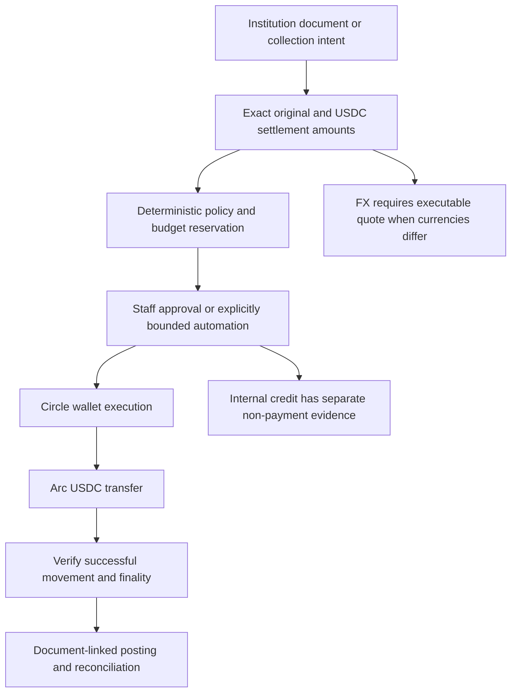
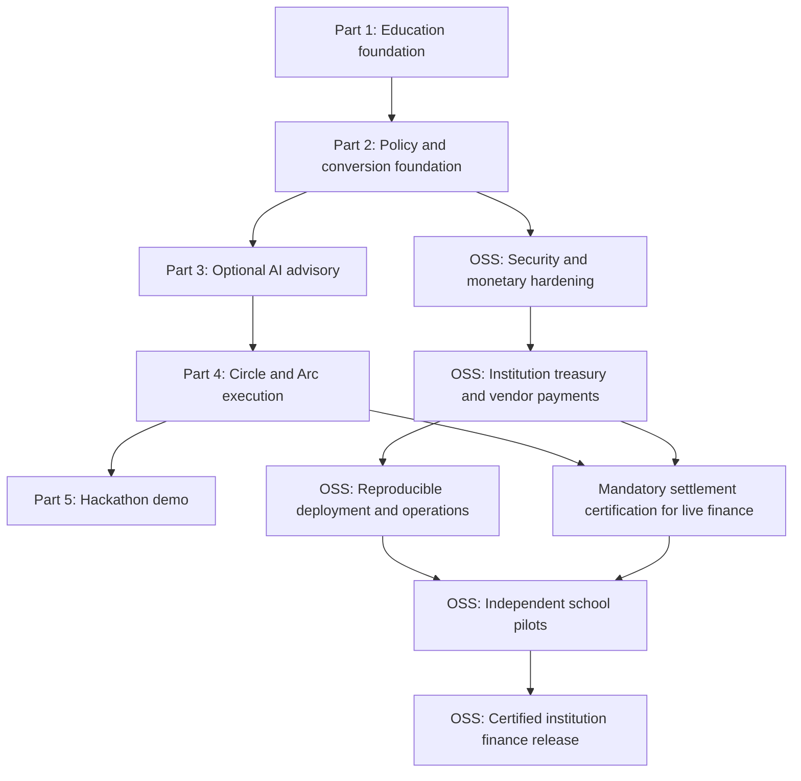
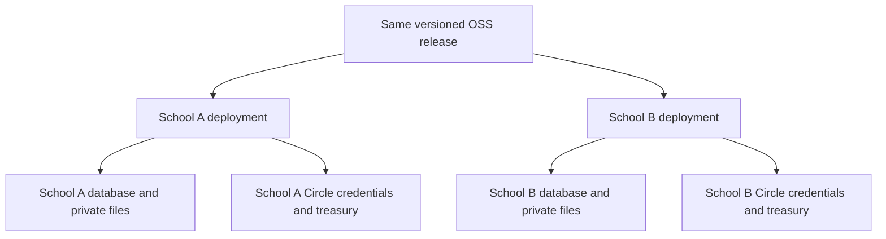
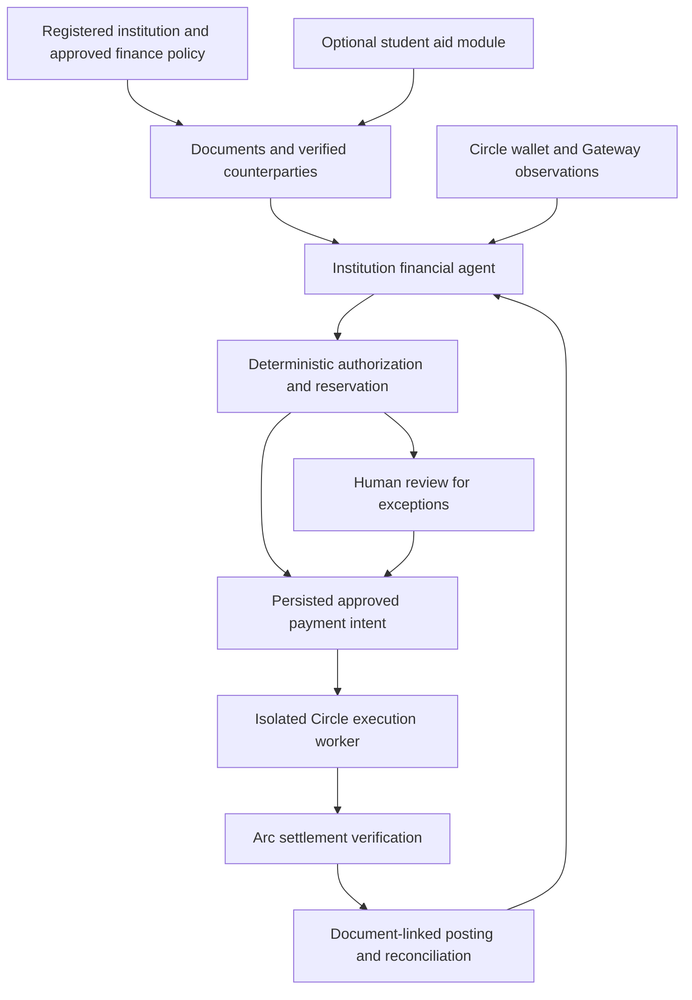

# EduFlow AI — Project Plan & Architecture Roadmap

**Tagline:** Open-source institutional finance agent and payment orchestration, powered by Circle Agent Stack and USDC settlement on Arc.

**Document scope:** Parts 1–5 describe the existing implementation and developer demos. Sections 5–11 define the institution-ready OSS release track; Section 12 records Circle/Arc research and the institution-first architecture; Section 13 catalogs wider operational events. **Section 14 is the authoritative current hackathon pilot scope, delivery order and acceptance contract.** It supersedes older demo priorities, not financial safety or production release gates. Proposed capabilities are not shipped features; a completed demo milestone is not a production-readiness claim.

**Product direction confirmed by the owner:** Circle Agent Stack and Arc USDC are the primary finance execution infrastructure, not an optional side feature. Keep MIT and one institution per self-hosted instance. Keep **Circle Agent Wallets through Lepton for this hackathon**; Developer-Controlled Wallets remain a later institutional deployment decision. The first finance pilot must operate with zero students. Installation, fake simulation and read-only previews must not submit payments; actual testnet execution requires separate explicit authorization. Mainnet and real college fund movement remain out of scope. LLM advisory stays optional.

**Current hackathon focus:** Fee collections and budget planning in shadow/parallel mode, starting with **one college department, its approved budget and approved bills due over the next couple of weeks**. Use staff-verified aggregate realized receipts or approved opening funds, not a new student payment portal. The college keeps collecting and paying in local currency through its existing process. Each eligible admin-approved bill must produce a linked, verified USDC mirror payment on Arc testnet; read-only analysis plus an unrelated transfer is not completion. Add a separately approved, small capped testnet-only lane for existing recurring obligations after the human-approved path is safe. Confirm the selected problem with college staff before expanding. See [Section 14](#14-college-shadow-pilot--hackathon-execution-contract).

---

## 1. Executive Summary & Core Concept

EduFlow is an institution-owned financial agent: it observes collections and obligations, plans cash use, applies approved spending policy, submits payments through Circle, and reconciles settlement on Arc. Student aid is one workload alongside vendor invoices, donations, subscriptions, and reimbursements—not the agent's identity or startup requirement.

USDC on Arc is the primary operational settlement asset. Institutions may still keep bills and statutory accounts in domestic currency. Current `CurrencyCode` supports USDC, USD, PHP, EUR, GBP, CAD, SGD, and INR; AUD and NGN remain expansion targets. Native-fiat accounting, executable FX and local-bank off-ramps are not complete. USDC settlement does not itself satisfy local payroll, tax, custody or accounting requirements.

Target architecture separates responsibilities:
- **EduFlow control plane:** Institution identity, counterparties, payable/receivable documents, budgets, reservations, approvals, bounded planning and document-linked accounting evidence.
- **Circle execution plane:** Agent Wallet operations through Lepton; product-specific Wallets, Gateway, CCTP and App Kit capabilities through reviewed adapters. These services move/sign value; they do not know the school's procurement or funding restrictions.
- **Arc settlement plane:** USDC movement, successful execution and deterministic finality. Independently reconcile intended payments against matching evidence; onchain correctness does not prove vendor ownership or goods delivery.
- **Currency/reporting plane:** Exact source/settlement amounts and fees with immutable quote snapshots when conversion occurs. Indicative display rates never authorize an FX trade. Internal tuition credits never imply a USDC or bank transfer.

The product serves school operations, not only accounting or student aid. Finance events
include an expiring learning-platform contract, urgent facility repair, conflicting
purchase commitments, restricted grant receipt, enrollment collection exception or
vendor destination change. Each needs a documented response and accountable owner;
not every event needs a payment or an AI model. Section 13 defines concrete examples.

EduFlow introduces an **institution-first bounded agent loop**:
> Observe verified balances and documents; reconcile collections; forecast liquidity; propose payment intents; authorize and reserve deterministically; request human review for exceptions; submit through Circle; verify Arc settlement; post accounting evidence.

The existing vendor cycle works independently of student records. C0 now also constructs
the AI operator without an assistance fund or policy and provides read-only institution
inspection. Live vendor-payment safety remains C1/C2 work; student aid is an optional
capability, not the general treasury context.

### Non-Negotiable Security Principles
1. **No Direct LLM Fund Control:** The Large Language Model (LLM) **never** has direct access to private keys or direct authorization to move funds. All decisions are evaluated against deterministic PHP rules and dual-ledger database state.
2. **Fixed-Point Base-Unit Math — Required Release Invariant:** Payment amounts use exact 6-decimal USDC units; currently supported fiat uses 2 decimals. Arc native balances, gas and residuals use 18-decimal integer quantities stored as strings/arbitrary-precision values, never PHP floats or 64-bit casts. Native and ERC-20 interfaces expose the same USDC balance. Legacy treasury/payment floats and two-decimal storage remain gaps.
3. **Locked Exchange Rate Snapshots:** Every decision, reservation, and transaction records an immutable snapshot of the exchange rate, rate provider, and timestamp.
4. **The LLM Is a Proposer, Not an Authoriser:** Model output is advisory only. It may tighten a decision but never loosen one. Every money-moving path is gated by a deterministic predicate evaluated in PHP — see Part 3 §3.1 and §3.2.
5. **A Stored Hash Is a Claim, Not Proof:** Settlement requires successful execution, matching chain/asset/sender/recipient/amount, and the rail's documented finality evidence. Transaction lookup alone is insufficient. Missing lookup results are pending or unknown until investigated, not automatically proof of fabrication. The database ledger is never presented as on-chain funds.

---

## 2. Multi-Currency Architecture



### Supported Currencies & Precision Matrix

| Currency | Code | Type | Minor Unit Decimals | Multiplier ($1.00$) |
|---|---|---|---|---|
| **USD Coin (Settlement)** | `USDC` | Stablecoin | 6 | `1,000,000` |
| **US Dollar** | `USD` | Fiat | 2 | `100` |
| **Philippine Peso** | `PHP` | Fiat | 2 | `100` |
| **Euro** | `EUR` | Fiat | 2 | `100` |
| **British Pound** | `GBP` | Fiat | 2 | `100` |
| **Canadian Dollar** | `CAD` | Fiat | 2 | `100` |
| **Singapore Dollar** | `SGD` | Fiat | 2 | `100` |
| **Indian Rupee** | `INR` | Fiat | 2 | `100` |

---

## 3. Multi-Part Implementation Roadmap



---

### Part 1: Education Data Foundation & Request Intake (COMPLETED)
- [x] **Data Foundation:**
  - `Student` model linked to `User` with student number, program, year level, academic status, and attendance rate.
  - `AcademicTerm` model with calendar boundaries and `isActive()` evaluation.
  - `TuitionAccount` model storing integer base-unit USDC amounts (6 decimal places) with computed remaining balance.
  - `AssistanceRequest` model with UUID `submission_key` idempotency constraints and non-negative database triggers.
  - Database migration `2026_09_27_090000_create_education_tables.php`.
- [x] **Access Control:**
  - Extended `RoleEnums` with `STUDENT` and `FINANCE_OFFICER`.
  - Restricted Filament panels: `/finance` for finance officers/admins, `/admin` for super admins only.
  - Allowlisted user activity logging to prevent credential/secret leakage.
- [x] **Student Interface (React / Inertia 3):**
  - Student dashboard at `/student/dashboard` displaying tuition balance and request history.
  - Assistance request form at `/assistance/create` with decimal USDC validation (up to 1,000,000 max).
  - Assistance detail page at `/assistance/{id}` with clear status tracking.
- [x] **Staff Review Panel (Filament 5):**
  - Dedicated `FinancePanelProvider` at `/finance` with `AssistanceRequestResource`.
  - Read-only table and infolist showing exact 6-decimal USDC values, student academic standing, and tuition accounts.
- [x] **Testing & Validation:**
  - Previously reported: 249 passing Pest tests (1,144 assertions) across unit, feature, authorization, and lifecycle suites.
  - Previously reported: clean TypeScript compilation (`npm run types:check`) and Vite asset bundling. Historical counts are not current OSS release evidence; each release needs fresh CI results.

---

### Part 2: Deterministic Policy Engine & Multi-Currency Conversion (COMPLETED)

#### Objectives
1. **Currency Conversion & Exchange Rate Layer:**
   - `CurrencyRate` model and repository storing live and fallback exchange rates against USDC.
   - `CurrencyConverter` service converting between USDC base units and any supported fiat/crypto currency using integer scaling.
   - Exchange rate quote expiration and locking (`quote_id`, `rate`, `quoted_at`, `expires_at`).
   - Multi-currency display formatting utility for frontend and Filament panel (e.g. `$100.00 USDC ≈ ₱5,750.00 PHP` or `€92.50 EUR`).
2. **Institutional Assistance Funds & Policies:**
   - `AssistanceFund` model with reserve threshold ($5,000 USDC$) and daily budget limits ($1,000 USDC$).
   - `AssistancePolicyVersion` model with versioned rules for enrollment, GPA, attendance, and semester caps.
3. **Deterministic `EvaluateAssistancePolicy` Action:**
   - Check enrollment status (`enrolled`).
   - Check academic status (`qualified` or threshold GPA).
   - Check attendance threshold (e.g. $\ge 85\%$).
   - Check outstanding tuition balance ($> 0$).
   - Check student semester assistance cap.
   - Check fund minimum reserves and daily budget.
4. **Autonomous Limit vs. Human Review Split:**
   - Single autonomous limit: **$100.000000 USDC** (or converted local currency equivalent at locked rate).
   - Example ($150 USDC requested / ~₱8,625 PHP):
     - Automatic approved portion: **$100.000000 USDC** (~₱5,750 PHP).
     - Escalated human-review portion: **$50.000000 USDC** (~₱2,875 PHP).
     - Status: `partially_approved` with pending escalation.
5. **Agent Decisions & Dual-Currency Audit Logs:**
   - `AgentDecision` capturing exact evaluation rules, pass/fail checks, locked exchange rates, and split amounts.
6. **Filament Staff Actions:**
   - Staff review and one-click approve/reject actions for the escalated human-review portion in the Finance Panel.

#### Planned Files
- `app/Enums/CurrencyCode.php`
- `app/Models/CurrencyRate.php`
- `app/Services/CurrencyConverter.php`
- `app/Models/AssistanceFund.php`
- `app/Models/AssistancePolicyVersion.php`
- `app/Models/AgentDecision.php`
- `app/Actions/EvaluateAssistancePolicy.php`
- `app/Actions/ApproveEscalatedRequest.php`
- `app/Filament/Resources/AssistanceRequests/Actions/ApproveEscalatedAction.php`
- `tests/Feature/CurrencyConverterTest.php`
- `tests/Feature/PolicyEvaluationTest.php`

---

### Part 3: AI Agent Layer (Laravel AI SDK)

**Status: SDK installed; advisory layer and approval seam shipped and tested.**

`laravel/ai` v1.0.1 is installed. The four agents, two tools, and advisory boundary exist;
the plan previously reported 27 adversarial tests. Advisory and conversational wiring
are described below. These implementation milestones do not certify production safety
or external-provider availability; fresh release CI remains required.

Shipped:
- `AssistanceAssessor`, `TreasuryAnalyst` — `HasStructuredOutput`, advisory only.
- `AskEduFlowAgent` — conversational, read-only, no tools.
- `SettlementOperator` — `Conversational` + `HasTools`, proposes via tool calls.
- `DisburseAssistance` — `Approvable`; `needsApproval()` **is** the policy engine, and
  `handle()` re-evaluates rather than trusting the earlier verdict.
- `RecordHardshipContext` — not approvable, writes advisory only.
- `AdvisoryEnvelope` / `AdvisorySanitizer` / `AdvisoryGate` — allowlist, fail-closed.

Two findings from reading the SDK rather than assuming it:
- An agent that pauses a tool must be `Conversational` (or be handed history via
  `withMessages`), or resuming throws `ApprovalNotResumableException`. `SettlementOperator`
  uses `RemembersConversations` for exactly this reason.
- `continue()` and `continueOrStart()` do **not** verify participant ownership. Any route
  resuming a conversation must call `ConversationStore::conversationBelongsTo()` first.

Also shipped: admin-configured providers. `ai_providers` holds endpoints with an
encrypted `api_key` cast, managed under `Settings -> AI Providers` (any SDK driver,
including `openai-compatible` for Ollama, LM Studio, vLLM, LiteLLM or a gateway).
`AiProviderResolver` resolves an admin provider ahead of `.env`, per request, and
`AiSettings` gates every call behind two separate switches plus an opt-in for settlement
proposals. Keys are never rendered back into the edit form.

The advisory gate is wired in. `EvaluateAssistancePolicy::recordDecision()` writes the
authoritative decision row first, then attaches commentary under a namespaced `advisory`
key. The existing implementation calls `AdvisoryGate::assessHardship()` synchronously;
that gate calls `prompt()`. Failure can leave the deterministic verdict intact, but a
slow provider can still delay the caller. Moving advisory work to a durable queue after
commit is an OSS release gate, not an already-satisfied invariant. Prior live gateway
checks are development observations, not reproducible release evidence.

Verified live against 9Router, which shaped two design decisions. It ignores
`response_format: json_schema`, so agents also request the JSON shape in their
instructions and the gate decodes a string response. And `AiProviderResolver` must return a
built `Provider` instance rather than the driver name, because a bare name resolves against
`config/ai.php` and fails with "requires a default text model".

`AskEduFlow` is now conversational. The deterministic answer is computed first and is always
the floor; `StudentBrief` hands the model the facts *and* that explanation, and `QnaGate`
replaces the text only when `BriefGuard` finds every figure in the response inside the brief.
Verified live against the configured gateway: it rephrases the split explanation correctly,
refuses to discuss moving funds, and a fabricated balance falls back to the computed figure.
`conversationBelongsTo()` is called inside the gate, not at the route, so no caller can skip it.

Replacing the matcher also surfaced a live routing bug. `str_contains($q, 'usd')` matched
"USDC", so any question quoting an amount was answered about exchange rates, and `'aid'`
matched inside "paid". `answer()` and `query()` also carried separate keyword chains that had
drifted apart, so a question could be answered from the policy and labelled `general`; there is
now one `classify()`.

The approval-resume endpoint is in place. `ApprovalResumeGate` is the only route from a human
decision to a paused tool call, and holds six checks: role through the Gate, conversation
ownership, pending-set subset, a tool allowlist that never constructs `Decision::edit()`, target
provenance read from the stored pause rather than the payload, and the settings gate. The request
body is only ever `id => bool`, so there is no field through which an amount or recipient could
arrive. A replay returns `nothing_pending` rather than paying again, and every settlement in the
response is flagged as requiring on-chain verification.

Verified by mutation: removing the ownership check turns 3 tests red, the tool allowlist 1, the
pending-set subset 1, and the replay short-circuit 1.

Building it surfaced a latent defect. `app(SettlementOperator::class)` returns an agent holding
*blank* Organization, AssistanceFund and AssistancePolicyVersion records, because Eloquent models
take no constructor arguments and the container instantiates them anyway. Its `primaryWallet()` is
null, so `DisburseAssistance::handle()` refuses with "The organization has no active wallet" — the
right outcome for the wrong reason, and it behaves differently once a wallet row exists.
`SettlementOperatorFactory` now refuses to build an operator from non-existent records. The SDK
also binds only `ConversationStore` while implementing `VerifiesConversationOwnership` and
`ResolvesPendingApprovals`; resolving those interfaces failed until they were aliased in
`AppServiceProvider`.

Remaining: decide whether to wire `TuitionSettlementService` into the settlement path or delete it.
It still has zero callers.

#### 3.1 Three-Tier Authority Model

The LLM is a *proposer*, never an authoriser. Authority is split into three tiers and the
boundary between them is enforced in PHP, not in a prompt.

| Tier | Owner | Examples | Can move funds? |
| --- | --- | --- | --- |
| **Deterministic** | PHP, non-negotiable | limits, reserve math, daily caps, FX rate locking, auto-vs-escalate, vendor allowlist, signing | Only after all checks pass |
| **Advisory** | LLM, clamped by PHP | hardship category, urgency, confidence, review priority, narrative, anomaly flags | Never |
| **Prohibited** | — | approved amount, policy verdict, key material, recipient selection | Never |

**One-way ratchet:** the LLM may only *tighten* a decision. If the deterministic engine
returns `ESCALATE`, no model response can downgrade it to `AUTO_APPROVE`. Any code path
where model output could loosen a decision is a defect.

#### 3.2 The Seam: `Approvable` Tools

The SDK's `Approvable` contract maps directly onto bounded autonomy. An `Approvable` tool
pauses the run before executing, and `needsApproval(Request): Approval|bool` is evaluated
**per tool call against its arguments**. This predicate *is* the policy engine:

```php
class DisburseAssistance implements Approvable, Tool
{
    use InteractsWithApprovals;

    /**
     * The deterministic policy engine, evaluated per call.
     * Within limits -> executes autonomously. Over limit -> pauses for a human.
     */
    protected function needsApproval(Request $request): Approval|bool
    {
        $result = $this->policy->evaluateStudentAssistance(
            requestedAmount: $request['amount'],
            org: $this->org,
            wallet: $this->wallet,
        );

        return $result->isAutoApproved()
            ? false
            : Approval::required($result->reasoning);
    }
}
```

The model decides *what to propose*; `needsApproval()` decides *whether a human must sign*.
This replaces the current arrangement where the agent writes directly to
`CircleWalletService` — the transfer becomes a tool call that cannot bypass approval.

#### 3.3 Structured Output as the Contract

`HasStructuredOutput` with `schema(JsonSchema $schema)` produces schema-validated output,
removing the hand-rolled `validateSchema()` in `DecisionExplainer`. The advisory schema is
an **allowlist** — advisory fields only, never `approved_amount` or `decision`:

```php
public function schema(JsonSchema $schema): array
{
    return [
        'hardship_category' => $schema->string()->enum([
            'medical', 'academic_materials', 'tuition_shortfall', 'living_costs', 'other',
        ])->required(),
        'urgency' => $schema->string()->enum(['standard', 'high'])->required(),
        'confidence' => $schema->number()->min(0)->max(1)->required(),
        'narrative' => $schema->string()->required(),
        'anomaly_flags' => $schema->array()->items($schema->string())->required(),
    ];
}
```

Unknown keys returned by the model are dropped before the payload reaches the policy
engine, so a prompt-injected `"approved_amount": 999999` is discarded.

#### 3.4 Agents to Build

| Agent | Type | Role | Authority |
| --- | --- | --- | --- |
| `AssistanceAssessor` | `HasStructuredOutput` | Classify hardship, score urgency, flag anomalies | Advisory only |
| `TreasuryAnalyst` | `HasStructuredOutput` | Forecast narrative, explain reserve risk | Advisory only |
| `AskEduFlow` | `Conversational` + `RemembersConversations` | Student Q&A over balance, rates, policy | Read-only |
| `SettlementOperator` | `HasTools` (Approvable) | Propose disbursements as tool calls | Gated by `needsApproval()` |

All four use `Promptable`. `AskEduFlow` uses `RemembersConversations` so chat history
persists to the SDK's `agent_conversations` tables, replacing the stateless `fetch()` POST
in `resources/js/components/ask-eduflow.tsx`.

#### 3.5 Non-Negotiable Invariants

1. **No tool reaches `CircleWalletService` without passing `needsApproval()`.** Every
   money-moving tool implements `Approvable`.
2. **No model output is trusted for arithmetic.** All amounts are integer base units
   computed in PHP. The model never sees or emits an approved figure.
3. **Rate locking stays in PHP.** The model may explain a locked quote; it cannot create one.
4. **The agent must not run in the synchronous settlement path.** Advisory calls use
   `->queue()->then()->catch()` so a provider timeout degrades to the deterministic path
   rather than blocking a payment.
5. **Fail closed.** A missing, malformed, or schema-violating response is treated as
   "no advisory available" and the deterministic engine proceeds alone.
6. **Conversations are not authorisation.** The SDK's `continue()` / `continueOrStart()`
   do not verify participant ownership; the app must call
   `ConversationStore::conversationBelongsTo()` before resuming.

#### 3.6 Provider Strategy

`config/ai.php` supports OpenAI, Anthropic, Gemini, Azure, Bedrock, Groq, xAI, DeepSeek,
Mistral, Ollama, OpenRouter, and `openai-compatible`.

- **Demo without a key:** the `openai-compatible` driver can target a local Ollama or
  LM Studio endpoint, so the AI layer runs in a hackathon demo with no paid API key.
- **Production:** `ANTHROPIC_API_KEY` or `OPENAI_API_KEY` via the SDK's **Failover**
  support, so a provider outage degrades instead of failing.
- Provider selected through the `Laravel\Ai\Enums\Lab` enum rather than raw strings.

#### 3.7 Testing Strategy

`Agent::fake()` removes the network from the test suite entirely — no API key, no cost,
no flakiness:

```php
AssistanceAssessor::fake([['hardship_category' => 'medical', 'urgency' => 'high', ...]]);

// Faking a paused tool call, to assert the human-in-the-loop path
SettlementOperator::fake([
    AgentResponse::fakeWithPendingApprovals([
        new PendingApproval(id: 'call_abc', tool: 'DisburseAssistance', arguments: [...], reason: '...'),
    ]),
]);
```

Faking a structured agent without explicit responses auto-generates schema-conforming
data. Required adversarial tests:

- Model returns `approved_amount` → assert it is discarded, not applied.
- Model returns a verdict of `auto_approve` for an over-limit request → assert the
  ratchet holds and the call still escalates.
- Model returns malformed JSON → assert fail-closed and deterministic fallback.
- Model times out → assert no payment is blocked and nothing is half-written.
- Prompt-injected student statement attempting to override policy → assert inert.

#### 3.8 Planned Files

All shipped. `tests/Feature/Ai/AdversarialAgentTest.php` covers the five scenarios in
3.7, `tests/Feature/Ai/ApprovalRatchetTest.php` the approval seam, and
`tests/Feature/Ai/AiProviderAdminTest.php` plus `tests/Feature/Filament/AiProviderAdminUiTest.php`
the admin provider configuration and key encryption.

Remaining release work:
- Move advisory calls out of synchronous evaluation and settlement paths.
- Approval-resume endpoint, verifying conversation ownership, staff authority, and fresh policy checks (3.5.6).
- Re-run advisory and conversational boundary tests with no provider configured.

---

### Part 4: Circle / Arc USDC Settlement Layer & FX Off-Ramp Rails (IN PROGRESS)

**Status: Circle / Arc transfer and hash-reconciliation integration exists; production settlement certification and local-currency off-ramping remain incomplete.**

Shipped:
- **Lepton Agent Wallet** via the published `yukazakiri/lepton-agent` package. No CLI
  strings in application code; gateways are injected via contracts.
- **Programmable Disbursements:** the autonomous $100 USDC portion dispatches through
  `CircleWalletService`; the $50 remainder dispatches only after a human authorises it in
  the `/finance` panel via `ApproveEscalatedAction`.
- **Settlement Provenance:** transactions record gateway, base units, explorer URL,
  and simulation metadata. `CircleWalletService::executePayment()` currently writes
  `CONFIRMED` immediately after the gateway returns; production must distinguish
  submission from verified settlement.
- **Reconciliation:** `php artisan lepton:reconcile` checks hashes via
  `eth_getTransactionByHash`, with a Circle history fallback. Existing verdicts are
  `verified` / `fabricated` / `unverifiable` / `ledger_only`; these legacy labels need
  stronger evidence and pending/unknown states before live use. See Sections 5 and 8.
- **Operations truth:** `php artisan lepton:doctor` reports CLIs, Circle auth, treasury
  identity, funding, chain reads, and ledger-versus-chain drift.

Outstanding:
- **Internal Tuition Credit:** `TuitionSettlementService` is now called by escalated
  assistance approval on this branch. It still requires a treasury wallet, uses USDC
  account amounts and lacks atomic/idempotent posting. This is an internal credit, not
  a wallet-free production rail or fiat off-ramp; it does not replace Arc settlement.
- Real Arc Testnet funding: the ledger balance is a demo figure, not on-chain funds.
  Reconciliation must stay honest about the difference rather than presenting the ledger
  as settled.

---

### Part 5: Hackathon Demo & End-to-End Verification

**Current college pilot:** Follow Section 14, not the legacy student-aid walkthrough below.
The target is staff using one department's real approved bills and budget, with each
permitted approval connected to a verified Circle Agent Wallet payment on Arc testnet.
C0 preview and C1 drafts/policy activation alone cannot execute this target.

- **Primary walkthrough (target; remaining C1/C2 work required):**
  1. Show the agreed departmental budget, staff-verified opening funds/realized receipts and
     anonymized bills, all retaining their original local currency and document references.
  2. Explain a pay/hold/escalate proposal with exact source amount, approved USDC mirror
     mapping, policy checks, remaining allocation, reserve/fee protection and due date.
  3. Let authorized finance staff approve or reject. A requested material edit requires a
     reviewed replacement proposal and fresh authorization, not mutation of an approved intent.
  4. Execute each eligible approval through the existing Circle Agent Wallet on `ARC-TESTNET`;
     keep the college's actual payable and bank-payment status unchanged.
  5. Verify successful matching Arc movement/finality, link explorer evidence to the decision,
     and repeat the cycle without another payment.
  6. After explicit standing-policy approval, show one eligible recurring bill using the small
     capped autonomous testnet lane and another requiring human review or a policy hold.
  7. Record staff usage with permission and report approve-as-is/edit/reject/hold counts,
     automatic-versus-escalated decisions and review time against a recorded baseline.

**Legacy assistance developer demo (retained; not current college pilot):** Amounts below
are illustrative policy examples, not installation defaults. Read the active policy and
current fixtures for the actual split. Fake and testnet runs must be labelled separately;
neither proves mainnet or local-bank readiness.

- **Legacy Assistance Walkthrough (3–5 Minutes):**
  1. **Student Login:** Juan logs in, seeing a tuition balance displayed in both local currency (e.g., `₱17,250 PHP`) and `300.00 USDC`.
  2. **Assistance Request:** Juan submits an emergency request for `150.00 USDC` (`₱8,625 PHP`).
  3. **Autonomous Evaluation:** Policy engine runs instantly:
     - Verifies enrollment (✓), attendance 95% (✓), academic standing (✓), outstanding balance (✓).
     - Checks autonomous limit ($100.00 USDC / ₱5,750 PHP).
  4. **The Split Decision:**
     - Deterministic policy approves `$100.00 USDC` immediately; the model has no approval authority.
     - Escalates `$50.00 USDC` to human review with exact policy reasons.
  5. **Disbursement & Conversion:**
     - Simulates or executes Circle/Arc testnet payment of $100 USDC to Juan's wallet.
     - Displays live conversion quote and transaction receipt.
  6. **Admin Review:**
     - Finance officer logs into `/finance` and views Juan's escalated request with complete AI reasoning and locked exchange rate.
     - Administrator approves the remaining $50 USDC.
  7. **Audit & Explanation:**
     - EduFlow answers: *"Why didn't you send the full $150 USDC initially?"*
     - Agent explains the institutional threshold and currency conversion breakdown.

---

## 4. Technology Stack

- **Backend:** Laravel 13, PHP 8.5, SQLite (dev/test) / PostgreSQL (production), Laravel Octane
- **Frontend:** React 19, Inertia.js v3, Tailwind CSS v4, Radix UI, shadcn/ui, Lucide Icons
- **Admin & Operations:** Filament v5, Spatie Permission & Shield, Spatie Activitylog
- **AI:** `laravel/ai` (official Laravel AI SDK) — agents, structured output, tools,
  human tool approval, conversation memory. See Part 3.
- **Agent Infrastructure:** `yukazakiri/lepton-agent` — Circle Agent Stack + Arc gateway.
  Contracts for wallets, Arc RPC, and x402; `circle` and `fake` drivers.
- **Testing:** Pest 5, Pest Agent Plugin, PHPUnit, `Agent::fake()` for AI
- **Routing & Types:** Laravel Wayfinder, TypeScript 5.9
- **Web3 & Currency:** USDC, Circle Agent Wallets, Arc Testnet, Multi-Currency Fixed-Point Math

---

## 5. OSS Readiness Review — Verified Gaps

**Review basis:** Repository source and configuration inspected on 2026-10-02. This is
not a full security audit, live settlement test, or PostgreSQL certification. `.env.example`
exists but editor privacy rules blocked reading it; its defaults are unverified. Existing
implementation work is preserved. Findings below describe the original review; implementation
progress is tracked immediately after the table. No item is closed solely by changing this document.

| ID | Observed gap and evidence | Required outcome | Gate |
| --- | --- | --- | --- |
| OSS-01 | `auto-release.yml` contains a literal Graphite credential. | Revoke/rotate with its owner, replace with Actions secrets or remove integration, scan working tree and history. Removing the string alone does not revoke it. | Before public release |
| OSS-02 | `DatabaseSeeder` always calls `RolesAndPermissionsSeeder`; that seeder creates `admin@admin.com` with password `password` and superadmin rights, outside a local/testing guard. | Production seeds create roles/settings only. First admin is explicitly bootstrapped with unique credentials or expiring invitation. Test production seeding creates no default users. | Before any school deployment |
| OSS-03 | `CircleWalletService::executePayment()` takes `float`; financial models cast money to floats; legacy financial tables store `decimal(15, 2)`. `EvaluateAssistancePolicy` converts base units to two-decimal floats and casts a daily sum before scaling. | Exact minor-unit money representation across decisions, caps, balances, postings, and gateways. Audit and migrate legacy precision; do not assume rounded historical values can be recovered. | Before production financial use |
| OSS-04 | Payment gateway call precedes wallet/transaction persistence; transfer options omit `idempotencyKey`. `ApproveEscalatedRequest` pays before its later state updates. | Durable payment intent, atomic reservation, unique fulfilment identity, stable provider idempotency, crash recovery and reconciliation before retry. | Before external payments |
| OSS-05 | `LeptonReconciliationService` marks any returned transaction array verified, without execution success or amount/recipient matching; null lookup becomes fabricated; Circle fallback searches only 200 records. | Successful receipt/finality plus expected payment matching; distinguish pending, unknown, reverted, and mismatched. Paginated provider evidence or unresolved status when evidence is incomplete. | Before live USDC |
| OSS-06 | Staff dashboards/widgets use `Organization::first()`; students and academic terms have no institution ownership column in the education migration. | Enforced one-institution installation for initial OSS release; explicit installation institution resolver. No shared-database multi-school claim. | Before school pilots |
| OSS-07 | `CurrencyConverter` uses static fallback rates, assumes USD parity, and creates a new 15-minute snapshot timestamp independently of the source rate expiry. | Separate indicative display rates from executable quotes; preserve source timestamps/expiry, rounding, fees and spread. Hold real FX when valid quote unavailable. | Before FX-sensitive payments |
| OSS-08 | Original review: `TuitionSettlementService` had no caller and wrote a two-decimal transaction amount. It is now wired on this branch but remains wallet-dependent and lacks atomic/idempotent fulfilment. | Tested internal credits with exact money, account ownership/term checks and no duplicate or excess posting; never label a ledger offset as external settlement. | Before enabling internal-credit module |
| OSS-09 | `EvaluateAssistancePolicy` invokes advisory synchronously through `prompt()`. AI switches default off in `AiSettings`. | Keep AI off by default; queue advisory after durable decision commit. Slow/unavailable AI must not delay approval or fulfilment. | Before enabling AI in pilots |
| OSS-10 | Dockerfile uses Bun without a frozen lock, frontend PHP from distro packages, `--ignore-platform-reqs`, starter-kit branding, and an amd64-only helper. Entrypoint checks `/var/www/html` while image root is `/app`. No Compose file found. | Clean, reproducible production image and deployment bundle; matching runtime paths, real platform checks, non-root operation, documented services and architecture support. | Before container release |
| OSS-11 | README is demo-focused; installation docs and `version.json` still identify KoamiStarterKit. Composer hooks enable Blog and run starter-kit setup. `.gitattributes` excludes README from archives. | Product identity and release metadata agree. School installation preserves application code, ships docs, and never invokes scaffold rewriting or demo provisioning. | Before OSS release |
| OSS-12 | CI tests SQLite through `phpunit.xml`; inspected CI has no PostgreSQL job. Auto-release runs independently of CI and tags prereleases as `latest`. Root PHP constraint/README say 8.3+, but locked Symfony 8.1 dependencies require PHP 8.4.1+. | Test actual production DB, concurrency and upgrades; publish only tested commits; isolate preview/stable channels; document a certified runtime baseline. | Before stable release |

### O0 Implementation Progress

- **OSS-01 source cleanup implemented:** Graphite integration and literal token removed.
  Workflow credential regression tests added. Owner revocation/rotation and historical
  exposure review are still required; this blocker is not fully closed.
- **OSS-02 seed safety implemented:** Role seeding creates no users in any environment.
  Explicit `DemoUsersSeeder` owns local/testing defaults; demo `DatabaseSeeder` invokes it.
  Production/staging seeding creates no users or
  demo records. `eduflow:bootstrap-admin` creates the first admin through hidden password
  prompts, refuses existing accounts/second superadmins, and records a secret-free audit.
  Existing default accounts are not deleted or reset; operators must remediate them.
- **OSS-12 release guards implemented in part:** CI no longer commits formatter/refactor
  changes. Preview publication requires successful same-repository push CI and checks out
  its exact commit. Manual publication requires exact-commit CI; preview/draft releases
  cannot update stable `latest`. Ad hoc Docker publication disabled. PostgreSQL coverage,
  runtime/image certification and supply-chain attestations remain open.
- Operator bootstrap/release notes added to README; source archives now retain README
  and changelog instead of excluding them. Foundation PR introduced no schema migration,
  dependency change, live payment or shared-institution tenancy.
- **OSS-06 selection/setup implemented in part:** `InstallationInstitution` uses persisted
  installer identity or matching explicit `EDUFLOW_INSTITUTION_ID`, and exactly one
  organization; missing/invalid/ambiguous context fails closed. Dashboards, wallet doctor
  and settlement operator factory no longer choose `Organization::first()`.
- **Installer foundation:** `eduflow:install` initializes institution/settings through a
  locked DB transaction, without migrating, demo seeding, admin creation or wallet/provider
  I/O. Identical retry preserves state; explicit adoption required for legacy institution;
  conflicting identity/metadata refused. Initial registration, impersonation and AI disabled.
  Settings migration adds persisted installation identity. Eloquent creation of a second
  institution blocked after setup; raw DB access is outside that guard.
- Registration GET/POST now respects disabled registration for installed schools; signup
  still cannot provision staff rights or enrollment. Country validation is code-format
  only. Native-fiat ledger, complete ownership/backfill, data imports and rail safety remain
  open; institution currency metadata alone does not convert legacy USDC accounting.
- **OSS-03 exact-money foundation implemented in part:** Readonly `Money` DTO parses
  plain decimal strings with currency precision/range checks, performs checked arithmetic,
  formats without floats and serializes minor units as strings. Intake uses it and rejects
  invalid amount limits even when called outside a Form Request. Converter uses existing
  Brick Math for overflow-safe integer intermediates. Legacy decision/treasury/payment
  float APIs and two-decimal DB columns remain open; no money schema cutover yet.
- **OSS-07 rate snapshots hardened in part:** Future/expired/over-age/non-positive sources
  excluded, source timestamps/expiry preserved, display rates marked indicative. USD can
  use an actual source rate instead of forced parity. `requireFreshQuote()` rejects fallback
  or unbounded rates; all external-currency snapshots remain indicative, not provider offers
  or executable FX. No live feed/off-ramp or settlement path is certified by this change.
- **Current branch follow-up:** Valid payout-address checks, a base-unit payment entry
  point, daily base-unit snapshots and tuition-credit wiring were added. Legacy float
  balances, provider submission before durable intent and immediate `CONFIRMED` remain;
  those additions do not close OSS-03/04/05 or certify live payments.
- Next: institution-first exact treasury/reservation/payment evidence foundations, then
  a zero-student vendor-payment pilot. O0 still needs credential-owner confirmation,
  dependency/asset review and named owners.

**Strengths to preserve:** MIT already exists; deterministic policy actions, student
intake, role separation, AI opt-in settings, encrypted provider keys, Lepton contracts,
quote snapshots, and fake gateways offer a useful foundation. Do not rewrite working
modules just to introduce a new framework.

**Meaning of “any institution”:** Download, inspect, adapt, and self-host without project
permission or a central account. It does not mean every jurisdiction, currency, school
policy, bank, or payment provider is certified on day one. Publish a capability/support
matrix and grow it through pilots.

---

## 6. Product, License, and Institution Boundary

### 6.1 Initial Product Scope

**First supported finance workflow:** An institution registers its identity, binds an
institution-authorized Circle treasury, imports one verified vendor/bill and budget,
reconciles available USDC, approves or holds deterministically, submits a persisted
payment intent, verifies settlement on Arc and exports document-linked evidence.
Zero `Student`, `TuitionAccount`, `AssistanceFund` or `AssistancePolicyVersion` rows must
be required for this workflow. An AI provider is not required to execute approved policy.

The core supplements existing accounting/SIS systems. It is not a payroll calculation
engine, complete ERP or statutory general ledger. Accept payable documents from those
systems rather than rebuilding tax, payroll or procurement in the first release.
Circle/Arc readiness is mandatory for live finance; installation, read-only operation
and fake-driver simulation remain available without a funded wallet.

| Capability | First finance release target | Later / separately gated |
| --- | --- | --- |
| Institution treasury, verified counterparties, vendor bills and budgets | Zero-student operating baseline | More payable types and country templates |
| Exact money, reservations, bounded approval and evidence exports | Mandatory shared controls | ERP/SIS adapters |
| Circle wallet execution and Arc USDC reconciliation | Primary live rail; certified before launch | More custody models and chains |
| Receivables and inbound matching | Referenced USDC collections and unmatched-funds queue | Crosschain collections and regional onramps |
| Gateway unified balance and x402 service spend | Explicitly separate capabilities | Enable only after capability-specific recovery tests |
| Students, aid and internal tuition credit | Reuse existing modules; never startup prerequisites | Module-specific school acceptance |
| AI document/treasury advisory | Optional; disabled by default | Approved cloud or local endpoint |
| FX/off-ramp, escrow, Earn or Borrow | Not automatic finance capabilities | Provider/legal/security approval per capability |
| Shared hosted multi-tenancy | Not initial scope | Separate isolation/custody review |

An internal tuition credit does not move USDC. Manual bank evidence is a separate record,
not independent bank proof. A local-currency recipient needs an approved off-ramp, not
an invented wallet address or a claim that Circle automatically pays every local bank.

### 6.2 License and Sustainable OSS

- **Keep existing MIT license.** Schools may use, modify, redistribute, or sell their
  version while retaining required notices. Do not silently relicense contributors' work.
- Audit Composer/npm dependencies, bundled assets/fonts, model weights, generated UI,
  and container contents for redistribution terms. The root MIT license does not
  override third-party licenses or make Circle/AI services open-source.
- Publish third-party notices and a software bill of materials (SBOM) with release
  artifacts. Record provenance for imported starter-kit code.
- No EduFlow license server, per-student unlock, mandatory telemetry or maintainer login.
  The institution owns its Circle account/session and pays applicable external service,
  network and ramp fees. Self-hosted OSS does not mean Circle's hosted infrastructure
  becomes self-hosted, free or available in every jurisdiction.
- Revenue options: paid hosting, deployment help, training, migration, custom adapters,
  and support agreements. Hosted service is an operating model, not a separate mandatory
  code license. MIT permits competitors to host forks; accept that trade-off.
- MIT has no warranty or support SLA. Separate commercial agreements from community
  support. Maintainer bandwidth and financial/security expertise constrain release scope.

### 6.3 One Institution per Installation First

**Recommended v1 boundary:** One institution, one installation-owned database, storage,
queue/cache namespace, encryption key, mail configuration, and institution-owned treasury context.
Two schools run two instances, even when an IT provider manages both. Never share their
provider credentials or wallet sessions. Campuses inside one legal institution may share
an instance only under the same access/data policy; separate campus wallets and scoped
campus permissions require additional design.



Reuse `Organization` as the institution identity; do not add a competing `School` model.
Persist an explicit installation institution selection. Replace `Organization::first()`
and hardcoded IDs with a fail-closed resolver; reject a missing/ambiguous institution.
Setup must prevent creation of a second active institution on the single-school profile.
Future ownership migrations must backfill and validate existing records, not assign
ambiguous records to whichever organization appears first.

**Future shared hosting:** Do not advertise multi-tenancy because an `organization_id`
exists. It needs memberships, authorization, tenant-bound queries/unique keys, private
file paths, queues/cache, AI conversations, exports, provider sessions, and background
jobs, with negative cross-institution tests. Choose database-per-institution or shared
schema only after an explicit threat model and operational review. No tenancy package
or microservice split is required to ship the self-hosted core.

### 6.4 School Configuration Without Forking

Build on existing settings, `Organization`, and `AssistancePolicyVersion`:
- Name/logo, country, locale, timezone, default/display currencies, contact/privacy owner.
- Treasury network/account model, operational USDC limits, restricted funds, departmental
  budgets, counterparty verification, maker/checker routing and fee/reserve limits.
- Academic calendar, student ID format, tuition categories, attendance/academic eligibility
  and term caps belong to the enabled student-aid module, not institution startup.
- Mail, storage, retention, staff invitation, enabled integrations, and automation mode.
- Policy versions are immutable after activation. Record effective dates and approver;
  preview changes against fixtures/history before activation. Policy updates never
  silently expand an already-approved payment.
- Defaults are conservative: manual release, zero autonomous payout allowance, no
  enabled live rail, AI off, public registration off. Schools must consciously activate
  any automation. Attendance/GPA eligibility is configurable, not a universal rule.

Use typed configuration and existing contracts. Avoid arbitrary executable policy code,
per-school source edits, and a generic plugin marketplace in the initial release.

---

## 7. Distribution, Setup, and Data Portability

### 7.1 Supported Distribution Contract

1. **Primary: versioned OCI container plus Docker Compose deployment bundle.** Same image
   for HTTP, worker, and scheduler roles. Bundle defines PostgreSQL, Redis, persistent
   private files, secret injection, health/readiness, and reverse-proxy/TLS instructions.
2. **Secondary: tagged source release for experienced Laravel operators.** Include lock
   files, migration/upgrade notes, production configuration template, and built frontend
   assets or an exact documented build. Use `composer install`, not `composer update`,
   for a tagged release. No scaffold wizard or repository creation/push in school setup.
3. **Demo profile:** Disposable local deployment with synthetic accounts/data and fake
   gateways. Explicit testnet profile requires operator consent. Demo and production
   data/services must never share an instance. Testnet is not the default school path.

**Initial certification target:** PHP 8.5, Laravel 13, Filament 5, PostgreSQL, Redis,
FrankenPHP/Octane for the packaged runtime. Pin actual image/DB versions and extensions
only after clean-build and migration tests pass. SQLite stays development/test/demo.
MySQL, shared hosting, alternate Octane drivers and ARM64 are not advertised as supported
until their matrix passes. Provide an amd64 image first; remove architecture assumptions
before adding ARM64. Node/npm is build-time only for non-SSR production; SSR, if offered,
needs a separately tested Node runtime. Align toolchain versions and choose one lock-file
workflow; current npm/Bun divergence is not a release contract.

No `--ignore-platform-reqs` in a certified build. Run real platform checks in the runtime
image. Secrets, databases, uploaded files, debug tools, and development artifacts must
not enter an image layer; use an explicit build-context exclusion policy. Public source
archives must retain README and installation/security documentation.

**CLI progress:** `eduflow:install` now initializes institution identity, role-only seeds
and safe settings after separately applied migrations. `eduflow:bootstrap-admin` creates
first admin independently. Full workflow/data onboarding is not complete.
`eduflow:health` remains proposed, not an existing command. Planned health reports readiness
without changing balances or broadcasting payments. Installer never calls `eduflow:demo`.

### 7.2 School Onboarding Flow

1. An operator chooses a supported tagged release, deployment host, data location, and
   internal/external domain. Verify checksum/image digest and follow the production guide.
2. Provision private DB/cache/storage and unique secrets. Set production mode, disable
   debug, configure TLS and SMTP, and generate `APP_KEY` exactly once for a new instance.
3. Run a controlled one-off migration/installation task. Create institution identity,
   unique first-admin credentials or an expiring invitation; lock first-run setup afterward.
   Never ship a public unauthenticated setup wizard or reusable bootstrap token.
4. Admin completes MFA, sets school details/calendar/currency/retention, and invites
   finance reviewers. Run readiness checks and a mail-delivery test. Installation cannot
   be marked ready while password reset/invitations are unusable.
5. Import vendors, payable documents and budgets through a dry-run preview; reconcile
   opening totals with the source system. Student imports are optional module onboarding.
6. Bind an institution-authorized Circle wallet/session to an explicit network; verify
   real balance, signing readiness, recovery owner and applicable policies. Test one complete
   zero-student vendor-payment cycle with fakes, then a separately approved capped testnet
   cycle. Installation never creates, funds or broadcasts a wallet action automatically.
7. Confirm backups, restore/reconciliation, staff roles and live-rail acceptance before
   activating real payments. Start with explicit human release and zero autonomous limits;
   approve bounded automation and AI separately.

Setup is re-runnable without duplicating institution/admin/roles or resetting secrets,
policy, opening balances, or existing records. A partially completed setup can resume.
Production setup never executes `migrate:fresh`, demo seeders, or key regeneration on an
existing instance. Migration and seeding are not HTTP/worker startup side effects.

### 7.3 Imports, Exports, and Local Adaptation

- Start with UTF-8 CSV templates for counterparties/vendors, payable documents and
  institutional budgets; optional student-module templates cover rosters, terms and tuition
  opening balances. Version formats and preserve authoritative external document IDs.
- Require exact decimal strings plus currency code at input; validate exponent/limits,
  duplicates, foreign keys and active term. Preserve stable external IDs and leading
  zeros in student numbers. Parse money without floats; reject ambiguous formatted input.
- Dry-run shows mappings, counts, errors and reconciliation totals before commit.
  Import batches have identity/checksum and row outcomes; safe retries must not duplicate
  students, tuition obligations, or postings. Detect conflicting updates, not overwrite
  financial history. Escape spreadsheet formula injection in exported CSV cells.
- Export records, decision policy snapshots, posting/payment evidence and audit history
  in documented CSV/JSON schemas. Restrict exports to authorized staff; log requests;
  exclude keys/tokens and unnecessary hardship text.
- Provide data exit path independent of a hosted subscription. A school can leave without
  losing its financial/audit records. Integrate SIS/accounting APIs later through scoped,
  documented adapters; do not require a bespoke integration for the first pilot.
- Initial language support is English. Plan translation catalogs, timezone-aware academic
  dates, localized display and accessible/mobile forms; publish actual language coverage.
  Current eight-currency enum is not worldwide accounting support. New currencies with
  zero/three decimals require precision and formatting tests before enabling them.

### 7.4 Cost and Responsibility

OSS source is free; operation is not automatically free. Schools or their IT partners
provide hosting, storage, backups, mail, admin/security time, and Circle/Arc/provider fees.
AI adds optional model/API or local hardware costs. USDC adds network, custody-service,
conversion and off-ramp costs when applicable; gas sponsorship is capped and changeable.
Publish measured pilot sizing and an example monthly cost breakdown; no unsupported
student-capacity or “runs on any server” claim.

| Party | Responsibilities |
| --- | --- |
| Maintainers | Source/releases, supported matrix, security process, migration notes, contract tests |
| School operator / hosting partner | Infrastructure, secrets, TLS, patches, backups, recovery, incident response |
| School finance/privacy owners | Policy approval, segregation of duties, legal basis, retention, reconciliations |
| External provider | Contracted availability, custody/settlement, geography and account eligibility |

---

## 8. Financial Safety and Circle/Arc Execution Boundaries

### 8.1 Exact Money, Ledger, and Currency Semantics

Use exact minor units plus currency for obligations, budgets, decisions, reservations,
postings, payment intents and fulfilment. Reuse existing integer fields where appropriate;
consolidate legacy float APIs behind one money representation. Use PostgreSQL `BIGINT`
with explicit range checks; use existing exact math support for intermediates that may
overflow, not multiplication that silently becomes a float. Never send large integer
money values as unsafe JavaScript `Number`s; expose decimal strings or integer strings
and format at the display edge.

**USDC execution, domestic reporting:** Operational payouts/reservations use exact
USDC amounts. Preserve each bill's original currency/amount and the institution's reporting
currency separately. If currencies differ, record source/settlement amounts and executable
quote, fees, spread and rounding; do not silently turn a display estimate into authority.
USDC is not guaranteed to trade at exactly USD 1; a stablecoin is not an FX provider.

Arc native quantities use 18 decimals, the ERC-20 USDC interface uses 6, and both expose
one balance. Native amounts/gas can exceed `PHP_INT_MAX`: use arbitrary-precision integer
strings, not `BIGINT` for all chain quantities. Convert a 6-decimal payment to native units
by multiplying by `10^12`; preserve native residuals rather than silently dropping them.
Never sum native and ERC-20 balances or count their paired Transfer logs twice.

Do not call the current mutable balances a complete double-entry ledger. Add a focused,
balanced posting journal for budget reservation/release, aid fulfilment, tuition credits,
fees and reversals; link each event to decision/policy/payment evidence. No destructive
balance overwrite as reconciliation. Record adjustments with actor, reason and evidence.
Prevent cascading deletion from erasing financial history. Integrate accounting exports,
not a speculative full ERP/general-ledger rewrite.

Legacy migration requires preflight reconciliation, staging backup, additive fields,
explicit rounding mapping and verified cutover. Existing two-decimal values cannot prove
original six-decimal payments; flag uncertain historical records for review.

### 8.2 Payment Lifecycle and Failure Recovery

Separate **request**, **decision**, **approval**, **reservation**, and **fulfilment/payment**.
Approval is not payment; provider acceptance is not settlement; simulated settlement is
not real settlement. A partially approved request tracks autonomous and human-reviewed
portions separately; a denied remainder cannot roll back an already-settled portion.

Target external-payment states: `created`, `reserved`, `submitted`, `pending`,
`settled`, `failed`, `unknown`, `cancelled`. Keep simulation and internal/manual evidence
types distinct. Do not map the legacy `CONFIRMED` field to successful chain evidence.

1. Authorize caller; validate institution, beneficiary, amount, currency, policy version,
   quote and approval. Verified enrollment/identity and payout destination changes are
   school-controlled; address syntax alone does not prove recipient ownership.
2. In one DB transaction, lock budget/fund/request rows in a consistent order, check
   available funds/caps including reservations, persist intent/reservation and an outbox
   event. Unique keys identify request portion and fulfilment attempt. Commit before
   external I/O; do not hold DB locks over a slow provider call.
3. A worker submits the persisted intent with a stable provider idempotency key. Serialize
   conflicting wallet spends where needed; recheck remaining balance, fees/gas, policy,
   quote and beneficiary authorization. A changed material input needs a new review.
4. Save provider evidence; reconcile before completing ledger postings or tuition fulfilment.
   Crashes, timeouts and ambiguous submissions stay `unknown` until resolved. Queue
   uniqueness alone does not guarantee exactly-once external payments.
5. Retry known-safe operations with the same identity. On provider success plus DB failure,
   recover the existing payment, not send another. Release reservations only after safe
   cancellation/failure proof; failed/unknown payments never become extra spending room.

Human approval cannot bypass authorization, recipient validation, reservations, currency
integrity or available funds. Changing an eligibility rule belongs in a new approved
policy version, not an undocumented `human_override` that skips safety checks. High-risk
payments, payout-address changes and policy changes require configured maker/checker
separation; no self-approval. Read-only auditor role and privileged-action MFA are release
requirements. Provide an immediate stop for new submissions while preserving read-only
access and reconciliation of in-flight payments.

### 8.3 Settlement Evidence

For Circle / Arc, certification needs successful execution receipt/provider settlement
status, inclusion/finality, correct chain and asset, matching treasury, beneficiary,
amount and payment identity. Decode native/system and ERC-20 movements with their
respective emitters/precision; `tx.from` may be a relayer rather than the economic payer.
Gateway/x402 evidence needs its transfer ID, authorization nonce and lifecycle in addition
to any shared batch hash. Provider acceptance or pending credit is not final settlement.
A transaction array returned by `eth_getTransactionByHash` may be pending, reverted,
unrelated, or for a different amount; it is insufficient by itself.

A null RPC result may reflect propagation delay, provider indexing, wrong network or an
unknown transaction. Do not label it fabricated solely from one lookup, and never repay
on that assumption. RPC/history outages leave an unresolved state. History fallback
must account for pagination and verify successful matching payment evidence, not a hash
in a truncated list. If the configured Arc proxy cannot expose the required proof, the
live rail stays disabled until another reviewed evidence source is available.

### 8.4 AI and Provider Boundaries

- Reuse `AiSettings`, encrypted `AiProvider`, advisory DTOs and deterministic explanations.
  AI is off by default and never required for intake, policy evaluation, review or exports.
- Queue advisory after decision commit; bound timeouts, retries, spend and retention.
  Students can still get the deterministic explanation while an optional AI job is pending.
  Later advisory cannot silently rewrite approval or cancel already-settled funds.
- Enabling AI requires institution approval of data handling, legal basis, provider terms,
  retention and approved region. The existing disclosure toggle is acknowledgement,
  not automatically student consent or a lawful basis.
- Minimize/anonymize prompts; hardship text may contain health/family data. No secrets or
  unrestricted student documents in prompts. No provider failover outside the school's
  approved list/regions. Local providers need explicit deployment and model-license review.
- Provider endpoint configuration creates an outbound-request trust boundary: restrict it
  to trusted admins, validate TLS/redirects and egress targets, block metadata-service
  access, and allow private local endpoints only through reviewed policy.
- Agent conversations and approval resumes must check owner, role, institution, current
  policy and request state. Never treat knowledge of a conversation/approval ID as authority.

### 8.5 Rail Enablement and Jurisdiction

No mainnet by default and no silent testnet-to-mainnet switch. A school owns its provider
account/treasury and credentials. Funding and human OTP login remain operator tasks,
never installer/queue side effects. Plan provider-session expiry alerts, restricted session
storage, volume permissions, recovery and monitoring. Official Circle Agent Wallet docs
checked on 2026-10-05 specify 28-day sessions, separate mainnet/testnet sessions and an
OS secure keychain. Actual deployed CLI status is authoritative for expiry; older local
notes saying seven days must not define service behavior. Operator OTP renewal and
headless-container keychain support are readiness gates, not assumed unattended support.

Agent Wallets are user-controlled 2-of-2 MPC, not unilateral Circle custody. Their native
spending-policy changes require another OTP and are documented for mainnet only. The
institution must approve the responsible operator/recovery process. Developer-Controlled
Wallets are a distinct server-side alternative, not a drop-in use of an Agent Wallet
session; their authority and secret custody require separate implementation/review.

Document each rail's countries/currencies, account/KYC requirements, permitted custody,
fees, limits, finality, dispute/refund paths and school approval. Do not promise automatic
fiat off-ramping until a real partner integration and end-to-end proof exist. Financial,
sanctions, privacy and education rules require jurisdiction-specific institutional/legal
review; OSS licensing does not waive them.

---

## 9. Privacy, Operations, and Release Governance

### 9.1 School Data and Security Baseline

- School controls its records; no hidden central telemetry or maintainer access. Optional
  support bundles need explicit opt-in and redaction. Use synthetic public demo data.
- Separate applicant, reviewer, approver, institution admin, infrastructure operator and
  read-only auditor capabilities. Test object-level access for records, private files,
  exports and conversations, not only panel visibility. Disable or strictly audit
  impersonation on financial/AI paths; no silent approval under an impersonated user.
- Require HTTPS, secure session settings, staff MFA, login throttling and tested recovery.
  Public self-registration does not create staff privileges or verified student enrollment.
- Keep hardship evidence private with authorized, short-lived download access, upload
  validation/scanning and access logs. No sensitive proof documents on a public disk.
- Encrypt backups and secrets; document `APP_KEY` custody/rotation/recovery. Never regenerate
  it during upgrade: encrypted provider keys and other protected data depend on it.
- Define retention by data class. Preserve legally required financial evidence while
  deleting/anonymizing unnecessary personal/advisory content. Provide access/correction/
  export/deletion workflows and exception handling. Avoid claiming automatic GDPR/FERPA
  compliance; document responsibilities and deployment-specific controls.
- On-chain addresses/payment amounts are public and cannot be erased. Never place student
  names, IDs, hardship text or private documents on-chain. Explain linkability before
  offering that rail, especially when minors are involved.

### 9.2 Deployment, Backups, and Recovery

A production bundle needs separate HTTP, durable worker and scheduler processes using
the same release. DB and cache stay private; only the TLS entrypoint is public. Configure
worker restart/recycle limits, request-scoped institution/provider state, bounded network
timeouts, queue isolation, logs and graceful shutdown. Reload Octane workers and restart
queue workers after code/config updates. Test consecutive requests for state leaks.

Health must distinguish app liveness from readiness of DB, storage, mail, queue/scheduler
heartbeats and enabled integrations. An optional AI outage is degraded advisory, not
core downtime. A missing payment dependency disables that rail. Monitor failed jobs,
reservation age, unresolved payments, reserve drift, SMTP and provider-session expiry;
never expose secrets/student details through a public health endpoint.

**Proposed small-pilot targets:** RPO at most 24 hours for core school records; RTO at most
4 hours. These are acceptance targets, not current guarantees. Live funds need a separately
approved tighter recovery policy, durable payment identity and reconciliation before
resubmission. Measure both targets through restore drills rather than citing backup success.

Back up DB, private uploads, required configuration, encryption-key material and release
identity with separate access controls. Store encrypted off-site copies; define ownership,
retention and restore instructions. School operators rehearse restoration to an isolated
host. After restore, pause external payments and reconcile with external providers first;
restoring yesterday's DB must not repeat yesterday's settled transfer.

### 9.3 Upgrade and Support Policy

1. Review release notes/support matrix; stage the upgrade against an anonymized copy.
   Check migration preflight, schema and integration compatibility.
2. Freeze conflicting submissions, settle or preserve in-flight intent/reservation states,
   and take a verified backup. Record the current image digest and schema version.
3. Run migrations once through a controlled deployment task. Do not auto-migrate from
   every HTTP/worker replica, seed demo data, reset policies or regenerate keys.
4. Deploy the tested image, refresh configuration caches, reload/restart long-lived
   processes, and run core/rail readiness and reconciliation smoke tests.
5. Resume intake/automation only after checks pass. Prefer forward fixes for applied
   migrations. Code rollback is safe only with a documented compatible schema; restoring
   a pre-upgrade DB is not a safe financial rollback without external reconciliation.

Use additive expand/contract changes and an explicit migration path from the existing
demo schema to the first supported school release. Backups are not a substitute for an
upgrade test. Test the previous supported release upgrading to each new one. Do not
retroactively edit published migrations to repair school databases.

Recommend semantic versioning with separate `preview` and `stable` channels. Choose the
first EduFlow version after reviewing repository tags; `version.json` currently belongs
to the starter kit, not a certified EduFlow release. A preview must never update the
stable `latest` image. Operators pin a version/digest; no automatic financial production
upgrade from a moving tag. Release artifacts must identify source commit, SBOM, license
notices, checksum/signature, runtime matrix and known limitations.

**Proposed support promise:** Supported stable minor lines receive critical security fixes
for at least 12 months, subject to compatible dependency support. Name maintainers and
fund that commitment before publishing it; if unavailable, publish a shorter honest
window. Preview releases have no production support promise. Paid SLAs are separate.

### 9.4 Community and Supply Chain

- Add `CONTRIBUTING.md`, `SECURITY.md`, a code of conduct, issue templates, changelog,
  public roadmap and operator guides when the release work is executed. Update existing
  `docs/` instead of keeping starter-kit instructions as the school manual.
- Name a security contact and private disclosure process. Proposed response targets:
  acknowledgement within 3 business days and initial triage within 7; agree maintainer
  coverage first. Payment/authorization/migration changes need two reviewers.
- CI for pull requests validates without committing formatter/refactor changes. Restrict
  workflow permissions; pin trusted build actions, audit dependencies and scan for secrets.
  Never publish from untrusted PR code or accept external credentials in demo fixtures.
- Build/release from the exact commit that passed mandatory CI. Publish tested containers,
  signed provenance and release notes; identify vulnerabilities and unsupported features.
  Keep changelog/README in distributable archives.
- Accept contributions under the project license; document contributor sign-off/provenance
  without introducing a restrictive CLA by default. School user group guides priorities.
  No secrets, student records or real credentials in bug reports or community chat.

---

## 10. OSS Roadmap, Owners, and Acceptance Gates

**Scheduling rule:** Gates before dates. No fixed launch promise until the blockers are
estimated by named maintainers. Finance foundations, Circle/Arc certification and school
procurement run at different speeds. A read-only/simulated preview can ship before live
certification, but a production payment-agent claim cannot. Do not wait for AI, Earn,
Borrow or local-bank off-ramps to prove the primary USDC cycle. Assign phase owners first.

| Phase | Work and dependencies | Accountable owner | Exit evidence |
| --- | --- | --- | --- |
| O0 — Repository safety | Rotate exposed credential; production-safe seeds; review tracked history/assets/license notices; choose scope/support owners. No dependency on demo completion. | Security maintainer + project lead | Secret scan clean; token revocation confirmed; production seeding has no known-password/default users |
| O1 — Finance foundation | Exact money/legacy migration, reservation/posting journal, explicit institution context, policy/approval boundaries. Follows O0; precedes school financial use. | Backend/finance maintainer | Precision, authorization, atomicity and policy replay tests pass on PostgreSQL |
| O2 — Institution finance core | Decouple assistance context; treasury observation, verified vendors, payable/collection intents, policy, reservations and evidence exports. Uses O1; can run alongside O3. | Backend + institution finance owner | Zero-student vendor cycle passes with fake rails and no AI; student-module absence cannot disable treasury |
| O3 — Distribution/operations | Clean image/Compose, production template, locked build, health, TLS/mail, backup/restore/upgrade guides, gated releases. Starts after O0; validates O2 release candidate. | Release/operator maintainer | Independent clean install, restart, restore and previous-version upgrade pass |
| O4 — Independent pilots | Two institutions with different budgets/reporting currencies; named finance/privacy/IT owners. Uses O1–O3 and R1 for live payments; start read-only/fake, then capped testnet/live with approval. | Pilot coordinator + school owners | No-student operations, balances, approvals, settlements and exports reconcile; no duplicates; recovery drill and signed review |
| O5 — Stable institution finance | Resolve pilots and mandatory Circle/Arc gates; publish capability matrix, notices, operator docs, owners and signed artifacts. | Release maintainer | O0–O4 and primary live-rail acceptance pass; uncertified advanced capabilities remain disabled |
| R1 — Primary Circle/Arc certification | Durable intents/recovery, Arc-specific evidence, provider policy/session operations, jurisdiction review and capped opt-in live verification. Requires O1/O2; mandatory before live O4/O5. | Payment/security maintainer + institution finance owner | Duplicate/crash/unknown cases tested; real evidence matches; institution approves custody, rail and limits |
| R2 — Optional AI and wider adoption | Async advisory, approved providers/regions, retention, spend limits, translations, SIS/accounting adapters. | AI/privacy + integration maintainers | Core unaffected by provider failure; data/cost controls and per-adapter acceptance pass |

### 10.1 Required Release Test Matrix

Existing tests are a foundation, not proof of the new guarantees. Extend Pest/browser
and CI coverage as each feature is built; use fresh synthetic data, fakes and no payment
credentials in default CI. Real rails use controlled opt-in certification outside routine CI.

| Area | Required assertions |
| --- | --- |
| Clean install | Empty production DB, no API keys or Circle binaries/session, no default users; setup resumes and locks; no network payment occurs |
| Institution/auth | Explicit institution context, missing/ambiguous institution refused, no second-school setup; reviewers/auditors cannot release funds or edit secrets; students cannot read others' records |
| Zero-student treasury | No students, tuition accounts, assistance fund or assistance policy; forecast, vendor review/payment, reconciliation and export still work; empty payable cycle is an audited no-op |
| Money/currency | One minor unit, six-decimal USDC, 18-decimal native gas/residuals, cap boundaries, fractional totals, overflow, quote rounding/expiry and reporting currency; JS precision preserved |
| Concurrency | Concurrent requests/approvals reserve once and cannot overspend fund/daily/term caps; same fulfilment key produces one posting/payment; production DB behavior tested |
| Fulfilment | Internal credit cannot exceed tuition balance; declined remainder preserved; manual evidence/export states honest; reversals append instead of deleting history |
| Provider recovery | Timeout before/after acceptance, worker crash, provider success/DB failure, duplicate delivery and replay after restore cannot create a second payment |
| Settlement | Pending/reverted/wrong chain/asset/recipient/amount/incomplete history stay unsettled; success requires matching finality evidence; dual Arc event streams counted once; fake results never real |
| Gateway/x402 | Correct deposit methods, pending vs available balances, transfer-ID/nonce deduplication, nonunique batch hashes, fee/spend caps, expiry/revocation and replay tested before enabling |
| FX/AI disabled | No required quote for native-currency flow; invalid real FX quote holds payment; disabled AI sends no prompts; slow/malformed/injected AI cannot alter or delay core execution |
| Privacy/operations | Private documents/exports/conversations enforce authorization; keys redacted; backup restore decrypts keys without exposing them; health contains no PII; worker/scheduler recovery tested |
| Distribution | Clean locked production image/platform checks, tagged source archive contains docs; liveness/readiness, persistent volumes and non-root operation pass |
| Upgrade | Previous supported schema upgrades with policies/provider keys/ledger intact; in-flight intent recovery and rollback compatibility documented |
| Accessibility | Keyboard/mobile request and review flows, form errors, contrast and WCAG 2.2 AA target verified in browser checks |

### 10.2 Stable Core Go / No-Go

- [ ] OSS-01 and OSS-02 resolved; dependency/asset licenses and source provenance reviewed.
- [ ] Production money/cap/posting behavior exact; PostgreSQL concurrency tests pass.
- [ ] Single-institution boundary and object-level authorization verified.
- [ ] Institution can install without maintainers or demo seeding; unconfigured Circle stays read-only/simulated, never claims ready for payments.
- [ ] Complete zero-student Circle/Arc vendor-payment/reconciliation/export flow passes, with no AI and human release first.
- [ ] SMTP, MFA/recovery, private storage, import reconciliation and audit export verified.
- [ ] Backup/restore and previous-supported-version upgrade rehearsed within declared targets.
- [ ] Independent pilots approve workflows and documented limits; blockers resolved.
- [ ] Tagged artifacts trace to passing CI; preview cannot replace stable; docs/support owners named.
- [ ] Primary Circle/Arc live-rail gate passes; AI, Gateway/x402, escrow, off-ramp, Earn and Borrow remain disabled unless their own gates pass.

**Mandatory primary live-rail gate:** OSS-03/04/05 resolved; OSS-07 resolved wherever FX
is involved; institution/provider/legal approval recorded,
unknown-payment recovery tested, beneficiaries verified, restrictive limits and stop switch
proven, and successful real settlement reconciled. A green fake test suite alone never
satisfies this gate.

---

## 11. Next Work and Decisions Requiring Approval

**Next implementation batch:** Use Section 14's one-department college pilot as the
current product priority. Confirm the college's problem, consent, budget and source records;
finish required O0 checks and the remaining C1/C2 exact treasury, destination, reservation,
approval, submission/recovery and settlement-evidence gates. C0 already decouples the
institution operator from assistance; C1 draft/policy foundations are partial, not execution.
Prove each eligible staff-approved bill produces its linked testnet payment, then add the
opt-in capped recurring-payment lane. Keep existing working modules; broad inbound, student
aid, Gateway, x402, escrow, a generic ERP and a shared SaaS rewrite are not this batch.

Decisions to confirm before implementation:
1. Keep MIT and accept permissive forks/competing hosting, or seek a separately reviewed
   license change. Existing released MIT rights remain; no relicense in this planning change.
2. One institution per installation remains the proposed boundary. Institution-first,
   zero-student finance and Circle/Arc as primary settlement are confirmed product direction.
3. Hackathon wallet choice is settled: keep the current Circle Agent Wallet/Lepton path.
   Developer-Controlled Wallets may be reviewed after the hackathon. Obtain explicit testnet
   authorization, approved mirror-rate/rounding rules and controlled recipient mappings.
   Autonomous limits start at zero; staff may separately authorize only Section 14's capped
   testnet lane after its safety checks pass. Domestic payments remain separate.
4. Assign security/release/finance and college pilot owners; confirm one department, its
   bills, standing-policy limits and evidence/publication permissions with the interested
   college. Two independent institutions remain a later OSS O4 gate, not a hackathon prerequisite.
   Agree runtime, recovery and maintenance commitments from measured results.
5. Authorize credential remediation, seed safety changes and schema/payment refactoring
   as implementation work. This document does not execute those changes or transactions.

**Plan outcome:** Distribute an institution-owned Circle/Arc financial agent, not a
student-only demo. Keep one maintained codebase, configuration-driven policies, honest
capability limits and auditable USDC settlement. Self-hosted code does not remove Circle
service dependencies, custody duties or live-payment certification.

---

## 12. Circle/Arc-First Institution Financial Agent — Research and Build Plan

**Research date:** 2026-10-05. Official documentation and public sample source were read;
no wallet was provisioned/funded, no dependency installed and no transaction submitted.
Capabilities below are vendor-documented, not verified against this deployment. Mainnet
support does not certify EduFlow or establish institution-specific service eligibility.

### 12.1 Responsibility Split and No-Student Baseline

Circle/Arc is the financial execution backbone; EduFlow is the institution's orchestration
and control layer. Neither a wallet balance nor an LLM replaces accounting policy.

| Layer | Responsibility | Must not be mistaken for |
| --- | --- | --- |
| EduFlow | Documents, institution permissions, budgets, approvals, reservations, bounded plans, postings and reconciliation | Unrestricted model authority or a complete ERP |
| Circle Agent Stack / Wallets | Signing and wallet operations, supported spending controls, provider screening | School procurement validation, universal KYB or complete institution compliance |
| Arc | USDC transfers, execution evidence and deterministic finality | Proof that the intended legal beneficiary delivered goods or owns an address |
| Gateway / App Kits | Explicit crosschain liquidity and payment capabilities | Automatic local-bank settlement or an unlimited delegated spending budget |
| x402 | Payment negotiation for paid HTTP resources | A requirement for ordinary vendor invoice payments |



**Existing seam:** `EduFlowAgent::runAutonomousCycle(Organization)` forecasts and processes
vendor `Invoice` rows before assistance. A `Student` is not required for that vendor path.
`SettlementOperatorFactory` previously required an assistance fund and policy. C0 now
builds an institution operator without them; active institution-scoped aid setup enables
those tools separately. No fake student or duplicate finance application is introduced.

**C0 implemented in part:** `eduflow:finance-preview` and `InspectInstitutionFinance`
use persisted installation identity, recorded treasury, Arc network checks and read-only
vendor reviews. CLI records `finance_previewed`, including `no_op` for no open bills.
No students, tuition accounts, aid fund/policy or AI provider required. The report always
has `can_execute=false`; legacy policy/forecast results are explicitly indicative. Native
18-decimal balances/residuals are exact strings and fake observations marked simulated.
Ambiguous identity, untrusted network/address or inexact monetary storage fails closed.
Paused aid approvals are refused before attribution if aid setup is unavailable.

**C1 draft foundation implemented in part:** `PrepareVendorPayment` and operator CLI
persist an exact full-bill `PaymentIntent` in `draft` state with stable UUID/provider
identity, canonical document/policy/destination digest and attributed audit. Identical
retry returns the same record; changed evidence or conflicting key is refused.
`VerifyVendorPaymentDraft` reloads current/stored documents and fails closed on drift or
integrity mismatch. Eligible staff may prepare/view; no actor may execute. DB uniqueness,
bounds and restrictive foreign keys protect basic identity/state and evidence; model
updates/deletes refused. Empty-table rollback is tested; populated-table rollback refuses
to erase evidence. Malformed snapshot shape is invalid, not an inferred approval. Canonical
hashes are independent of JSON object-key order and bind intent identity/original preparer.
No external call, reservation, approval or invoice change occurs.

**C1 reviewed policy foundation implemented:** exact six-decimal USDC reserve, auto/daily
limits and fee ceiling are stored as immutable `FinancePolicyVersion` content. Preparation
and append-only activation use separate maker/reviewer identities; super admins cannot
self-review. CLI preparation requires an explicit reserve with zero spending defaults;
activation requires explicit expected-current evidence (`none` only for initial activation).
Retries preserve original audit; policy replacement stales old drafts, never reapproves them.
Each activation binds predecessor digest and verifies actual policy content throughout the
recorded institution history, bounded at 10,000 entries and fail-closed beyond it. New drafts
require restrictive version/activation references and verified active evidence; no legacy
policy fallback. Existing drafts remain nullable/unapproved rather than guessed/backfilled.
Database guards reject negative/fractional/currency/cap violations; SQLite table alterations
restore monetary triggers. Empty rollback and retained-evidence refusal are tested.

Policy activation does not approve payments or change legacy execution paths. CLI staff IDs
are host-operator attribution, not personal authentication/MFA. Hashes are change detection,
not signatures; privileged DB rewrites with recomputed digests remain outside this guarantee.

**Reviewed beneficiary foundation delivered:** `VendorDestinationVersion` records institution,
vendor, recorded nonzero address, exact Arc chain identity and control-evidence reference.
Separate authenticated admin approval binds expected content/current approval, independent
verification reference and predecessor digest. Same retries preserve audit; self-review,
foreign/stale evidence, revoked vendors and corrupt predecessor history fail closed.
Approval is staff attestation of offchain verification, not cryptographic control proof or
payment authority. Native addresses alone are not proof; no gateway calls occur.

New drafts require current reviewed destination evidence and restrictive version/approval
references. A replacement approval stales existing drafts even if address stays the same.
Legacy vendor-address conflict is held for master-data review, never silently adopted.
Reviewed exact USDC `InvoiceVersion`/review evidence may bind a draft at full six-decimal
precision without reading legacy invoice floats. Local reference valuations remain
non-executable: no FX or real local-payable settlement inferred. Upgraded drafts retain
nullable evidence rather than fabricated approval and fail verification until successor work.
SQLite monetary guards are restored after additive FK changes; populated rollback refused.

**Still proposed:** exact legacy treasury migration, selected account roles, authorized reservations/outbox,
settlement verification and posting. Draft digest is not approval, proof of ownership or
a digital signature. Raw DB writes/admin access and untested production concurrency are
not covered by model immutability. SQLite float storage cannot recover exact values.
Cancellation/replacement of a stale full-bill draft requires a future reviewed successor
workflow; creating another key is deliberately not a workaround.

### 12.2 Wallet Ownership, Authorization and Operational Budget

Official Agent Wallet docs describe user-controlled **2-of-2 MPC**: key shares are not
exposed to the agent, users retain custody and Circle cannot unilaterally move funds.
Authentication creates a **28-day** session in the OS secure keychain, with independent
mainnet/testnet sessions. Documented native policies cover transfer caps and recipient/
contract lists; policy changes require a second email OTP and are **mainnet-only**.
Do not advertise testnet policy enforcement or blindly apply outdated seven-day notes.

**Current hackathon pilot:** keep the existing Circle Agent Wallet/Lepton path; do not
switch wallet models mid-hackathon. Use an approved operator, recovery process and limited
faucet-funded `ARC-TESTNET` allowance. Check CLI/session/network compatibility, expiry,
limits and keychain operation in the deployment container. Testnet application caps remain
mandatory; do not claim Circle's mainnet-only native policies enforce the pilot.
**Later server treasury alternative:** Developer-Controlled Wallets are designed for backend
operations; the treasury sample uses this model. Their API key/entity-secret authorization
is a separate post-hackathon integration/review, not an Agent Wallet session or an automatic multisig.

The agent must not have access to the institution mailbox, OTPs, private keys, entity
secret or unrestricted shell. Only the isolated executor receives signing authority.
Never fund an automated operational wallet with the entire unrestricted treasury.
Reserve custody/recovery remains under institution control; replenishment requires
approved policy and human review initially. Independent EduFlow limits remain mandatory.

Each treasury account records provider/account identifier, address, network, account type,
role, ownership approval and readiness state. Roles distinguish reserve, operational and
Gateway-deposited funds. Departmental envelopes can be ledger allocations; they do not
require a wallet per student or department. Agent CLI wallet-count limits and deployment
costs must be verified before promising mass provisioning.

### 12.3 Arc Integration Rules That Change the Implementation

| Concern | Verified documentation | EduFlow requirement |
| --- | --- | --- |
| Networks | Mainnet chain ID `5042`; testnet `5042002`; USDC gas | Pin environment/chain/provider; verify RPC chain ID; never silent mainnet fallback |
| Precision | Native USDC 18 decimals; ERC-20 interface 6; one underlying balance | Payment units stay 6; preserve 18-decimal native balance/gas/residual strings; no floats or double-counted balances |
| Events | System emitter `0xffffFFFfFFffffffffffffffFfFFFfffFFFfFFfE` logs native/explicit USDC movement; ERC-20 emitter `0x3600000000000000000000000000000000000000` also logs ERC-20 transfers | Index canonical system events at 18 decimals or use an explicitly deduplicated strategy; do not add paired event streams |
| Finality | Final on inclusion in a committed block; included execution may still revert | Require successful receipt and matching economic movement, not hash or block number alone |
| Gas | USDC gas; documented `maxFeePerGas` minimum 20 Gwei | Estimate/cap fees, reserve gas, distinguish sponsored fees; unsupported/dropped/pending stays unresolved |
| Memos | Predeployed Memo wrapper preserves EOA sender; not a universal transaction memo field | Use opaque payment reference with verified Memo event/calldata association; direct EOA compatibility required |
| Batches | `Multicall3From` preserves EOA sender; `allowFailure` controls per-call failure | Future adapter must verify each intended transfer; successful batch hash alone cannot settle every payable |

Native gas fees are not Transfer events; derive actual fees from receipts and reconcile
fee sponsorship separately. Block timestamps can repeat; checkpoint by block/log position,
not timestamp alone. Use an RPC/indexer with required method/history support; the Lepton
proxy's `rpc()` method does not guarantee every RPC method is allowlisted.

Arc Foundry is the documented Arc-specific local testing/deployment tool. Use it for
future contracts rather than claiming standard Anvil simulates every Arc behavior. Review
contract addresses and supported wallet type against current official docs for each chain.

### 12.4 Three Distinct Money Flows

**A. Direct institutional USDC payments — first delivery**
- Vendor invoices, approved subscriptions, reimbursements, refunds and student grants.
- Create document-linked payment intent with source account, verified beneficiary,
  network/asset, exact amount, purpose, due date, approved policy and fee ceiling.
- Reserve once, approve when required, submit through Circle, verify Arc and post once.
- Payroll calculations/tax filings remain in existing payroll systems; import approved
  obligations only where recipient and jurisdiction permit the chosen settlement asset.

**B. Gateway / App Kits — crosschain treasury liquidity**
- Gateway forms a unified balance from deposits finalized and processed on source chains.
  Wallet funds, pending deposits, spendable Gateway balance and pending destination funds
  are separate buckets. A deposit/bridge is asset movement, not fresh institutional income.
- Deposit only through supported Gateway deposit methods. A normal ERC-20 transfer to
  the Gateway Wallet contract does not create a deposit and can lose the funds.
- Delegates have full allowance over authorized deposited balance, not a departmental
  spending cap. Do not delegate the main reserve to an unrestricted agent. Removing a
  delegate does not cancel already-signed burn intents before their expiry.
- Record source/destination chain, transfer ID/spec hash, attestation/expiry, source burn,
  destination mint, fees and recovery state. No duplicate bridging after an uncertain call.
- Recovery includes Gateway's documented seven-day trustless withdrawal path. That delay
  is not the Agent Wallet session lifetime and is not an instant cash reserve.

**C. x402 / Gateway Nanopayments — bounded paid services**
- Agent may buy approved FX data, document OCR or other HTTP services; x402 negotiates
  price and payment after HTTP `402`. It does not replace payables/document accounting.
- Direct facilitator settlement and Gateway batching are separate x402 mechanisms. The
  latter requires prefunded Gateway balance and compatible seller support.
- Persist request identity, seller/network/asset, quoted maximum, authorization nonce,
  expiry and provider transfer/settlement ID before retry. Restrict hosts, methods,
  redirects/egress and approved service catalog; model-supplied URLs are untrusted.
- Set per-call `maxAmount`, total daily/monthly API budgets and concurrency caps. A small
  per-call ceiling alone does not prevent cumulative wallet drainage.
- Gateway acceptance can serve a resource before batch settlement. Maintain accepted,
  pending and completed states; a batch transaction can include unrelated applications
  and many transfers. Never deduplicate these payments by batch hash alone.

### 12.5 Inbound Collection and Institution Payment Orchestration

Receivables may belong to a sponsor, donor, external organization or student. Student
identity is optional; institution ownership, business document and payment reference are
not. Use collection intent/payment link with opaque reference, permitted asset/network,
amount/expiry and institution-controlled destination.

1. Ingest verified Circle notifications and Arc observations into a durable inbox. Verify
   raw-body signatures before processing; deduplicate events and support replay/backfill.
2. Verify network, successful movement, destination ownership, asset, amount and finality.
   Sender address alone does not identify a student/vendor; relayer and economic sender
   can differ. Wallet balance increases without attributable evidence do not close invoices.
3. Allocate only from a bound collection/provider reference or verified compatible memo
   plus matching transfer. Reference is correlation, not authorization. Handle partial,
   excess, duplicate, expired and wrong-asset payments explicitly.
4. Ambiguous payments enter an **unallocated/suspense ledger**, with suggested matches for
   staff review. This is accounting classification, not smart-contract escrow. Fuzzy or
   LLM matches cannot automatically mark a receivable paid.
5. Issue receipt and document-linked postings once after verified allocation. Refunds
   create a separately approved outbound intent; never trust an unverified return address.

Do not assume unlimited per-invoice wallets, automatic bank VANs or a memo on every direct
send. Onramp Kit is a separate capability for acquiring stablecoins; local-bank off-ramp
availability requires another approved provider. Neither is proved by USDC transfer alone.

### 12.6 Durable Institution Cycle and Accounting Controls

Proposed `eduflow:financial-cycle` dispatches durable work; it is not claimed to exist.
Use Laravel scheduler and queue workers, not an indefinite request or Octane callback.
Use overlap/single-server controls with shared lock store, plus authoritative DB unique
intent identities. Queue uniqueness is not external exactly-once payment safety.

1. **Observe/reconcile:** Refresh wallet/Gateway observations and process inbox; complete
   verification of prior attempts before proposing more payments. Preserve unknown states.
2. **Forecast:** Compute current unrestricted spendable funds by bucket/currency, committed
   reservations, gas/fee allowance, approved obligations and protected reserves. Do not
   count unpaid receivables, pending deposits or restricted endowments as spendable cash.
3. **Plan:** Deterministically prioritize due/authorized obligations; optional model can
   explain or suggest a plan but cannot invent documents, recipients or funding sources.
4. **Authorize/reserve:** Apply immutable institutional policy, verified vendor master,
   budget, reserve/daily limits and maker/checker controls. Bind approval to a digest of
   material fields; amount/address/chain/policy changes invalidate previous authority.
5. **Execute:** Outbox worker loads the authorized intent, rechecks readiness/stop switch,
   fees and policy, and submits with stable provider identity. Auto portion, remainder,
   refund and separate instalments require distinct intent IDs—not one ticket-based key.
6. **Verify/post:** Match rail-specific settlement and append balanced document-linked
   postings, fees and allocation evidence. Provider success plus DB failure recovers the
   same payment; unknown results cannot release funds or cause another transfer.

**Accounting defenses:** Three-way match for applicable procurement (purchase order,
receipt and invoice); vendor destination change approval and cooling-off policy; duplicate
invoice detection; restricted funds; period close/lock; reversals and FX/dust entries with
explicit evidence. Balanced debit/credit arithmetic alone cannot detect a wrong payee or
fictional invoice. Chain proof verifies movement, not the business entitlement.

Reserve floor, payroll commitments and due-date priority are institution policy, not
universal hardcoded rules. Unspent departmental/grant money must not be swept automatically
unless funding restrictions, fiscal closure and authorized policy allow it. Earn/Borrow or
FX rebalancing of reserves requires separate risk approval; default is observation/advice.

### 12.7 Installed Bridge Coverage and Data Model

Installed `yukazakiri/lepton-agent` **2.6.0** contracts were inspected:

| Existing contract | Available methods | Missing from that contract |
| --- | --- | --- |
| `WalletGateway` | `transfer`, `balance`, `transactions`, `limits` | Wallet provisioning, arbitrary signing/contract execution, budget reservation |
| `ArcNetworkGateway` | Network/explorer helpers and read `rpc` | Guaranteed RPC allowlist/history support, a settlement predicate |
| `AuthGateway` | Session inspection and human-assisted OTP flow | Institutional roles, unattended credential renewal |
| `X402Gateway` | `searchServices`, `inspectService`, `payService`, `gatewayBalance` | Full Gateway deposit/delegate/withdrawal/transfer lifecycle API |

`executePaymentBaseUnits()` is only an entry-point improvement: current wallet/model
floats and two-decimal transaction columns still lose precision. Current immediate
`CONFIRMED` and hash-only reconciliation remain live-payment blockers. Ticket-based
idempotency does not distinguish assistance auto portion from human remainder.

Reuse Laravel actions/models, `InstallationInstitution`, `Money`, finance policy and
forecast services. Partial foundations already shipped: read-only Arc observations,
immutable `FinancePolicyVersion` content/activation and document-bound vendor
`PaymentIntent` drafts (Section 12.1). These do not provide payment authority or execution.
Remaining proposed records/lifecycle work:
- Destination suspension/revocation lifecycle, cooling-off and independent control evidence certification beyond shipped versioned staff approval.
- Durable treasury account observations with network/provider, balance bucket, units/precision
  and freshness; reporting values must not overwrite actual asset balances.
- Receivable collection intents, executable payment-intent lifecycle and attempt records.
- Unique reservation, approval-digest, outbox/inbox and allocation/posting records.
- Gateway transfer/deposit evidence and x402 request/nonce/provider-transfer records,
  with nonunique batch-hash links and distinct settlement states.

Each record carries institution ownership and authoritative document/intent identity.
Avoid polymorphic unvalidated IDs as permission bypasses. Retain evidence through deletion
or archival; financial history must not disappear via cascading model deletes.

App Kits are TypeScript SDKs; `@circle-fin/app-kit` is **not installed** here. If required
capability is absent in Lepton, propose an explicit adapter extension or isolated TS worker
using the documented Circle Wallets adapter. Worker accepts allowlisted authorized intents,
not arbitrary calldata or shell from the model. Pin/test SDK and chain compatibility;
package/architecture additions require approval. Do not invent PHP methods for TS SDKs.

### 12.8 Reference Apps: Borrow Patterns, Not Production Guarantees

| Supplied resource | Verified material | Safe use in EduFlow |
| --- | --- | --- |
| `circlefin/arc-fintech` | Next.js/Supabase treasury, Developer-Controlled Wallets, App Kit Send/Bridge/Swap, Gateway balances and notifications; testnet sample, Earn rewards mocked; Apache-2.0 | Wallet/available-balance separation, estimate-before-send, provider IDs and webhook-driven updates; port domain patterns, not framework/security assumptions |
| `circlefin/arc-escrow` | Arc testnet escrow with Circle contract execution; `validate-work` releases after LLM `valid`/`HIGH`; Apache-2.0 | Study escrow/refund lifecycle only. Never use model confidence as institutional release authority; use approved evidence, authorization and audited contract conditions |
| `the-canteen-dev/circle-agent` | Working testnet x402/Gateway trace, settlement UUID then batch; hardcoded demo snapshots and timestamp/amount heuristics | UX explaining wallet vs Gateway funds and pending vs completed. Heuristic batch pairing is not unique settlement proof; license not established by reviewed README |
| `circlefin/arc-x402-circle-wallets` | At review time repo contains README only, describing autonomous x402 with a developer-controlled wallet | Concept reference only; no runnable integration/code or production proof to copy |
| Canteen “Agents and Ledgers” | Editorial source analysis of nine ledgers and agent boundaries | Document provenance, three-way matching, visible repair, shared validation path and idempotency. Specific third-party findings need independent verification before adoption |

Apache-2.0 code reuse requires license/notice review; EduFlow's MIT does not override it.
None of these testnet samples proves institution eligibility, statutory accounting,
production custody, security audit or an end-to-end regional fiat off-ramp.

### 12.9 Ordered Delivery and Acceptance

| Stage | Deliverable | Gate before next stage |
| --- | --- | --- |
| C0 — Institution context (read-only slice implemented) | Aid-independent operator/factory, finance-preview CLI, Arc observation and indicative vendor review | Zero-student/no-aid tests, read-only/replay/network/precision/ownership checks and audited no-op pass; immutable finance policy and payment authority remain C1 work |
| C1 — Safe direct USDC (non-executable draft and reviewed policy foundation implemented) | Exact draft/snapshot/retry identity, immutable policy versions, separate activation, reviewed vendor destinations and exact USDC invoice evidence binding now; legacy migration, destination revocation/cooling-off, reservation/payment-approval/outbox/attempts, Arc verification and postings remain open | Draft/replay/staleness/ownership/DB-bounds/history/CLI tests pass on SQLite; PostgreSQL races/upgrades/recovery, authenticated privileged review and live settlement gates still required |
| C2 — Circle operations | Chosen account model, policy coverage, recovery, expiry/keychain checks and stop switch | Capped testnet proof then separately authorized institution live certification; no unattended mainnet assumption |
| C3 — Referenced collections | Circle/Arc inbox, USDC collection intents, deterministic allocations and suspense queue | Duplicate/partial/extra/native-vs-ERC20/replay cases pass without students |
| C4 — Crosschain and paid APIs | Gateway lifecycle/fees/recovery plus allowlisted x402 service spend | Transfer ID/nonce dedup, batch evidence, expiry/delegation and daily spend ceilings proven |
| C5 — Wider finance modules | Procurement escrow, refunds, subscriptions and aid through same shared intent engine | Human-approved business evidence and module-specific acceptance; no model-only escrow release |

Current first demonstration follows Section 14: one college department, its approved budget
and anonymized bills; staff-verified opening funds or aggregate realized fee receipts; policy
reasoning, holds and human review; each eligible approval connected to an actual Circle Agent
Wallet payment and verified Arc **testnet** evidence. Fake runs are development checks, not
payment-flow evidence. Add the separately authorized capped recurring-payment lane after the
human path passes. Repeat without paying again. Entire pilot must run with **zero students**;
a student collection portal and C3 inbound automation are not prerequisites.

**Production limits:** Circle screening is not complete KYB, beneficiary verification or
regulatory certification. Obtain institution/product/jurisdiction approval and establish
fund ownership/recovery before live use. Public-chain identifiers/amounts are linkable;
keep student names, IDs, private documents and hardship text offchain. Do not auto-invest
payroll/restricted reserves through Earn/Borrow because the SDK makes it possible.

### 12.10 Research Sources

Primary documentation:
- [Circle Agent Stack](https://developers.circle.com/agent-stack)
- [Agent Wallets and MPC](https://developers.circle.com/agent-stack/agent-wallets)
- [Authentication and 28-day sessions](https://developers.circle.com/agent-stack/agent-wallets/wallet-operations/authenticate)
- [Mainnet spending policies](https://developers.circle.com/agent-stack/agent-wallets/wallet-operations/custom-policies)
- [Developer-Controlled Wallets](https://developers.circle.com/wallets/dev-controlled)
- [Gateway technical guide, deposit/delegation/recovery](https://developers.circle.com/gateway/references/technical-guide)
- [Gateway nanopayment batching](https://developers.circle.com/gateway-nanopayments/concepts/batched-settlement)
- [Agent Wallet fees and sponsorship](https://developers.circle.com/agent-stack/agent-wallets/fees)
- [Arc connection and chain identifiers](https://docs.arc.network/arc/references/connect-to-arc)
- [Arc EVM differences](https://docs.arc.network/arc/references/evm-differences)
- [USDC system events](https://docs.arc.network/arc/references/usdc-system-events)
- [Arc transaction lifecycle](https://docs.arc.network/integrate/wallets/transaction-lifecycle)
- [Transaction memos and wallet restrictions](https://docs.arc.network/arc/concepts/transaction-memos)
- [Batched transactions and failure handling](https://docs.arc.network/arc/concepts/batched-transactions)
- [App Kits capabilities](https://docs.arc.network/app-kit)
- [App Kit adapter setups](https://docs.arc.network/app-kit/tutorials/adapter-setups)

Reviewed samples/article and concrete source:
- [Treasury sample](https://github.com/circlefin/arc-fintech) and [App Kit send adapter](https://github.com/circlefin/arc-fintech/blob/master/lib/circle/app-kit-send.ts)
- [Escrow sample](https://github.com/circlefin/arc-escrow) and [LLM-triggered release path](https://github.com/circlefin/arc-escrow/blob/master/app/api/contracts/validate-work/route.ts)
- [Working Gateway trace](https://github.com/the-canteen-dev/circle-agent) and [server/heuristic batch lookup](https://github.com/the-canteen-dev/circle-agent/blob/main/server.ts)
- [x402 Circle Wallets concept repository](https://github.com/circlefin/arc-x402-circle-wallets)
- [Agents and Ledgers editorial](https://thecanteenapp.com/analysis/2026/09/12/agents-and-ledgers.html)

---

## 13. School-Wide Finance Events, Feasibility and Measurable Value

### 13.1 Recommendation and What Has Been Verified

**Recommendation: proceed as institution-owned finance orchestration, not an unrestricted
AI treasurer or a replacement for the school's ERP, procurement staff or governing board.**
Student requests are one event source. Institutional operations, funding conditions,
contracts and payment exceptions are equally important sources.

**Technical feasibility checked on 2026-10-06:** Circle's official
[Developer-Controlled Wallet documentation](https://developers.circle.com/wallets/dev-controlled)
explicitly supports treasury management and scheduled/event-driven payouts, while requiring
application-owned policies and approvals. [Agent Wallets](https://developers.circle.com/agent-stack/agent-wallets)
provide bounded wallet operations; [Arc's transaction lifecycle](https://docs.arc.network/integrate/wallets/transaction-lifecycle)
provides execution/finality evidence. None of these products knows which school invoice,
purchase, grant condition or academic service justifies a payment.

**Repository evidence:** C0 tests exercise institution treasury observation and vendor-policy
review without students, aid funds or aid policies. Reviews cover holds, escalation, budget
failure, invalid destinations, institution/network mismatch and replay without payment.
This verifies a read-only foundation, not institution-wide live execution. Receipt verification,
exact treasury migration, atomic cumulative reservations and recovery are still required.

**Benefit verification is separate:** The owner reports a local college agreed to explore
EduFlow, with concern about AI handling money. This is an interested pilot partner, not a
completed deployment, adoption metric or public endorsement. No completed college pilot,
measured savings, improved retention or lower outage rate is claimed. Section 14 defines the
current shadow/testnet pilot; wider benefits below remain hypotheses with observable measures.
A passing test suite cannot prove adoption, provider eligibility, compliance or financial return.

| Decision | Recommended scope | Boundary |
| --- | --- | --- |
| Observe and explain | Due documents, stored commitments, verified balance observations, exceptions and evidence-linked summaries | State freshness, missing data and indicative results; never infer funds from forecast revenue |
| Prepare and route | Draft payment plans, reminders, exception cases and human approval packages | Human-owned policy, beneficiary master and permitted event sources; model cannot invent obligations |
| Execute bounded payments | Existing approved obligation, verified destination, allowed USDC rail, reserved budget and current authority | Only after C1/C2; zero autonomous allowance initially; revalidate material changes and stop switch |
| Change school policy or business entitlement | Procurement award, fee waiver, grant reallocation, payroll approval, borrowing or investment | Accountable staff/board decision; no model-only release or silent policy override |

### 13.2 Operational Use-Case Catalog

All event-specific modules below are **proposed** unless the status column says C0 review.
A generic `Invoice` can represent an approved bill today; it does not implement the named
business process, document checks, reminders, commitments or beneficiary verification.

| Event / difficulty | Proposed agent response and required evidence | Authority limit / dependencies | School-wide benefit to test | Status / acceptance signal |
| --- | --- | --- | --- | --- |
| **Learning-platform or internet renewal approaching expiry** | Read approved contract, service dates, renewal bill and departmental budget; flag deadline, prepare payment and request IT confirmation | Cannot renew unwanted services, accept price changes or assume supplier accepts USDC; C1/C2 execution, contract/deadline module | Keep teaching systems available; IT and teachers see funding/release blockers before expiry | C0 can review imported bill; later measure finance-caused service interruptions and proportion reviewed before cutoff |
| **Laboratory supplies or cafeteria replenishment** | Match purchase order, received quantities and invoice; detect duplicate bill; reserve approved allocation before release | Procurement confirms goods/quality; no duplicate payment or unreceived-goods release; supplier/local-ramp eligibility required | Reduce lesson or meal disruption caused by finance delay, not promise to solve inventory shortages | Bill review only today; later measure approved orders paid on time, stockout cause and unmatched delivery exceptions |
| **Emergency generator, water-system or storm-damage repair** | Link authorized facilities incident, quote and emergency budget; show cash impact and route expedited review | Emergency priority never bypasses reserve, verified recipient or maker/checker checks; repair necessity stays with facilities owner | Faster accountable response and fewer facility-related class cancellations attributable to funding delay | Urgency routing not shipped; measure incident-to-finance-decision time separately from vendor repair time |
| **Term-start collection rush and unidentified receipts** | Match verified incoming payment to bound collection reference; handle partial/excess amounts and queue uncertain allocations | No fuzzy/LLM auto-match; cashier reviews suspense cases; admission/enrollment eligibility remains SIS-owned; C3 | Less cashier rework and fewer incorrect unpaid flags for families; faster reliable registration processing | C3 planned; measure unmatched-receipt age, manual corrections and time from verified receipt to correct allocation |
| **Payroll deadline with delayed tuition or sponsor income** | Compare approved payroll obligations, actual unrestricted cash, commitments and forecast scenarios; hold discretionary releases and alert finance leadership | Do not count promised income as available; do not calculate payroll/taxes, borrow, liquidate reserves or pay staff in USDC without approved lawful arrangement | Earlier warning before operational disruption; leadership receives concrete choices rather than an unexplained low balance | C0 stored-ledger forecast only; restricted-cash/commitment model planned; measure warning lead time and forecast error |
| **Restricted research grant or donor-funded equipment** | Record award/donation conditions, permitted categories, milestones and separate fund allocation; block incompatible spending | No end-of-term sweep to general funds unless donor/legal conditions permit; research/grants owner validates use; restricted-fund module | Protect research delivery and donor trust; reduce questioned expenditure and repayment risk | Not shipped; acceptance requires prohibited-category and overcommitment tests plus fund-owner sign-off |
| **Field trip, tournament or graduation event deposits** | Link approved event budget, supplier contract, due instalments, participant collections and cancellation/refund terms; track total exposure | Never create travel commitments, substitute vendors or approve safety decisions; cumulative instalments need distinct intent identities | Avoid preventable event cancellation and explain outstanding costs to event owners | Generic bill review only; later measure deposit timeliness, budget overruns and refund exceptions per event |
| **Duplicate payment, course cancellation or dorm-deposit refund** | Verify original receipt, refund entitlement/credit note, previously refunded totals and return beneficiary; create separate refund intent | No new destination from an email/model; no refund beyond eligible received amount; admissions/housing approves entitlement; C3/C5 | Faster, traceable resolution for parents/students and fewer disputes | Refund workflow not certified; measure refund completion time, repeated refunds and disputed balances |
| **Vendor payout-address change or suspected duplicate invoice** | Compare approved vendor destination version and invoice identifiers; pause affected intent and route independent verification | A PDF, message or valid address syntax cannot update trusted destination; CFO/procurement confirm change outside the requester's channel | Protect school operating funds and preserve trusted supplier relationships | Versioned separate destination review and draft binding delivered; cryptographic/control certification, duplicate detection and cooling-off still planned |
| **Overlapping departmental purchases near term end** | Aggregate commitments, pending approvals and reservations across departments; show affordable options and blocked obligations | Never treat independently passing invoices as a cumulatively funded plan; staff approves trade-offs; C1 atomic reservations | Fewer last-minute cancellations and fairer, visible resource allocation to teaching departments | C0 independent reviews only; require concurrent-overcommitment tests and measure planned-versus-real spending |

Student hardship and scholarships remain supported module targets, but are not the trigger
for starting the institution agent. School operations, staff, parents, donors and students
benefit through different workflows; do not measure success only by number of aid requests.

### 13.3 Event Handling Without Turning Every Signal Into a Payment

Proposed workflow reuses Section 12's document-linked intent engine:

1. Capture an event from an authenticated institution action, imported approved document,
   due-date schedule or verified provider notification. Record institution, source event ID,
   document identity, owner, occurred/received times and applicable policy version.
2. Validate source/provenance, ownership, current document state and required business
   evidence. Webhooks and schedules may repeat or arrive out of order; deduplicate identity
   and recheck current state rather than blindly repeating an action.
3. Classify the response: informational alert, request for missing evidence, human exception
   review, proposed payment intent, or no-op. LLM interpretation is a suggestion; deterministic
   rules determine whether a proposed financial action is even permitted.
4. Show the accountable owner a package containing deadline, affected school service,
   exact amount, funding restrictions, relevant commitments, balance freshness and failed
   checks. Unknown or inconsistent evidence produces an explicit unresolved case.
5. Route a permitted financial action through C1 reservation and approval controls, then
   C2 Circle submission and Arc verification. Reminders, incident triage and document matching
   must not invoke a transfer merely because an event is called urgent.
6. Close the case only with appropriate evidence. A settled payment closes payment execution,
   not goods delivery, repair completion, enrollment approval or legal dispute resolution.

The main agent coordinates institution-owned work queues; no extra AI agent is required
per department. Humans remain accountable for business decisions. Read-only dashboards
can serve directors and department heads with role-scoped data; salary, personal hardship
and donor-sensitive information must not become broadly visible.

### 13.4 Concrete Walkthroughs and Failure Cases

**Class continuity under competing bills — hypothetical C1 example, not defaults:**
Treasury has `500.000000 USDC`, protected reserve `100.000000`, existing commitments
`350.000000` and fee allowance `5.000000`, leaving `45.000000` available. An approved LMS
bill for `25.000000` and facilities bill for `30.000000` cannot both be released. Once one
is reserved, the other requires a funding/trade-off decision. The agent shows affected
services, deadlines and alternatives; it cannot raid reserves, assume a tuition payment
will arrive, or let two workers reserve the same money. The school—not the model—chooses
which service obligation takes priority under approved policy. Reserve and commitment
figures must not overlap; C1 defines those accounting semantics explicitly.

**Grant-funded laboratory purchase:** A donor receipt is verified but restricted to lab
hardware. A lab supplier bill can be proposed against that fund after order/receipt checks;
a cafeteria bill cannot. Moving USDC successfully would not make the cafeteria spending
permitted. A spending hold protects the school and donor conditions, while the research
owner decides amendments through a recorded approval—not a model confidence score.

**Enrollment payment exception:** A parent pays the correct amount but supplies an invalid
reference. The collection is recorded as verified but unallocated; cashier receives a case
with candidate documents. No guessed allocation, automatic enrolment denial, late penalty
or hold on essential education services follows. After authorized matching, receipt and
SIS/accounting allocation are updated once; duplicate webhook replay cannot allocate again.
This illustrates C3 work, not an existing C0 collection feature.

### 13.5 Where Circle/Arc Fits—and When Not to Use It

Circle/Arc remains the primary programmable USDC rail. Its strongest fit is an institution
and counterparties approved to hold/receive USDC, especially when a real settlement or
crosschain liquidity need exists. End-to-end benefit depends on approved recipients,
funding, FX/ramp availability, support/recovery and local requirements—not chain speed alone.

Do **not** force parents, staff, domestic utility providers or public-sector suppliers into
stablecoins to satisfy the architecture. If they require local bank money, an approved
regional conversion/payout provider is necessary. No reviewed docs or code prove universal
bank coverage, lower total fees or permissible USDC payroll. Compare complete round-trip
cost and timing: acquisition, spreads, network/provider fees, payout, reconciliation and
operator effort, against the institution's existing route.

Not recommended:
- Model-only procurement awards, payroll approval, tuition penalties/waivers, fee changes,
  grant reallocations, investments or borrowing.
- Autonomous emergency overrides, arbitrary contract calls, unrestricted service purchases,
  or wallet-session/email access by a model.
- Replacing statutory accounting/SIS/payroll before data, controls and jurisdiction-specific
  workflows are independently validated.
- Live use of legacy execution just because C0 tests pass; float storage, intent/recovery
  and settlement-evidence gaps still block production financial authority.

**If USDC is not suitable for the pilot institution:** retain Circle/Arc in an isolated
simulated/testnet evaluation and keep production finance observation/review read-only.
Integrate approved obligations/reconciliation with the existing accounting/bank workflow;
a future reviewed local-bank export/adapter can serve it. This is a fallback operating
recommendation, not a claim that such an adapter ships today. Do not enable live money
movement until the institution approves a viable end-to-end rail.

### 13.6 Pilot That Proves Value Beyond Bookkeeping

Current hackathon scope is **fee collections and budget planning in shadow/parallel mode**,
narrowed to one department's approved budget and bills, as specified in Section 14. Staff-verified
aggregate receipts/opening funds can feed planning without student records or a collection
integration. Deliver the remaining C1/C2 lifecycle next: every eligible admin-approved item
must produce its linked, verified testnet payment; an unrelated transfer does not prove the
workflow. Then add the separately approved capped recurring-payment lane. Confirm value with
the college, expand departments first, and add C3 collections and later assistance only after
validation. The wider catalog is not a requirement to build all modules before the pilot.

Pilot sequence:
1. Record baseline for one institution's approved vendor bills, critical-service deadlines,
   manual review effort, exception age and current all-in payment cost. Agree case definitions
   with bursar, IT/facilities and academic operations; do not invent improvement percentages.
2. Start with C0 read-only reviews. Staff compares recommendations with authoritative records
   and policy. Log false holds, false approvals, missing data and useful alerts. C0 alone is
   not the organizer's payment-flow deliverable.
3. Resolve C1/C2 gates; test duplicate, crash, unknown outcome, reserve drift and restore
   cases. Obtain explicit testnet authorization and link each eligible approved bill to its
   exact USDC mirror payment. Real-money trials remain a separate post-hackathon decision.
4. Keep testnet release human-approved initially. Introduce an opt-in capped lane only for
   existing approved recurring obligations after all budget/destination/recovery/evidence
   checks pass. Policy failures stay blocked; a human cannot approve past a hard limit.
5. Compare approve-as-is versus edited/rejected proposals and review time against baseline;
   report automatic/escalated/held outcomes separately. Capture college-authorized video of
   staff using the workflow, collaboration proof and linked testnet/audit evidence. Publish
   only with consent and expand only when college owners confirm useful results.

| Owner / beneficiary | Evidence to collect | Acceptance / stop condition |
| --- | --- | --- |
| Accounting/cashier | Manual touches per correctly reconciled payment, correction rate and unresolved receipt/refund age | Exact reconciliation and no fabricated/duplicate posting; pause when unexplained balances persist |
| IT/facilities/academic operations | Finance-attributable service interruptions, deadline review coverage and incident-to-finance-decision time | Demonstrable useful warning/routing; do not blame unrelated stock/repair delays on finance |
| Department/research leaders | Approved commitments versus available allocation, prohibited-fund use and blocked overcommitments | Restricted spending never bypassed; no silent reallocation or reserve double-counting |
| Institution leadership | Forecast error/alert lead time, exception backlog, all-in cost, staff workload and recovery results | Improvement against agreed baseline without weakened controls; stop if burden/cost outweighs benefit |
| Families/students/vendors | Correct allocation/receipt or refund time, disputes and on-time approved payments | No automatic adverse school decisions from uncertain payment data; protect privacy and recipient choice |

Absolute live-pilot stop conditions: unauthorized release, duplicate charge, beneficiary
mismatch, breached reservation/reserve boundary, lost approval evidence, unresolved signing
ownership, or missing trustworthy settlement proof. Freeze new submissions while preserving
in-flight reconciliation and investigation. A benefit claim requires measured school
results; technical feasibility alone is not proof of adoption or financial value.

---

## 14. College Shadow Pilot — Hackathon Execution Contract

### 14.1 Decision, Authority and Current Status

**Source:** Organizer Aljosa [Arc]'s feedback supplied by the owner: focus on one workflow,
prefer fee collections and budget planning in shadow/parallel mode, start with one department,
connect approved items to actual Arc testnet payments, include a small capped autonomous
lane, collect real-user evidence and keep Circle Agent Wallets for the hackathon.
This is product guidance, not a waiver of safety gates, official judging rules, guaranteed
endorsement or a promise of social promotion.

**Pilot partner status:** The owner reports one local college said yes to exploring EduFlow.
The college remains skeptical of AI handling institutional funds. Department, primary pain
point, authorized finance owner, records, limits and publication permissions still require
confirmation. Do not describe this as a completed pilot or production adoption.

**Scope precedence for implementation agents:** This section governs current hackathon
priorities when older student-aid demos or the broader OSS roadmap suggest different work.
Sections 8–10 still govern financial safety and production release. The user college decides
which useful, feasible problem to validate; organizer preference does not replace discovery.

| State | What exists or is required | What it does not prove |
| --- | --- | --- |
| C0 foundation | Read-only institution observation, indicative vendor review and audited no-op; no student/aid/AI requirement | `can_execute=false`; not an approved-payment pilot |
| C1 foundation, partial | Exact non-executable vendor drafts, reviewed immutable finance-policy activation, normal invoice-version evidence/review and exact closed-set departmental budget/cash planning | No payment approval, atomic reservation, outbox, safe execution or settlement certification from a draft/activation/evidence review |
| Current delivery target | Departmental source records, policy-linked proposals, authenticated staff review, each eligible approval's actual testnet payment, verified evidence and capped automation | Target is not shipped by this documentation update |
| Later institution release | Exact legacy migration, production concurrency/recovery and full operational/provider/jurisdiction gates | Testnet success does not authorize mainnet, college treasury custody or local-bank payments |

**Application boundary:** shadow pilot names the demo practice only. Reuse normal invoice,
budget, review and payment-intent workflows; do not add a dedicated shadow feature or
parallel finance domain. Testnet execution is separately configured and authorized.

### 14.2 One Workflow, One Department

**Product wedge:** fee collections and budget planning. **First executable slice:** one
college department, its already-approved budget and approved vendor/service bills due over
the next couple of weeks. Use the college's most important feasible problem, confirmed by
its finance owner. Do not begin with a generalized agent handling every inflow/outflow.

Minimum inputs, supplied or confirmed by authorized staff:
- Department and budget period, approved allocation, already-spent/committed amounts and
  any restricted funds or protected reserves. Budget allocation is not proof of cash.
- Staff-verified aggregate realized fee receipts or approved opening funds, with source/date
  evidence. Expected tuition, promised grants and forecast revenue are not available funds.
- Anonymized approved bills: stable source reference, original amount/currency, due date,
  budget category, vendor alias, business approval and recurring-obligation evidence if relevant.
- Current approved finance policy, authorized reviewers, exact mirror-rate/rounding rule,
  allowlisted controlled testnet recipients, spend/fee caps and stop/recovery owner.

Planning proposes payment order and use of the existing approved allocation. It explains
budget conflicts, reserve holds, due dates and missing evidence; it cannot reallocate funds
between departments, change restricted-fund uses or approve new business obligations.
A finance administrator must authorize those business decisions separately.

**No student dependency:** staff-verified aggregate inputs suffice for the first slice.
Do not build a student fee portal, individual payer matching, grade/attendance imports or
new SIS/bank integration before proving this department's bill lifecycle. A manual/import
input and staff review UI are delivery work, not existing capabilities assumed by this plan.

### 14.3 Parallel Operation and Exact Testnet Mirroring

1. Keep the college's actual collections, statutory accounts and payments in local currency
   through its existing process. Pilot access is read-only or approved anonymized extracts;
   EduFlow has no authority to debit the college's bank account or mainnet treasury.
2. Preserve each source amount/currency and reference. Use an immutable, staff-approved
   reference-rate snapshot, source/time and explicit rounding rule to derive exact
   six-decimal USDC mirror units. Do not assume one local-currency unit equals one USDC.
   This mapping is a **testnet representation**, not executable FX or fiat settlement.
3. Link the source bill and original proposal to the staff decision or approved standing
   policy, exact payment intent, provider attempt and verified Arc testnet transaction.
   Each eligible approved item must reach verified mirror settlement once; failures remain
   visible unresolved cases, never silently reported as paid. An unrelated token transfer
   or fake-driver receipt cannot satisfy this requirement.
4. Send only through the existing Circle Agent Wallet/Lepton path on `ARC-TESTNET` with
   checked chain ID `5042002`. Use actual faucet-funded balances and protect fee allowance;
   no implicit mainnet fallback or authority derived from seeded ledger funds.
5. Map each vendor alias to an explicitly approved, operator-controlled testnet recipient.
   Verify ownership/control and record the mapping offchain. Do not invent addresses or
   imply the real vendor accepts USDC or received the college's real payment.
6. Keep **local actual-payment state separate from testnet mirror state**. A verified mirror
   may consume its pilot reservation, but must not settle the real local payable, create
   college income or replace its accounting/bank evidence. The same separation applies to
   imported collections and budgets; a mirrored allocation is not new cash.

**Funding feasibility:** preflight the actual USDC total plus fees before selecting bills.
Faucet amounts/rate limits may block full-value mirroring; do not loop faucet requests,
seed imaginary funds or silently scale the college's numbers. Select smaller real bills or
obtain sufficient verified testnet funding with operator approval. If a scaled synthetic
demo is needed, label it separately and disclose it to the college/organizer; it is not
full-value settlement evidence for the real-bill pilot.

### 14.4 Human Approval and Capped Autonomous Lanes

**Default lane: agent proposes, authorized finance staff approves.** Show original/local
and mirror amounts, due date, source evidence, policy version, passed/failed checks,
remaining allocation, commitments, reserve/fee impact and destination before review.
Approve/reject requires authenticated role/ownership checks and auditable staff identity;
a supplied CLI staff ID alone is not proof of personal approval.

Staff edits count as feedback, not permission to mutate an approved intent. Preserve the
original proposal and reasons for changes; create a reviewed successor using the planned
replacement workflow, then re-evaluate and authorize it. C1 drafts currently cannot be
edited, cancelled/replaced or executed; do not bypass that boundary with a second key.
Rejection and a policy hold cause no transfer. Human approval cannot bypass a hard rule.

**Opt-in autonomous lane: testnet only, zero allowance until staff approves standing policy.**
After the human path passes its gates, allow recurring payments without per-item review
only when all deterministic checks pass:
- Existing business-approved recurring obligation within the agreed department/period;
  no new purchase, inferred recurrence or LLM-created debt.
- Approved vendor alias and versioned, verified controlled testnet destination; destination
  changes require independent review, not an emailed address or model suggestion.
- Exact amount at or below the reviewed per-payment cap, within cumulative daily/pilot
  limits, available departmental allocation, verified wallet funds, reserve and fee ceiling.
  Count settled spending and outstanding reservations; concurrent proposals cannot reuse funds.
- Current policy, source document, mirror snapshot and authority match the approved intent;
  revalidate before submission. Stale or changed evidence requires fresh review.
- Durable retry identity, reservation and attempt state; enabled stop switch and known
  outcome. Missing, conflicting, suspicious or unknown evidence stays held/unresolved.

An otherwise valid bill outside the autonomous lane goes to human review. Budget/reserve,
destination, network or integrity failures stay blocked until corrected and re-evaluated;
not every failed automatic check is an approvable exception. Model output may propose or
explain, never authorize, loosen limits, access keys/OTPs or acquire unrestricted shell access.
Application enforcement is mandatory; do not advertise Circle's mainnet-only native
wallet policies as testnet enforcement.

### 14.5 Ordered Implementation Work and Exit Gates

No new feature is complete merely because its checklist appears here. Reuse institution
context, `Invoice`, budget, finance policy, draft intent and Lepton seams; extend only what
this slice requires. No wallet-model migration, parallel ERP or required extra AI agent.

**Implementation clarification from the owner:** shadow/parallel is a demo operating
practice, not an application domain. No dedicated shadow models, tables, routes, screens
or testnet-only finance feature. Build reusable institutional invoice/budget/review/payment
workflows; the demo exercises those same workflows with explicitly authorized testnet
configuration and controlled recipients. Keep real local accounting separate from network
payment evidence; a testnet transaction must not settle a real payable.

**Delivered normal finance evidence/planning foundation (partial Step 2):** `InvoiceVersion`
and `InvoiceVersionReview` bind exact source money in supported currencies (including USDC),
source/business-approval references, department/period, an explicit USDC reference rate,
source/time and rounding to an existing institution `Invoice`. A separate authenticated
admin approves evidence, rejects or holds it against the expected digest. Evidence review
is not business entitlement verification, payment approval or executable FX. No chain or
demo payment state is hardcoded into these records. Source money is staff-supplied exact
input, never inferred from legacy floats. A change fingerprint detects legacy document
edits without pretending to recover original precision. Conflicting retries, self-review,
foreign/stale/tampered evidence fail closed. Safe successors still require implementation.

`BudgetSnapshot` captures exact staff-attested approved allocation, already-spent and other
budget commitments separately from opening funds, realized receipts, actual outflows,
restricted cash, protected reserve and other cash commitments. Allocation is not cash;
forecast revenue cannot fund a plan. All inputs use exact decimal strings/integer units;
headroom uses arbitrary precision and preserves deficits. Each capture binds a closed set
of invoice-version/review digests, department/period, source references, as-of/expiry and
budget change fingerprint. Staff attests that selected bills are excluded from other
commitments and protection buckets are disjoint.

`DepartmentBudgetPlanner` applies cumulative allocation/cash checks by due date and ID.
Drift, expiry or corrupt bound evidence blocks the entire plan rather than freeing uncertain
cash for another bill. Authenticated JSON input/show/review/planning routes are
`finance.invoice-versions.*` and `finance.budget-snapshots.*`; staff UI/import files remain
open. Evidence is immutable with restrictive FKs and populated-rollback refusal. Versioned
invoices remain blocked from legacy float policy/payment execution. Independently reviewed
exact USDC invoice versions now bind non-executable drafts; local reference valuations do
not become USDC payment authority. Reviewed vendor destination versions/approvals bind
draft recipients and chain identity. No invoice payment state, wallet or budget is changed by capture,
review or planning. Outputs remain `can_execute=false`, no reservation, no verified funding,
no payment approval or transfer. Staff attestation is not independent bank/rate verification.

Step 1 still requires college confirmation and separate permissions. Independent budget/
policy sign-off, destination suspension/cooling-off and control certification, successors,
reservations, authenticated payment authorization,
durable attempts/recovery, network fees/funding, verified Arc settlement and production
concurrency remain gates. Model immutability/digests do not protect against privileged DB
rewrites with recomputed hashes. No completed staff pilot or actual payment is claimed.

1. **Confirm pilot with college.** Name finance/department/operator owners; agree problem,
   baseline, records, budget, dates, permissions, reference-rate mapping and limits. Record
   separate consent for external AI processing, testnet transfers and public evidence.
2. **Capture source and mirror evidence.** Add the minimum authorized input/review path,
   exact source/mirror amounts, document references and separate local/pilot states. Resolve
   required legacy float/storage gaps on this path; preview cannot supply guessed exact funds.
3. **Complete C1 authorization.** Reviewed destinations, authenticated staff review, immutable
   decision/proposal history, safe successor workflow, atomic cumulative reservations and
   durable intent/outbox/attempt identity. Test same-item retries and simultaneous approvals.
4. **Complete C2 execution and evidence.** Explicit testnet-only opt-in, checked wallet/chain,
   fee preflight, isolated executor, stop switch and recovery. Verify successful receipt,
   matching chain/asset/sender/recipient/amount and finality before marking mirror settled.
   Null RPC, timeout or uncertain provider response stays pending/unknown; reconcile the
   existing attempt rather than submitting a blind retry or declaring fabrication.
5. **Prove human lane end to end.** Staff uses a real approved bill; its approved proposal
   produces one verified testnet transfer with audit/export evidence. Repeat review, job and
   reconciliation without duplicate payment; show rejected/held bills cause no transfer.
6. **Enable capped lane separately.** Staff approves narrow recurring-payment policy and
   limits. Demonstrate an eligible automatic testnet payment, a human escalation and a hard
   policy hold; verify cap boundaries, cumulative overspend/concurrency and stop behavior.
7. **Capture pilot evidence and decide expansion.** Compare decisions/time with baseline;
   obtain authorized staff-usage video and collaboration proof; review value with the college.
   Expand departments first, then deeper collections/C3, then optional student assistance
   only when users need it and privacy/business approvals permit it.

Required automated tests use synthetic records and fake gateways by default. Cover exact
source/mirror precision and rounding, source/approval drift, roles/ownership, zero-student
operation, local/testnet state separation, approve/reject/hold and autonomous boundaries,
duplicate/concurrent/crash/unknown/restore cases, reverted or mismatched receipts, fake
labelling and stop behavior. Real testnet proof is a separately consented run, not routine CI.
Existing student-aid tests/features stay intact; their existence is not pilot acceptance.

### 14.6 Traction Evidence and Honest Metrics

Priority evidence, collected with the college's permission:
- **Staff-usage video and collaboration proof:** actual finance staff operating the tool,
  not only a developer demo. Obtain permission for recording and public name/logo/quotes;
  willingness to explore does not authorize an endorsement claim.
- **Connected payments:** anonymized bill/proposal reference, reasoning and policy checks,
  reviewer decision or standing-policy authority, exact local/mirror mapping, verified
  transaction/explorer link and audit record for every executed item. Show unresolved
  attempts honestly; fake or scaled synthetic examples are separate.
- **Human review quality:** record original proposals approved as-is, edited, rejected,
  held and pending. Define approval-as-is rate as approved-as-is / resolved human-reviewed
  original proposals (approved-as-is + edited + rejected); report holds/pending separately
  and prevent repeated reviews or revisions from inflating counts. An edit is not approval
  of the original proposal and needs its own successor authorization.
- **Review effort:** measure comparable staff review time against the agreed baseline,
  include data-entry/correction overhead and sample sizes, and distinguish active review
  time from waiting/settlement delay. Do not invent savings or percentages.
- **Autonomy and escalation:** count auto-authorized, human-review, held/rejected, submitted,
  verified and pending/failed outcomes separately. Post-run staff agreement with automatic
  decisions is retrospective feedback, not per-item approval or proof of correctness.
- **Staff feedback:** collect permissioned quotes and concrete examples of useful reasoning,
  wrong recommendations or remaining work. Report limitations alongside successes.

Keep identifying student/vendor data, invoice text, bank details and private documents
offchain. Even public wallet addresses and amounts can be linkable; explain this before
consent and do not assume anonymization removes all privacy risk. Public proof may use
opaque references and permitted redacted excerpts. No student grades, attendance, hardship
or subjective "morals" assessment is needed for this pilot.

**Pilot done means:** confirmed useful departmental problem, staff-operated workflow,
linked successful testnet payments for eligible approved items, separately authorized capped
lane demonstrated, rejected/held paths safe, replay/recovery checked and permissioned
user/payment/metric evidence collected. It does **not** mean real college bills were paid
by EduFlow, student fees were collected onchain, production/mainnet readiness, measured
adoption beyond the observed pilot, or a guaranteed Arc/Circle shoutout.

**Deferred scope:** all-institution autonomous treasury; full student payment intake and
bank/FX adapters; payroll execution/tax calculations; assistance eligibility, discounts,
installments and student employment; grades/attendance/hardship assessment; Developer-Controlled
Wallet migration; Gateway/x402/escrow/Earn/Borrow. Preserve existing modules and revisit them
only after college validation, not because the broad architecture makes them possible.
